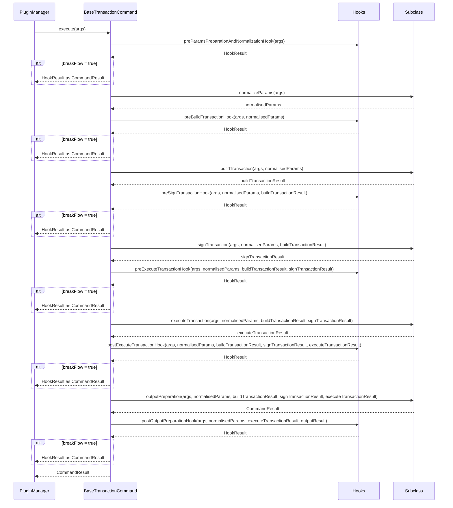

### ADR-009: Class-Based Command Structure and Cross-Plugin Hook System

- Status: Proposed
- Date: 2026-03-05
- Related: `src/core/commands/command.ts`, `src/core/hooks/abstract-hook.ts`, `src/core/plugins/plugin-manager.ts`, `docs/adr/ADR-001-plugin-architecture.md`, `docs/adr/ADR-003-command-handler-result-contract.md`

## Context

Existing plugin commands are implemented as plain handler functions (`CommandHandler`) that receive `CommandHandlerArgs` and return `Promise<CommandResult>`. While straightforward, this approach conflates input validation, domain logic, and output formatting into a single function body. This makes it difficult to:

- Intercept or extend command behavior without modifying the handler itself.
- Test individual phases (validation, business logic, output) in isolation.
- Inject cross-cutting concerns (logging, auditing, authorization) from other plugins.

As the number of plugins grows, the need for a structured command lifecycle with well-defined extension points becomes critical.

## Decision

Introduce two complementary mechanisms:

1. **`Command`** -- an interface that defines a single `execute` method, allowing any command to provide its own custom execution logic.
2. **`BaseTransactionCommand`** -- an abstract class that decomposes command transaction execution into discrete, testable phases with lifecycle hooks between them.
3. **`AbstractHook`** -- a hook base class whose instances can be registered in any plugin manifest and injected into any command's lifecycle, enabling cross-plugin extensibility.
4. **`HookResult`** -- a return type from hooks that enables flow control: any hook can halt command execution and return an early result.

### Part 1: Command Interface

The `Command` interface (defined in `src/core/commands/command.interface.ts`) is the foundation of the class-based command system. It defines a single method contract:

```ts
// src/core/commands/command.interface.ts
import type { CommandHandlerArgs, CommandResult } from '@/core';

export interface Command {
  execute(args: CommandHandlerArgs): Promise<CommandResult>;
}
```

Any class that implements `Command` can be registered on the optional `command` field of `CommandSpec` in a plugin manifest. When `PluginManager` executes a command and `commandSpec.command` is present, it calls `command.execute(handlerArgs)` instead of the legacy `commandSpec.handler(handlerArgs)` function.

This means commands are not required to extend `BaseTransactionCommand`. A command can implement the `Command` interface directly and provide a fully custom `execute()` method with its own internal logic, without the phases and hooks that `BaseTransactionCommand` provides. This is useful for simple commands that do not involve transactions or for commands that need a non-standard execution flow.

```ts
// Example: a simple command with custom execute logic
import type { CommandHandlerArgs, CommandResult } from '@/core';
import type { Command } from '@/core/commands/command.interface';

export class SimpleStatusCommand implements Command {
  async execute(args: CommandHandlerArgs): Promise<CommandResult> {
    const network = args.api.network.getCurrentNetwork();
    return { result: { network, status: 'connected' } };
  }
}
```

`BaseTransactionCommand` itself implements `Command`, providing the structured lifecycle. But the interface remains open for any alternative implementation.

### Part 2: BaseTransactionCommand

`BaseTransactionCommand<TNormalisedParams, TBuildTransactionResult, TSignTransactionResult, TExecuteTransactionResult>` (defined in `src/core/commands/command.ts`) implements the `Command` interface and provides a template-method `execute` orchestrator. Subclasses implement four abstract methods:

#### Full Implementation

```ts
// src/core/commands/command.ts
import type { CommandHandlerArgs, CommandResult } from '@/core';
import type { Command } from '@/core/commands/command.interface';
import type { AbstractHook } from '@/core/hooks/abstract-hook';
import type {
  HookResult,
  PostExecuteTransactionParams,
  PostOutputPreparationParams,
  PreBuildTransactionParams,
  PreExecuteTransactionParams,
  PreSignTransactionParams,
} from '@/core/hooks/types';

export abstract class BaseTransactionCommand<
  TNormalisedParams = unknown,
  TBuildTransactionResult = unknown,
  TSignTransactionResult = unknown,
  TExecuteTransactionResult = unknown,
> implements Command {
  async execute(args: CommandHandlerArgs): Promise<CommandResult> {
    const preNormalizationHookResult =
      await this.preParamsNormalizationHook(args);
    if (preNormalizationHookResult.breakFlow) {
      return this.processHookResult(preNormalizationHookResult);
    }
    const normalisedParams = await this.normalizeParams(args);

    const preBuildTransactionHookResult = await this.preBuildTransactionHook(
      args,
      { normalisedParams },
    );
    if (preBuildTransactionHookResult.breakFlow) {
      return this.processHookResult(preBuildTransactionHookResult);
    }
    const buildTransactionResult = await this.buildTransaction(
      args,
      normalisedParams,
    );

    const preSignTransactionHookResult = await this.preSignTransactionHook(
      args,
      { normalisedParams, buildTransactionResult },
    );
    if (preSignTransactionHookResult.breakFlow) {
      return this.processHookResult(preSignTransactionHookResult);
    }
    const signTransactionResult = await this.signTransaction(
      args,
      normalisedParams,
      buildTransactionResult,
    );

    const preExecuteTransactionHookResult =
      await this.preExecuteTransactionHook(args, {
        normalisedParams,
        buildTransactionResult,
        signTransactionResult,
      });
    if (preExecuteTransactionHookResult.breakFlow) {
      return this.processHookResult(preExecuteTransactionHookResult);
    }
    const executeTransactionResult = await this.executeTransaction(
      args,
      normalisedParams,
      buildTransactionResult,
      signTransactionResult,
    );
    const postExecuteTransactionHookResult =
      await this.postExecuteTransactionHook(args, {
        normalisedParams,
        buildTransactionResult,
        signTransactionResult,
        executeTransactionResult,
      });
    if (postExecuteTransactionHookResult.breakFlow) {
      return this.processHookResult(postExecuteTransactionHookResult);
    }
    const result = await this.outputPreparation(
      args,
      normalisedParams,
      buildTransactionResult,
      signTransactionResult,
      executeTransactionResult,
    );
    const postOutputHookResult = await this.postOutputPreparationHook(args, {
      normalisedParams,
      executeTransactionResult,
      outputResult: result,
    });
    if (postOutputHookResult.breakFlow) {
      return this.processHookResult(postOutputHookResult);
    }
    return result;
  }

  // Hooks
  async preParamsNormalizationHook(
    args: CommandHandlerArgs,
  ): Promise<HookResult> {
    return await this.executeHooks(
      async (h) => h.preParamsPreparationAndNormalizationHook(args),
      args.hooks,
    );
  }

  async preBuildTransactionHook(
    args: CommandHandlerArgs,
    params: PreBuildTransactionParams<TNormalisedParams>,
  ): Promise<HookResult> {
    return await this.executeHooks(
      async (h) => h.preBuildTransactionHook(args, params),
      args.hooks,
    );
  }

  async preSignTransactionHook(
    args: CommandHandlerArgs,
    params: PreSignTransactionParams<
      TNormalisedParams,
      TBuildTransactionResult
    >,
  ): Promise<HookResult> {
    return await this.executeHooks(
      async (h) => h.preSignTransactionHook(args, params),
      args.hooks,
    );
  }

  async preExecuteTransactionHook(
    args: CommandHandlerArgs,
    params: PreExecuteTransactionParams<
      TNormalisedParams,
      TBuildTransactionResult,
      TSignTransactionResult
    >,
  ): Promise<HookResult> {
    return await this.executeHooks(
      async (h) => h.preExecuteTransactionHook(args, params),
      args.hooks,
    );
  }

  async postExecuteTransactionHook(
    args: CommandHandlerArgs,
    params: PostExecuteTransactionParams<
      TNormalisedParams,
      TBuildTransactionResult,
      TSignTransactionResult,
      TExecuteTransactionResult
    >,
  ): Promise<HookResult> {
    return await this.executeHooks(
      async (h) => h.postExecuteTransactionHook(args, params),
      args.hooks,
    );
  }

  async postOutputPreparationHook(
    args: CommandHandlerArgs,
    params: PostOutputPreparationParams<
      TNormalisedParams,
      TExecuteTransactionResult
    >,
  ): Promise<HookResult> {
    return await this.executeHooks(
      async (h) => h.postOutputPreparationHook(args, params),
      args.hooks,
    );
  }

  /**
   * Generic hook execution method that executes hooks on all registered hooks.
   * Hook-agnostic: just awaits the hook executor without caring about the result.
   * @param hookExecutor - The hook function to execute on each hook.
   * @param hooks - abstract hooks list registered.
   */
  protected async executeHooks(
    hookExecutor: (hook: AbstractHook) => Promise<HookResult>,
    hooks?: AbstractHook[],
  ): Promise<HookResult> {
    if (!hooks) {
      return {
        breakFlow: false,
        result: {
          message: 'no hooks available',
        },
      };
    }

    for (const hook of hooks) {
      const hookResult = await hookExecutor(hook);
      if (hookResult.breakFlow) {
        return hookResult;
      }
    }
    return {
      breakFlow: false,
      result: {
        message: 'success',
      },
    };
  }

  protected async processHookResult(
    hookResult: HookResult,
  ): Promise<CommandResult> {
    return Promise.resolve({
      result: hookResult.result,
      overrideSchema: hookResult.schema,
      overrideHumanTemplate: hookResult.humanTemplate,
    });
  }

  abstract normalizeParams(
    args: CommandHandlerArgs,
  ): Promise<TNormalisedParams>;

  abstract buildTransaction(
    args: CommandHandlerArgs,
    normalisedParams: TNormalisedParams,
  ): Promise<TBuildTransactionResult>;

  abstract signTransaction(
    args: CommandHandlerArgs,
    normalisedParams: TNormalisedParams,
    buildTransactionResult: TBuildTransactionResult,
  ): Promise<TSignTransactionResult>;

  abstract executeTransaction(
    args: CommandHandlerArgs,
    normalisedParams: TNormalisedParams,
    buildTransactionResult: TBuildTransactionResult,
    signTransactionResult: TSignTransactionResult,
  ): Promise<TExecuteTransactionResult>;

  abstract outputPreparation(
    args: CommandHandlerArgs,
    normalisedParams: TNormalisedParams,
    buildTransactionResult: TBuildTransactionResult,
    signTransactionResult: TSignTransactionResult,
    coreActionResult: TExecuteTransactionResult,
  ): Promise<CommandResult>;
}
```

| Method                                                                                                                | Responsibility                                                                                                                     |
| --------------------------------------------------------------------------------------------------------------------- | ---------------------------------------------------------------------------------------------------------------------------------- |
| `normalizeParams(args)`                                                                                               | Validate and transform raw CLI arguments into a strongly-typed params object (`TNormalisedParams`). Typically uses a Zod schema.   |
| `buildTransaction(args, normalisedParams)`                                                                            | Build a transaction from the normalized params. Returns `TBuildTransactionResult` (e.g. a build transaction object).               |
| `signTransaction(args, normalisedParams, buildTranasctionResult)`                                                     | Sign a transaction from the builded transaction object. Returns `TSignTransactionResult` (e.g. a signed transaction bytes object). |
| `executeTransaction(args, normalisedParams, buildTranasctionResult, signTransactionResult)`                           | Submit the signed transaction to the network. Returns `TExecuteTransactionResult` (e.g. a transaction receipt).                    |
| `outputPreparation(args, normalisedParams, buildTranasctionResult, signTransactionResult, executeTransactionResult?)` | Map the domain result into a `CommandResult` for the CLI output pipeline.                                                          |

Transaction operations are splitted into three separate methods `buildTransaction`, `signTransaction` and `executeTransaction`. This enables hooks to inspect or modify the signed transaction before it is submitted, and to react to the submission result before output is prepared.

Each hook point checks the returned `HookResult` -- if `breakFlow` is `true`, execution stops immediately and the hook's result is returned as the command output via `processHookResult`.

#### Registration

A `BaseTransactionCommand` instance is registered on the `command` field of `CommandSpec` in the plugin manifest. When `PluginManager` executes a command:

- If `commandSpec.command` is present, it calls `command.execute(handlerArgs)`.
- Otherwise, it falls back to the legacy `commandSpec.handler(handlerArgs)` function.

This makes adoption incremental -- existing handler functions continue to work unchanged.

```ts
// In plugin manifest (CommandSpec)
{
  name: 'foo',
  summary: 'Run foo',
  description: 'Execute the foo command',
  command: new FooTestCommand(),   // <-- BaseTransactionCommand instance
  handler: fooTestOptions,         // <-- legacy fallback
  output: { schema: FooTestOutputSchema, humanTemplate: FOO_TEMPLATE },
}
```

#### Example: FooTestCommand

```ts
import type { CommandHandlerArgs, CommandResult } from '@/core';
import { BaseTransactionCommand } from '@/core/commands/command';

export class FooTestCommand extends BaseTransactionCommand<
  FooNormalizedParams,
  FooBuildTransactionResult,
  FooSignTransactionResult,
  FooExecuteTransactionResult
> {
  async normalizeParams(
    args: CommandHandlerArgs,
  ): Promise<FooNormalizedParams> {
    const validArgs = FooTestInputSchema.parse(args.args);
    return { message: validArgs.message };
  }

  async buildTransaction(
    args: CommandHandlerArgs,
    normalisedParams: FooNormalizedParams,
  ): Promise<FooBuildTransactionResult> {
    const { api } = args;
    const transaction = api.account.create({
      key: normalisedParams.key,
    });
    return {
      transaction,
    };
  }

  async signTransaction(
    args: CommandHandlerArgs,
    normalisedParams: FooNormalizedParams,
    buildTransactionResult: FooBuildTransactionResult,
  ): Promise<FooSignedTransactionResult> {
    void normalisedParams;
    const { api } = args;
    const signedTx = api.signer.sign({
      transaction: buildTransactionResult.transaction,
    });
    return {
      signedTx,
    };
  }

  async executeTransaction(
    args: CommandHandlerArgs,
    normalisedParams: FooNormalizedParams,
    buildTransactionResult: FooBuildTransactionResult,
    signedTransactionResult: FooSignedTransactionResult,
  ): Promise<FooTransactionExecuteResult> {
    void normalisedParams;
    void buildTransactionResult;
    const { api } = args;
    const transactionResult = api.txExecution.execute({
      transaction: signedTransactionResult.transaction,
    });
    return {
      transactionResult,
    };
  }

  async outputPreparation(
    args: CommandHandlerArgs,
    normalisedParams: FooNormalizedParams,
    buildTransactionResult: FooBuildTransactionResult,
    signedTransactionResult: FooSignedTransactionResult,
    executeTransactionResult: FooTransactionExecuteResult,
  ): Promise<CommandResult> {
    return { result: { bar: normalisedParams.message } };
  }
}
```

### Part 3: Hook System

`AbstractHook` (defined in `src/core/hooks/abstract-hook.ts`) provides five no-op lifecycle methods at the key points of the command execution pipeline. Each method returns `Promise<HookResult>`, enabling hooks to optionally halt the execution flow.

#### Full Implementation

```ts
// src/core/hooks/abstract-hook.ts
import type { CommandHandlerArgs } from '@/core';
import type {
  HookResult,
  PostExecuteTransactionParams,
  PostOutputPreparationParams,
  PreBuildTransactionParams,
  PreExecuteTransactionParams,
  PreSignTransactionParams,
} from '@/core/hooks/types';

export abstract class AbstractHook {
  public preParamsPreparationAndNormalizationHook(
    _args: CommandHandlerArgs,
  ): Promise<HookResult> {
    void _args;
    return Promise.resolve({
      breakFlow: false,
      result: {
        message: 'success',
      },
    });
  }

  public preBuildTransactionHook(
    _args: CommandHandlerArgs,
    _params: PreBuildTransactionParams,
  ): Promise<HookResult> {
    void _args;
    void _params;
    return Promise.resolve({
      breakFlow: false,
      result: {
        message: 'success',
      },
    });
  }

  public preSignTransactionHook(
    _args: CommandHandlerArgs,
    _params: PreSignTransactionParams,
  ): Promise<HookResult> {
    void _args;
    void _params;
    return Promise.resolve({
      breakFlow: false,
      result: {
        message: 'success',
      },
    });
  }

  public preExecuteTransactionHook(
    _args: CommandHandlerArgs,
    _params: PreExecuteTransactionParams,
  ): Promise<HookResult> {
    void _args;
    void _params;
    return Promise.resolve({
      breakFlow: false,
      result: {
        message: 'success',
      },
    });
  }

  public postExecuteTransactionHook(
    _args: CommandHandlerArgs,
    _params: PostExecuteTransactionParams,
  ): Promise<HookResult> {
    void _args;
    void _params;
    return Promise.resolve({
      breakFlow: false,
      result: {
        message: 'success',
      },
    });
  }

  public postOutputPreparationHook(
    _args: CommandHandlerArgs,
    _params: PostOutputPreparationParams,
  ): Promise<HookResult> {
    void _args;
    void _params;
    return Promise.resolve({
      breakFlow: false,
      result: {
        message: 'success',
      },
    });
  }
}
```

#### Hook Lifecycle Methods

| Hook                                       | Fires                       | Receives                                                                                                              |
| ------------------------------------------ | --------------------------- | --------------------------------------------------------------------------------------------------------------------- |
| `preParamsPreparationAndNormalizationHook` | Before `normalizeParams`    | `args`                                                                                                                |
| `preBuildTransactionHook`                  | Before `buildTransaction`   | `args`, `{ normalisedParams }`                                                                                        |
| `preSignTransactoinHook`                   | Before `signTransaction`    | `args`, `{ normalisedParams, buildTransactionResult }`                                                                |
| `preExecuteTransactionHook`                | Before `executeTransaction` | `args`, `{ normalisedParams, buildTransactionResult, signTransactionResult }`                                         |
| `postExecuteTransactionHook`               | After `executeTransaction`  | `args`, `{ normalisedParams, buildTransactionResult, signTransactionResult, executeTransactionResult }`               |
| `postOutputPreparationHook`                | After `outputPreparation`   | `args`, `{ normalisedParams, buildTransactionResult, signTransactionResult, executeTransactionResult, outputResult }` |

Concrete hooks extend `AbstractHook` and override only the methods they need.

#### Hook Param Types

```ts
// src/core/hooks/types.ts
import type { z } from 'zod';
import type { CommandResult } from '@/core';

export interface PreBuildTransactionParams<TNormalisedParams = unknown> {
  normalisedParams: TNormalisedParams;
}

export interface PreSignTransactionParams<
  TNormalisedParams = unknown,
  TBuildTransactionResult = unknown,
> {
  normalisedParams: TNormalisedParams;
  buildTransactionResult: TBuildTransactionResult;
}

export interface PreExecuteTransactionParams<
  TNormalisedParams = unknown,
  TBuildTransactionResult = unknown,
  TSignTransactionResult = unknown,
> {
  normalisedParams: TNormalisedParams;
  buildTransactionResult: TBuildTransactionResult;
  signTransactionResult: TSignTransactionResult;
}

export interface PostExecuteTransactionParams<
  TNormalisedParams = unknown,
  TBuildTransactionResult = unknown,
  TSignTransactionResult = unknown,
  TExecuteTransactionResult = unknown,
> {
  normalisedParams: TNormalisedParams;
  buildTransactionResult: TBuildTransactionResult;
  signTransactionResult: TSignTransactionResult;
  executeTransactionResult: TExecuteTransactionResult;
}

export interface PostOutputPreparationParams<
  TNormalisedParams = unknown,
  TBuildTransactionResult = unknown,
  TSignTransactionResult = unknown,
  TExecuteTransactionResult = unknown,
> {
  normalisedParams: TNormalisedParams;
  buildTransactionResult: TBuildTransactionResult;
  signTransactionResult: TSignTransactionResult;
  executeTransactionResult: TExecuteTransactionResult;
  outputResult: CommandResult;
}

export interface HookResult {
  breakFlow: boolean;
  result: object;
  schema?: z.ZodTypeAny;
  humanTemplate?: string;
}
```

### Part 4: HookResult and Flow Control

Each hook returns `Promise<HookResult>`. The `HookResult` interface:

```ts
export interface HookResult {
  breakFlow: boolean;
  result: object;
  humanTemplate?: string;
}
```

| Field           | Purpose                                                                                                                                                         |
| --------------- | --------------------------------------------------------------------------------------------------------------------------------------------------------------- |
| `breakFlow`     | When `true`, command execution stops immediately. The hook's `result` and optional `humanTemplate` are returned as the `CommandResult` via `processHookResult`. |
| `result`        | The output object to use if `breakFlow` is `true`.                                                                                                              |
| `humanTemplate` | Optional Handlebars template override for the output.                                                                                                           |

The `CommandResult` type supports the optional `humanTemplate` field:

```ts
export interface CommandResult {
  result: object;
  humanTemplate?: string;
}
```

When `PluginManager` renders output, it prefers `result.humanTemplate` (if set by a hook) over the command's default template from the manifest.

**Flow control evaluation** happens in `executeHooks`: hooks are executed sequentially, and the loop terminates as soon as any hook returns `{ breakFlow: true, ... }`. The default base-class implementations return `{ breakFlow: false, result: { message: 'success' } }`, allowing execution to continue. When no hooks are registered, `executeHooks` returns `{ breakFlow: false, result: { message: 'no hooks available' } }`.

#### Hook Registration

Hooks are registered via `HookSpec` in a plugin's manifest:

```ts
export interface HookSpec {
  name: string;
  relevantCommands: string[]; // e.g. ["topic_submit-message", "contract_deploy"]
  hook: AbstractHook;
}
```

The `relevantCommands` array uses the format `${pluginName}_${commandName}` to target specific commands. A hook registered in plugin A can target commands in plugin B -- this is the core cross-plugin extensibility mechanism.

#### Hook Delivery

Hooks are passed to commands via the `hooks` field on `CommandHandlerArgs`:

```ts
export interface CommandHandlerArgs {
  args: Record<string, unknown>;
  api: CoreApi;
  state: StateManager;
  config: ConfigView;
  logger: Logger;
  hooks?: AbstractHook[];
}
```

During `PluginManager.registerCommands`, all `HookSpec` entries from every loaded plugin are collected into a single list:

```ts
this.hooks = Array.from(this.loadedPlugins.values()).flatMap(
  (plugin) => plugin.manifest.hooks ?? [],
);
```

When a command is executed, `filterHooksForCommand` selects the relevant hooks and injects them into `handlerArgs.hooks`:

```ts
private filterHooksForCommand(
  plugin: LoadedPlugin,
  commandSpec: CommandSpec,
): AbstractHook[] {
  const commandKey = `${plugin.manifest.name}_${commandSpec.name}`;
  return this.hooks
    .filter((spec) => spec.relevantCommands.includes(commandKey))
    .map((spec) => spec.hook);
}
```

#### Example: Transaction Inspection Hook

A hook that logs the signed transaction before it is submitted to the network:

```ts
import type { CommandHandlerArgs } from '@/core';
import type {
  HookResult,
  PreExecuteTransactionParams,
} from '@/core/hooks/types';
import { AbstractHook } from '@/core/hooks/abstract-hook';

export class TransactionInspectionHook extends AbstractHook {
  override preExecuteTransactionHook(
    args: CommandHandlerArgs,
    params: PreExecuteTransactionParams,
  ): Promise<HookResult> {
    const { logger } = args;
    const { signTransactionResult } = params;

    logger.info(`Signed transaction: ${JSON.stringify(signTransactionResult)}`);

    return Promise.resolve({
      breakFlow: false,
      result: { message: 'success' },
    });
  }
}
```

#### Example: Authorization Hook with breakFlow

A hook that halts execution if the user lacks permission:

```ts
export class AuthorizationHook extends AbstractHook {
  override preBuildAndSignHook(
    args: CommandHandlerArgs,
    params: PreBuildAndSignParams,
  ): Promise<HookResult> {
    const isAuthorized = checkPermissions(args);

    if (!isAuthorized) {
      return Promise.resolve({
        breakFlow: true,
        result: { error: 'Insufficient permissions' },
        humanTemplate: 'Access denied: {{error}}',
      });
    }

    return Promise.resolve({
      breakFlow: false,
      result: { message: 'success' },
    });
  }
}
```

When `breakFlow: true` is returned, `BaseTransactionCommand.execute` immediately returns the hook's result as the command output, skipping `buildAndSign`, `executeTransaction`, `outputPreparation`, and all subsequent hooks.

## Execution Flow



## Pros and Cons

### Pros

- **Cross-plugin extensibility.** Hooks registered in one plugin can intercept commands in a completely different plugin. This enables cross-cutting concerns (auditing, authorization, telemetry) without modifying the target command.
- **Separation of concerns.** Validation (`normalizeParams`), transaction construction (`buildAndSign`), network submission (`executeTransaction`), and output formatting (`outputPreparation`) are isolated in dedicated methods, making each easier to understand and maintain.
- **Transaction interception.** The split between `buildAndSign` and `executeTransaction` allows hooks to inspect, log, or reject a signed transaction before it reaches the network. This is valuable for audit trails, dry-run modes, and multi-signature workflows.
- **Flow control via hooks.** Any hook can halt command execution by returning `{ breakFlow: true }` with a custom result. This enables use cases like authorization gates, rate limiting, or conditional command skipping -- all without modifying the command itself.
- **Testability.** Each phase can be unit-tested independently. Hooks can be tested in isolation by invoking them directly with mock args and params.
- **Incremental adoption.** The `command` field on `CommandSpec` is optional. Existing plain handler functions continue to work, so migration can happen command-by-command.
- **Open/Closed principle.** New behavior can be added to existing commands via hooks without modifying the command's source code.

### Cons

- **Additional boilerplate.** A `BaseTransactionCommand` subclass requires implementing four methods, three type parameters, and separate files for normalized params and output types -- noticeably more code than a plain handler function for simple commands.
- **Learning curve.** Developers must understand the lifecycle phases, hook ordering, the `HookResult` contract, and how `HookSpec.relevantCommands` matching works.
- **Sequential hook execution overhead.** Hooks are executed sequentially with `await`. A slow hook blocks subsequent hooks and the command phase it precedes. There is no parallel execution or timeout mechanism.
- **Debugging complexity.** When multiple hooks from different plugins interact with the same command, tracing the execution flow and diagnosing issues requires understanding the full hook chain, which is assembled at runtime. The `breakFlow` mechanism adds another dimension -- a hook may silently prevent execution of later hooks and the command itself.
- **No hook ordering guarantees.** Hook execution order depends on plugin loading order, which may vary. There is currently no priority or explicit ordering mechanism.

## Consequences

- New commands should prefer `BaseTransactionCommand` over plain handler functions when they involve distinct validation, signing, execution, and output phases, or when hook extensibility is needed.
- Plugins that need to inject cross-cutting behavior into other plugins' commands should define `HookSpec` entries in their manifest.
- Hook authors must handle errors defensively -- an unhandled exception in a hook will propagate and abort the command execution.
- Hooks that use `breakFlow: true` should provide meaningful `result` and optionally `humanTemplate` values, as these become the command's output.
- The `CommandResult.humanTemplate` field allows hooks to override the output template defined in the command manifest, giving hooks full control over the user-facing output when they halt execution.
- The `buildAndSign`/`executeTransaction` split is designed for transaction-oriented commands; non-transactional commands may use trivial implementations (e.g. returning `undefined` from `buildAndSign` and performing all logic in `executeTransaction`).

## Testing Strategy

- **Unit: BaseTransactionCommand subclass.** Test each abstract method independently by instantiating the subclass and calling `normalizeParams`, `buildAndSign`, `executeTransaction`, and `outputPreparation` with mock args.
- **Unit: Hook execution.** Verify that `executeHooks` calls each hook in order, returns `{ breakFlow: false }` when no hook breaks flow, and returns the `HookResult` immediately when a hook sets `breakFlow: true`.
- **Unit: Flow interruption.** Verify that when a hook returns `breakFlow: true`, subsequent hooks are not called and the command phases after the hook point are skipped.
- **Unit: Hook filtering.** Test `filterHooksForCommand` with various `relevantCommands` patterns to ensure correct matching.
- **Unit: Individual hooks.** Instantiate a concrete hook and invoke its lifecycle method with mock args/params. Assert the expected side effects and `HookResult` values.
- **Integration: Cross-plugin hooks.** Load two plugins where one declares a hook targeting the other's command. Execute the command and verify the hook fires.
- **Integration: Legacy fallback.** Ensure commands without a `command` field still execute via the plain `handler` function.
