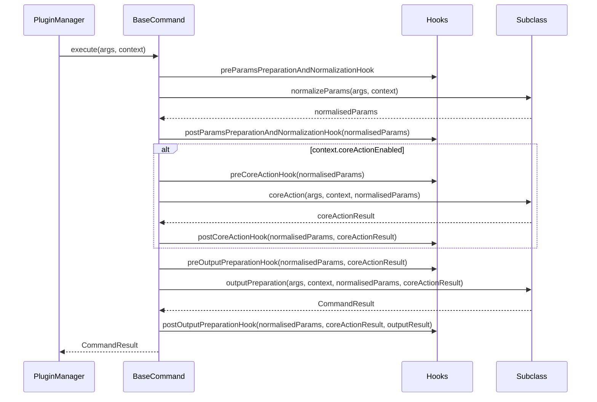

### ADR-009: Class-Based Command Structure and Cross-Plugin Hook System

- Status: Proposed
- Date: 2026-03-05
- Related: `src/core/commands/command.ts`, `src/core/hooks/abstract-hook.ts`, `src/core/plugins/plugin-manager.ts`, `docs/adr/ADR-001-plugin-architecture.md`, `docs/adr/ADR-003-command-handler-result-contract.md`

## Context

Existing plugin commands are implemented as plain handler functions (`CommandHandler`) that receive `CommandHandlerArgs` and return `Promise<CommandResult>`. While straightforward, this approach conflates input validation, domain logic, and output formatting into a single function body. This makes it difficult to:

- Intercept or extend command behavior without modifying the handler itself.
- Test individual phases (validation, business logic, output) in isolation.
- Inject cross-cutting concerns (logging, auditing, authorization) from other plugins.

As the number of plugins grows, the need for a structured command lifecycle with well-defined extension points becomes critical.

## Decision

Introduce two complementary mechanisms:

1. **`BaseCommand`** -- an abstract class that decomposes command execution into discrete, testable phases with lifecycle hooks between them.
2. **`AbstractHook`** -- a hook base class whose instances can be registered in any plugin manifest and injected into any command's lifecycle, enabling cross-plugin extensibility.

### Part 1: BaseCommand

`BaseCommand<TNormalisedParams, TCoreActionResult>` (defined in `src/core/commands/command.ts`) implements the `Command` interface and provides a template-method `execute` orchestrator. Subclasses implement three abstract methods:

#### Full Implementation

```ts
// src/core/commands/command.ts
import type { CommandHandlerArgs, CommandResult } from '@/core';
import type { Command } from '@/core/commands/command.interface';
import type { AbstractHook } from '@/core/hooks/abstract-hook';
import type {
  PostCoreActionParams,
  PostOutputPreparationParams,
  PostParamsPreparationAndNormalizationParams,
  PreCoreActionParams,
  PreOutputPreparationParams,
} from '@/core/hooks/types';
import type { Context } from '@/core/shared/context/context';

export abstract class BaseCommand<
  TNormalisedParams = unknown,
  TCoreActionResult = unknown,
> implements Command {
  async execute(args: CommandHandlerArgs, context: Context) {
    this.preParamsNormalizationHook(args, context);
    const normalisedParams = await this.normalizeParams(args, context);
    this.postParamsNormalizationHook(args, context, { normalisedParams });
    this.preCoreActionHook(args, context, { normalisedParams });

    let coreActionResult;
    if (context.coreActionEnabled) {
      coreActionResult = await this.coreAction(args, context, normalisedParams);
    }

    this.postCoreActionHook(args, context, {
      normalisedParams,
      coreActionResult,
    });
    this.preOutputPreparationHook(args, context, {
      normalisedParams,
      coreActionResult,
    });

    const result = await this.outputPreparation(
      args,
      context,
      normalisedParams,
      coreActionResult,
    );

    this.postOutputPreparationHook(args, context, {
      normalisedParams,
      coreActionResult,
      outputResult: result,
    });
    return result;
  }

  async preParamsNormalizationHook(
    args: CommandHandlerArgs,
    context: Context,
  ): Promise<void> {
    await this.executeHooks(context, async (h) =>
      h.preParamsPreparationAndNormalizationHook(args, context),
    );
  }

  async postParamsNormalizationHook(
    args: CommandHandlerArgs,
    context: Context,
    params: PostParamsPreparationAndNormalizationParams<TNormalisedParams>,
  ): Promise<void> {
    await this.executeHooks(context, async (h) =>
      h.postParamsPreparationAndNormalizationHook(args, context, params),
    );
  }

  async preCoreActionHook(
    args: CommandHandlerArgs,
    context: Context,
    params: PreCoreActionParams<TNormalisedParams>,
  ): Promise<void> {
    await this.executeHooks(context, async (h) =>
      h.preCoreActionHook(args, context, params),
    );
  }

  async postCoreActionHook(
    args: CommandHandlerArgs,
    context: Context,
    params: PostCoreActionParams<TNormalisedParams, TCoreActionResult>,
  ): Promise<void> {
    await this.executeHooks(context, async (h) =>
      h.postCoreActionHook(args, context, params),
    );
  }

  async preOutputPreparationHook(
    args: CommandHandlerArgs,
    context: Context,
    params: PreOutputPreparationParams<TNormalisedParams, TCoreActionResult>,
  ): Promise<void> {
    await this.executeHooks(context, async (h) =>
      h.preOutputPreparationHook(args, context, params),
    );
  }

  async postOutputPreparationHook(
    args: CommandHandlerArgs,
    context: Context,
    params: PostOutputPreparationParams<TNormalisedParams, TCoreActionResult>,
  ): Promise<void> {
    await this.executeHooks(context, async (h) =>
      h.postOutputPreparationHook(args, context, params),
    );
  }

  protected async executeHooks(
    context: Context,
    hookExecutor: (hook: AbstractHook) => Promise<void>,
  ): Promise<void> {
    if (!context.hooks) return;
    for (const hook of context.hooks) {
      await hookExecutor(hook);
    }
  }

  abstract normalizeParams(
    args: CommandHandlerArgs,
    context: Context,
  ): Promise<TNormalisedParams>;

  abstract coreAction(
    args: CommandHandlerArgs,
    context: Context,
    normalisedParams: TNormalisedParams,
  ): Promise<TCoreActionResult>;

  abstract outputPreparation(
    args: CommandHandlerArgs,
    context: Context,
    normalisedParams: TNormalisedParams,
    coreActionResult?: TCoreActionResult,
  ): Promise<CommandResult>;
}
```

| Method                                                                  | Responsibility                                                                                                                   |
| ----------------------------------------------------------------------- | -------------------------------------------------------------------------------------------------------------------------------- |
| `normalizeParams(args, context)`                                        | Validate and transform raw CLI arguments into a strongly-typed params object (`TNormalisedParams`). Typically uses a Zod schema. |
| `coreAction(args, context, normalisedParams)`                           | Execute domain logic: network calls, state mutations, transaction signing. Only runs when `context.coreActionEnabled` is `true`. |
| `outputPreparation(args, context, normalisedParams, coreActionResult?)` | Map the domain result into a `CommandResult` for the CLI output pipeline.                                                        |

#### Registration

A `BaseCommand` instance is registered on the `command` field of `CommandSpec` in the plugin manifest. When `PluginManager` executes a command:

- If `commandSpec.command` is present, it calls `command.execute(handlerArgs, context)`.
- Otherwise, it falls back to the legacy `commandSpec.handler(handlerArgs)` function.

This makes adoption incremental -- existing handler functions continue to work unchanged.

```ts
// In plugin manifest (CommandSpec)
{
  name: 'foo',
  summary: 'Run foo',
  description: 'Execute the foo command',
  command: new FooTestCommand(),   // <-- BaseCommand instance
  handler: fooTestOptions,         // <-- legacy fallback
  output: { schema: FooTestOutputSchema, humanTemplate: FOO_TEMPLATE },
}
```

#### Example: FooTestCommand

```ts
import type { CommandHandlerArgs, CommandResult } from '@/core';
import type { Context } from '@/core/shared/context/context';
import { BaseCommand } from '@/core/commands/command';

interface FooNormalizedParams {
  message: string;
}

export class FooTestCommand extends BaseCommand<FooNormalizedParams, void> {
  async normalizeParams(
    args: CommandHandlerArgs,
    _context: Context,
  ): Promise<FooNormalizedParams> {
    const validArgs = FooTestInputSchema.parse(args.args);
    return { message: validArgs.message };
  }

  async coreAction(
    args: CommandHandlerArgs,
    _context: Context,
    normalisedParams: FooNormalizedParams,
  ): Promise<void> {
    args.logger.info(normalisedParams.message);
  }

  async outputPreparation(
    _args: CommandHandlerArgs,
    _context: Context,
    normalisedParams: FooNormalizedParams,
  ): Promise<CommandResult> {
    return { result: { bar: normalisedParams.message } };
  }
}
```

### Part 2: Hook System

`AbstractHook` (defined in `src/core/hooks/abstract-hook.ts`) provides six no-op lifecycle methods -- one **pre** and one **post** hook for each of the three command phases.

#### Full Implementation

```ts
// src/core/hooks/abstract-hook.ts
import type { CommandHandlerArgs } from '@/core';
import type {
  PostCoreActionParams,
  PostOutputPreparationParams,
  PostParamsPreparationAndNormalizationParams,
  PreCoreActionParams,
  PreOutputPreparationParams,
} from '@/core/hooks/types';
import type { Context } from '@/core/shared/context/context';

export abstract class AbstractHook {
  public preParamsPreparationAndNormalizationHook(
    _args: CommandHandlerArgs,
    _context: Context,
  ): Promise<void> {
    void _args;
    void _context;
    return Promise.resolve();
  }

  public postParamsPreparationAndNormalizationHook(
    _args: CommandHandlerArgs,
    _context: Context,
    _params: PostParamsPreparationAndNormalizationParams,
  ): Promise<void> {
    void _args;
    void _context;
    void _params;
    return Promise.resolve();
  }

  public preCoreActionHook(
    _args: CommandHandlerArgs,
    _context: Context,
    _params: PreCoreActionParams,
  ): Promise<void> {
    void _args;
    void _context;
    void _params;
    return Promise.resolve();
  }

  public postCoreActionHook(
    _args: CommandHandlerArgs,
    _context: Context,
    _params: PostCoreActionParams,
  ): Promise<void> {
    void _args;
    void _context;
    void _params;
    return Promise.resolve();
  }

  public preOutputPreparationHook(
    _args: CommandHandlerArgs,
    _context: Context,
    _params: PreOutputPreparationParams,
  ): Promise<void> {
    void _args;
    void _context;
    void _params;
    return Promise.resolve();
  }

  public postOutputPreparationHook(
    _args: CommandHandlerArgs,
    _context: Context,
    _params: PostOutputPreparationParams,
  ): Promise<void> {
    void _args;
    void _context;
    void _params;
    return Promise.resolve();
  }
}
```

#### Hook Lifecycle Methods

| Hook                                        | Fires                      | Receives                                                                  |
| ------------------------------------------- | -------------------------- | ------------------------------------------------------------------------- |
| `preParamsPreparationAndNormalizationHook`  | Before `normalizeParams`   | `args`, `context`                                                         |
| `postParamsPreparationAndNormalizationHook` | After `normalizeParams`    | `args`, `context`, `{ normalisedParams }`                                 |
| `preCoreActionHook`                         | Before `coreAction`        | `args`, `context`, `{ normalisedParams }`                                 |
| `postCoreActionHook`                        | After `coreAction`         | `args`, `context`, `{ normalisedParams, coreActionResult }`               |
| `preOutputPreparationHook`                  | Before `outputPreparation` | `args`, `context`, `{ normalisedParams, coreActionResult }`               |
| `postOutputPreparationHook`                 | After `outputPreparation`  | `args`, `context`, `{ normalisedParams, coreActionResult, outputResult }` |

Concrete hooks extend `AbstractHook` and override only the methods they need.

#### Hook Registration

Hooks are registered via `HookSpec` in a plugin's manifest:

```ts
export interface HookSpec {
  name: string;
  relevantCommands: string[]; // e.g. ["topic_submit-message", "contract_deploy"]
  hook: AbstractHook;
}
```

The `relevantCommands` array uses the format `${pluginName}_${commandName}` to target specific commands. A hook registered in plugin A can target commands in plugin B -- this is the core cross-plugin extensibility mechanism.

#### Hook Collection and Filtering

During `PluginManager.registerCommands`, all `HookSpec` entries from every loaded plugin are collected into a single list:

```ts
this.hooks = Array.from(this.loadedPlugins.values()).flatMap(
  (plugin) => plugin.manifest.hooks ?? [],
);
```

When a `BaseCommand` is executed, `filterHooksForCommand` selects only the hooks relevant to that specific command:

```ts
private filterHooksForCommand(
  plugin: LoadedPlugin,
  commandSpec: CommandSpec,
): AbstractHook[] {
  const commandKey = `${plugin.manifest.name}_${commandSpec.name}`;
  return this.hooks
    .filter((spec) => spec.relevantCommands.includes(commandKey))
    .map((spec) => spec.hook);
}
```

The filtered `AbstractHook[]` array is passed into the `Context.hooks` field. `BaseCommand.executeHooks` iterates over them sequentially:

```ts
protected async executeHooks(
  context: Context,
  hookExecutor: (hook: AbstractHook) => Promise<any>,
): Promise<void> {
  if (!context.hooks) return;
  for (const hook of context.hooks) {
    await hookExecutor(hook);
  }
}
```

#### Example: MessageLoggerHook

A hook defined in the topic plugin that logs the `message` parameter before the core action:

```ts
import { AbstractHook } from '@/core/hooks/abstract-hook';
import type { PreCoreActionParams } from '@/core/hooks/types';

export class MessageLoggerHook extends AbstractHook {
  override async preCoreActionHook(
    args: CommandHandlerArgs,
    _context: Context,
    params: PreCoreActionParams,
  ): Promise<void> {
    const { logger } = args;
    const { normalisedParams } = params;

    if (!normalisedParams || typeof normalisedParams !== 'object') return;

    const message = (normalisedParams as Record<string, unknown>).message;
    if (typeof message === 'string') {
      logger.error(message);
    }
  }
}
```

Registered in the topic plugin manifest to target the `test_foo` command:

```ts
export const topicPluginManifest: PluginManifest = {
  name: 'topic',
  // ...
  hooks: [
    {
      name: 'message-logger',
      relevantCommands: ['test_foo'],
      hook: new MessageLoggerHook(),
    },
  ],
};
```

This demonstrates a hook in the **topic** plugin intercepting a command in the **test** plugin.

## Execution Flow



## Pros and Cons

### Pros

- **Cross-plugin extensibility.** Hooks registered in one plugin can intercept commands in a completely different plugin. This enables cross-cutting concerns (auditing, authorization, telemetry) without modifying the target command.
- **Separation of concerns.** Validation (`normalizeParams`), domain logic (`coreAction`), and output formatting (`outputPreparation`) are isolated in dedicated methods, making each easier to understand and maintain.
- **Testability.** Each phase can be unit-tested independently. Hooks can be tested in isolation by invoking them directly with mock args and params. The `coreActionEnabled` context flag allows testing output preparation without executing real transactions.
- **Incremental adoption.** The `command` field on `CommandSpec` is optional. Existing plain handler functions continue to work, so migration can happen command-by-command.
- **Open/Closed principle.** New behavior can be added to existing commands via hooks without modifying the command's source code.

### Cons

- **Additional boilerplate.** A `BaseCommand` subclass requires implementing three methods, type parameters, and separate files for normalized params and output types -- noticeably more code than a plain handler function for simple commands.
- **Learning curve.** Developers must understand the lifecycle phases, hook ordering, the `Context` object, and how `HookSpec.relevantCommands` matching works.
- **Sequential hook execution overhead.** Hooks are executed sequentially with `await`. A slow hook blocks subsequent hooks and the command phase it precedes. There is no parallel execution or timeout mechanism.
- **Debugging complexity.** When multiple hooks from different plugins interact with the same command, tracing the execution flow and diagnosing issues requires understanding the full hook chain, which is assembled at runtime.
- **No hook ordering guarantees.** Hook execution order depends on plugin loading order, which may vary. There is currently no priority or explicit ordering mechanism.

## Consequences

- New commands should prefer `BaseCommand` over plain handler functions when they involve distinct validation, domain, and output phases, or when hook extensibility is needed.
- Plugins that need to inject cross-cutting behavior into other plugins' commands should define `HookSpec` entries in their manifest.
- Hook authors must handle errors defensively -- an unhandled exception in a hook will propagate and abort the command execution.
- The `Context` interface may evolve to carry additional metadata (e.g., hook execution telemetry, command metadata) as the system matures.

## Testing Strategy

- **Unit: BaseCommand subclass.** Test each abstract method independently by instantiating the subclass and calling `normalizeParams`, `coreAction`, and `outputPreparation` with mock args.
- **Unit: Hook execution.** Verify that `executeHooks` calls each hook in order and that a missing `context.hooks` array is handled gracefully.
- **Unit: Hook filtering.** Test `filterHooksForCommand` with various `relevantCommands` patterns to ensure correct matching.
- **Unit: Individual hooks.** Instantiate a concrete hook and invoke its lifecycle method with mock args/params. Assert the expected side effects.
- **Integration: Cross-plugin hooks.** Load two plugins where one declares a hook targeting the other's command. Execute the command and verify the hook fires.
- **Integration: Legacy fallback.** Ensure commands without a `command` field still execute via the plain `handler` function.
