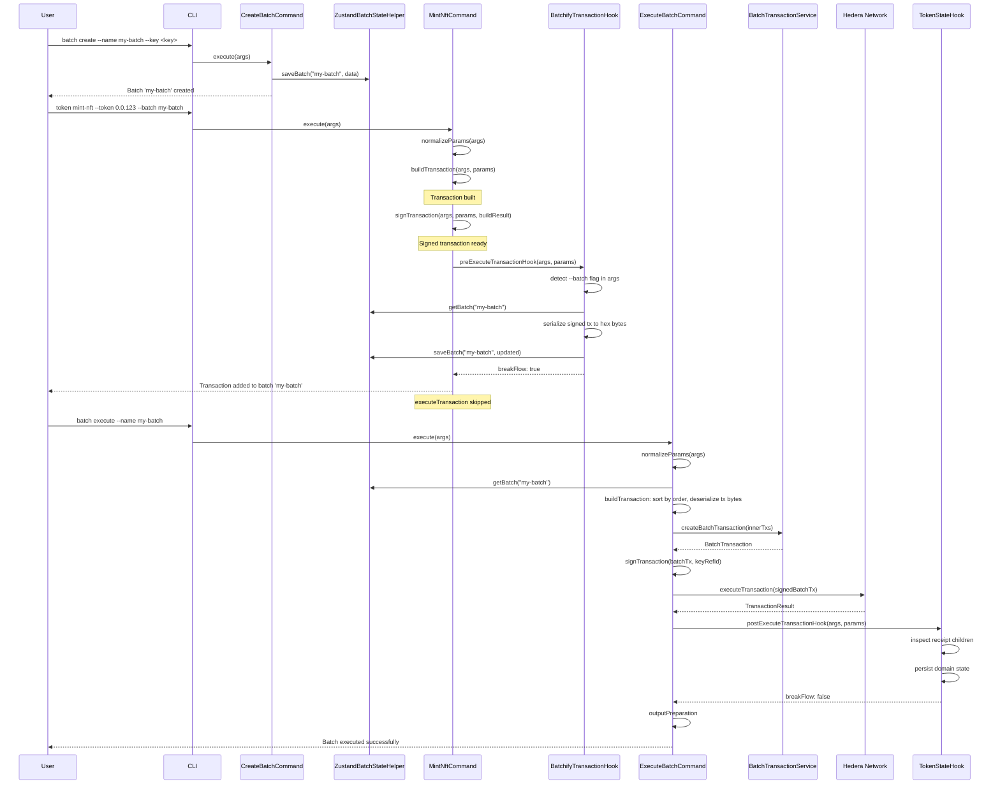
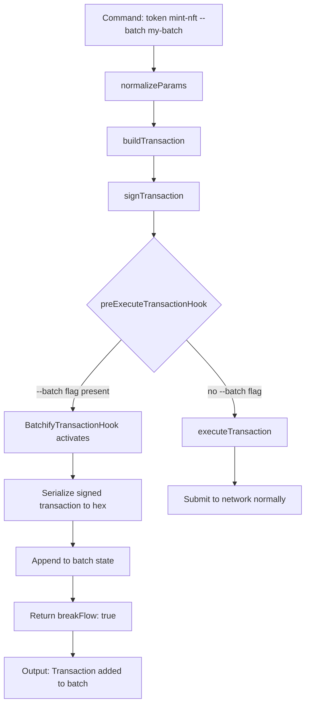

### ADR-010: Batch Transaction Plugin

- Status: Proposed
- Date: 2026-03-09
- Related: `src/plugins/batch/*`, `src/core/services/batch/*`, `src/core/commands/command.ts`, `src/core/hooks/abstract-hook.ts`, `docs/adr/ADR-001-plugin-architecture.md`, `docs/adr/ADR-009-class-based-handler-and-hook-architecture.md`

## Context

Hedera introduced `BatchTransaction` in [HIP-551](https://hips.hedera.com/hip/hip-551), which allows multiple inner transactions to be submitted atomically as a single network call. This is useful when a user wants to group operations (e.g. mint an NFT, create a topic, transfer tokens) and execute them together with all-or-nothing semantics.

The CLI already supports individual commands for token, topic, account, and contract operations, each building and executing transactions independently. To support batch workflows we need:

1. A way to **create** a named batch container with a signing key.
2. A way to **collect** inner transactions from arbitrary plugin commands (token mint, topic create, etc.) into that batch container, _without_ executing them immediately.
3. A way to **execute** the batch, deserializing all collected inner transactions, wrapping them in a `BatchTransaction`, and submitting them to the network.
4. A way for domain plugins (token, topic, account) to **persist their own state** after a successful batch execution (e.g. recording a newly created token ID).

This ADR builds on the class-based command system and hook architecture defined in ADR-009.

## Decision

### Part 1: Batch Plugin Structure

The batch plugin lives at `src/plugins/batch/` and exposes two commands:

```
src/plugins/batch/
├── index.ts
├── manifest.ts
├── schema.ts
├── zustand-state-helper.ts
├── hooks/
│   └── batchify/
│       ├── handler.ts
│       ├── index.ts
│       ├── output.ts
│       └── types.ts
└── commands/
    ├── create/
    │   ├── handler.ts
    │   ├── index.ts
    │   ├── input.ts
    │   └── output.ts
    └── execute/
        ├── handler.ts
        ├── index.ts
        ├── input.ts
        ├── output.ts
        └── types.ts
```

### Part 2: State Model

Batch state is persisted via Zustand under the namespace `batch-batches`. The schema is defined in `src/plugins/batch/schema.ts`:

```ts
export const BatchTransactionItemSchema = z.object({
  transactionBytes: z.string().min(1, 'Transaction raw bytes'),
  order: z
    .number()
    .int()
    .describe('Order of inner transaction in batch transaction'),
});

export const BatchDataSchema = z.object({
  name: AliasNameSchema,
  keyRefId: z.string().min(1, 'Key reference ID is required'),
  transactions: z.array(BatchTransactionItemSchema).default([]),
});
```

| Field                             | Type                     | Purpose                                                                     |
| --------------------------------- | ------------------------ | --------------------------------------------------------------------------- |
| `name`                            | `string`                 | Unique batch alias (validated with `AliasNameSchema`)                       |
| `keyRefId`                        | `string`                 | Reference to the signing key resolved at batch creation time                |
| `transactions`                    | `BatchTransactionItem[]` | Ordered list of serialized inner transactions collected from other commands |
| `transactions[].transactionBytes` | `string`                 | Hex-encoded bytes of a signed Hedera `Transaction`                          |
| `transactions[].order`            | `number`                 | Integer determining execution order (ascending)                             |

State access is encapsulated in `ZustandBatchStateHelper` with methods: `saveBatch`, `getBatch`, `hasBatch`, `listBatches`.

### Part 3: Create Command

`CreateBatchCommand` implements the `Command` interface directly (not `BaseTransactionCommand`) because it does not involve a network transaction -- it only persists local state.

```ts
// src/plugins/batch/commands/create/handler.ts
export class CreateBatchCommand implements Command {
  async execute(args: CommandHandlerArgs): Promise<CommandResult> {
    const { api, logger } = args;
    const batchState = new ZustandBatchStateHelper(api.state, logger);
    const validArgs = CreateBatchInputSchema.parse(args.args);

    if (batchState.hasBatch(validArgs.name)) {
      throw new ValidationError(
        `Batch with name '${validArgs.name}' already exists`,
      );
    }

    const keyManager =
      validArgs.keyManager ||
      api.config.getOption<KeyManagerName>('default_key_manager');

    const resolved = await api.keyResolver.resolveSigningKey(
      validArgs.key,
      keyManager,
      ['batch:signer'],
    );

    batchState.saveBatch(validArgs.name, {
      name: validArgs.name,
      keyRefId: resolved.keyRefId,
    });

    return { result: { name: validArgs.name, keyRefId: resolved.keyRefId } };
  }
}
```

CLI usage: `hiero batch create --name my-batch --key <key>`

### Part 4: Execute Command

`ExecuteBatchCommand` extends `BaseTransactionCommand` from ADR-009, decomposing execution into five lifecycle phases:

| Phase                | Responsibility                                                                                                                              |
| -------------------- | ------------------------------------------------------------------------------------------------------------------------------------------- |
| `normalizeParams`    | Parse input, resolve batch from state by name + network key, throw `NotFoundError` if missing                                               |
| `buildTransaction`   | Deserialize inner transactions from hex bytes, sort by `order` (ascending), wrap them in a `BatchTransaction` via `BatchTransactionService` |
| `signTransaction`    | Sign the `BatchTransaction` with the batch's `keyRefId`                                                                                     |
| `executeTransaction` | Submit the signed `BatchTransaction` to the network                                                                                         |
| `outputPreparation`  | Map the `TransactionResult` into the output schema                                                                                          |

```ts
// src/plugins/batch/commands/execute/handler.ts (simplified)
export class ExecuteBatchCommand extends BaseTransactionCommand<
  BatchNormalisedParams,
  BatchBuildTransactionResult,
  BatchSignTransactionResult,
  TransactionResult
> {
  async buildTransaction(
    args,
    normalisedParams,
  ): Promise<BatchBuildTransactionResult> {
    const innerTransactions = [...normalisedParams.batchData.transactions]
      .sort((a, b) => a.order - b.order)
      .map((txItem) =>
        Transaction.fromBytes(
          Uint8Array.from(Buffer.from(txItem.transactionBytes, 'hex')),
        ),
      );
    const result = args.api.batch.createBatchTransaction({
      transactions: innerTransactions,
    });
    return { transaction: result.transaction };
  }

  async signTransaction(
    args,
    normalisedParams,
    buildTransactionResult,
  ): Promise<BatchSignTransactionResult> {
    const signedTransaction = await args.api.signer.sign({
      transaction: buildTransactionResult.transaction,
      signerKeys: [normalisedParams.batchData.keyRefId],
    });
    return { transaction: signedTransaction };
  }

  async executeTransaction(
    args,
    normalisedParams,
    buildTransactionResult,
    signTransactionResult,
  ): Promise<TransactionResult> {
    const result = await args.api.txExecution.execute(
      signTransactionResult.transaction,
    );
    if (!result.success) {
      throw new TransactionError(
        `Failed to execute batch (txId: ${result.transactionId})`,
        false,
      );
    }
    return result;
  }
  // normalizeParams and outputPreparation omitted for brevity
}
```

CLI usage: `hiero batch execute --name my-batch`

### Part 5: BatchTransactionService

The core service at `src/core/services/batch/batch-transaction-service.ts` wraps the Hedera SDK `BatchTransaction` class:

```ts
export class BatchTransactionServiceImpl implements BatchTransactionService {
  createBatchTransaction(
    params: CreateBatchTransactionParams,
  ): CreateBatchTransactionResult {
    const batchTransaction = new BatchTransaction();
    params.transactions.forEach((tx) => {
      batchTransaction.addInnerTransaction(tx);
    });
    return { transaction: batchTransaction };
  }
}
```

The service accepts an array of deserialized `Transaction` objects and returns a `BatchTransaction` ready for signing and submission.

### Part 6: Hook System

Because `ExecuteBatchCommand` extends `BaseTransactionCommand`, it participates in the full hook lifecycle defined in ADR-009. Two concrete hook types are planned to enable cross-plugin batch integration:

#### 6.1 BatchifyTransactionHook

**Owner:** Batch plugin (`src/plugins/batch/hooks/batchify/handler.ts`)

**Purpose:** Intercept transaction-producing commands from other plugins (e.g. `token mint-nft`, `token create-nft`, `topic create`) and, instead of submitting the transaction to the network, serialize it and append it to the active batch's state.

**Lifecycle point:** `preExecuteTransactionHook` -- fires after `buildTransaction` and `signTransaction` have produced a signed transaction but before `executeTransaction` would submit it to the network.

**Flow control:** Returns `breakFlow: true` to prevent the original command from executing the transaction on-chain. The inner transaction bytes are stored in batch state for later execution via `batch execute`.

**Hook registration:** Following ADR-009, the hook is defined in the batch plugin manifest. Each command that wants batch support opts in by including `'batchify'` in its `registeredHooks` array.

The hook declares an `options` array with a `--batch` / `-b` option. This option is automatically injected into every command that registers the hook (per ADR-009 Hook Option Injection), so commands do not need to declare it themselves.

**Registration in batch plugin manifest:**

```ts
// src/plugins/batch/manifest.ts (hooks section)
hooks: [
  {
    name: 'batchify',
    hook: new BatchifyTransactionHook(),
    options: [
      {
        name: 'batch',
        type: OptionType.STRING,
        description: 'Name of the batch to add this transaction to',
        short: 'b',
      },
    ],
  },
],
```

**Commands opting in (examples):**

```ts
// src/plugins/token/manifest.ts (command example)
{
  name: 'mint-nft',
  summary: 'Mint an NFT',
  description: '...',
  options: [ /* ... token-specific options ... */ ],
  registeredHooks: ['batchify'],
  command: new MintNftCommand(),
  handler: mintNft,
  output: { schema: MintNftOutputSchema, humanTemplate: MINT_NFT_TEMPLATE },
}

// src/plugins/topic/manifest.ts (command example)
{
  name: 'create',
  summary: 'Create a new Hedera topic',
  description: '...',
  options: [ /* ... topic-specific options ... */ ],
  registeredHooks: ['batchify'],
  command: new CreateTopicCommand(),
  handler: createTopic,
  output: { schema: CreateTopicOutputSchema, humanTemplate: CREATE_TOPIC_TEMPLATE },
}
```

Any command that includes `'batchify'` in its `registeredHooks` automatically gains the `--batch` / `-b` option without modifying its own option list.

**Hook implementation:**

```ts
// src/plugins/batch/hooks/batchify/handler.ts
import { AbstractHook } from '@/core/hooks/abstract-hook';
import type { CommandHandlerArgs } from '@/core';
import type {
  HookResult,
  PreExecuteTransactionParams,
} from '@/core/hooks/types';
import { ZustandBatchStateHelper } from '@/plugins/batch/zustand-state-helper';

export class BatchifyTransactionHook extends AbstractHook {
  override async preExecuteTransactionHook(
    args: CommandHandlerArgs,
    params: PreExecuteTransactionParams,
  ): Promise<HookResult> {
    const { api, logger } = args;
    const batchName = args.args.batch as string | undefined;

    // If no --batch flag was provided, let the command execute normally
    if (!batchName) {
      return { breakFlow: false, result: { message: 'no batch context' } };
    }

    const batchState = new ZustandBatchStateHelper(api.state, logger);
    const batch = batchState.getBatch(batchName);

    if (!batch) {
      return {
        breakFlow: false,
        result: { message: 'batch not found, proceeding normally' },
      };
    }

    // Serialize the signed transaction produced by signTransaction
    const signedTransaction = params.signTransactionResult;
    const transactionBytes = Buffer.from(signedTransaction.toBytes()).toString(
      'hex',
    );

    // Determine the next order index
    const nextOrder = batch.transactions.length;

    // Append the inner transaction to batch state
    batch.transactions.push({
      transactionBytes,
      order: nextOrder,
    });
    batchState.saveBatch(batchName, batch);

    logger.info(
      `Transaction added to batch '${batchName}' at position ${nextOrder}`,
    );

    // Break flow: prevent the original command from executing the transaction on-chain
    return {
      breakFlow: true,
      result: {
        message: `Transaction added to batch '${batchName}'`,
        batchName,
        order: nextOrder,
      },
      humanTemplate: `Transaction added to batch '{{batchName}}' (position {{order}})`,
    };
  }
}
```

**How the `--batch` flag reaches the hook:** The `batchify` hook declares a `batch` option in its `HookSpec.options`. When a command lists `'batchify'` in its `registeredHooks`, `PluginManager` automatically injects the `--batch` / `-b` option into that command (as non-required). If the user passes `--batch my-batch`, the hook detects it in `args.args.batch` and activates the interception logic. If absent, the hook is a no-op and the command executes normally.

#### 6.2 StateHook (for example TokenStateHook)

**Owner:** Each domain plugin (token, topic, account) that needs to persist state after batch execution.

**Purpose:** After `batch execute` successfully submits a `BatchTransaction` to the network, domain plugins need to update their own state to reflect the results of the inner transactions (e.g. store a new token ID, record a new topic, update account associations).

**Lifecycle point:** `postExecuteTransactionHook` -- fires after `executeTransaction` has successfully submitted the batch and a receipt is available.

**Flow control:** Returns `breakFlow: false` to allow the batch execute command to continue to output preparation and any subsequent hooks.

**Consuming command:** `batch execute` -- the `ExecuteBatchCommand` opts in to domain-state hooks by listing them in its `registeredHooks`.

**Registration in token plugin manifest (example):**

```ts
// src/plugins/token/manifest.ts (hooks section)
hooks: [
  {
    name: 'token-batch-state',
    hook: new TokenBatchStateHook(),
  },
],
```

**Registration in batch execute command (example):**

```ts
// src/plugins/batch/manifest.ts (execute command)
{
  name: 'execute',
  summary: 'Execute a batch transaction',
  description: '...',
  options: [ /* ... */ ],
  registeredHooks: ['token-batch-state', 'topic-batch-state', 'account-batch-state'],
  command: new ExecuteBatchCommand(),
  handler: executeBatch,
  output: { schema: ExecuteBatchOutputSchema, humanTemplate: EXECUTE_BATCH_TEMPLATE },
}
```

```ts
// src/plugins/token/hooks/batch-state/handler.ts
import { AbstractHook } from '@/core/hooks/abstract-hook';
import type { CommandHandlerArgs } from '@/core';
import type { HookResult, PostExecuteTransactionParams } from '@/core/hooks/types';
import { ZustandTokenStateHelper } from '@/plugins/token/zustand-state-helper';

export class TokenStateHook extends AbstractHook {
  override async postExecuteTransactionHook(
    args: CommandHandlerArgs,
    params: PostExecuteTransactionParams,
  ): Promise<HookResult> {
    const { api, logger } = args;
    const batchData = params.normalisedParams.batchData; // BatchData with all inner transactions
    const executeTransactionResult = params.executeTransactionResult; // TransactionResult from batch execution

    if (!executeTransactionResult?.success) {
      return { breakFlow: false, result: { message: 'batch failed, skipping state update' } };
    }

    const tokenState = new ZustandTokenStateHelper(api.state, logger);
    const receipt = executeTransactionResult.receipt;

    // Inspect the batch receipt for token-related child receipts
    // and persist state for each token operation that was part of the batch
    if (receipt.children) {
      ...
    }

    return { breakFlow: false, result: { message: 'token state updated' } };
  }
}
```

Analogous hooks would be created for other domain plugins:

| Hook Class         | Plugin  | Purpose                                                 |
| ------------------ | ------- | ------------------------------------------------------- |
| `TokenStateHook`   | token   | Persist newly created tokens, minted NFTs, associations |
| `TopicStateHook`   | topic   | Persist newly created topics                            |
| `AccountStateHook` | account | Persist newly created accounts                          |

Each domain-state hook inspects the batch execution receipt for child receipts relevant to its domain and updates its plugin's state accordingly.

## Execution Flow

### Full Batch Lifecycle



### BatchifyTransactionHook Interception Detail



## Pros and Cons

### Pros

- **Atomic multi-operation execution.** Multiple operations from different plugins (token, topic, account) can be grouped and submitted as a single `BatchTransaction`, providing all-or-nothing semantics at the network level.
- **Non-intrusive collection.** The `BatchifyTransactionHook` intercepts existing commands at `preExecuteTransactionHook` without modifying the command's own code. Adding batch support to a new command only requires listing `'batchify'` in the command's `registeredHooks` -- the `--batch` option is injected automatically via hook option injection (ADR-009).
- **Leverages ADR-009 architecture.** Both hooks (`BatchifyTransactionHook` and domain-state hooks) use the established `AbstractHook` lifecycle, `HookResult` flow control, command-driven hook registration (`registeredHooks`), and hook option injection, requiring no changes to the core framework.
- **Decoupled state persistence.** Domain plugins own their state hooks. The batch plugin does not need to know about token, topic, or account data models. The `batch execute` command registers domain-state hooks (e.g. `'token-batch-state'`) in its `registeredHooks`.
- **Order control.** The `order` field on `BatchTransactionItem` gives deterministic transaction ordering within the batch, important for operations with dependencies (e.g. create token before mint).
- **Incremental adoption.** Commands that are not yet migrated to `BaseTransactionCommand` (and therefore lack hook support) simply cannot participate in batching. Migration can happen command by command, with batch support becoming available automatically once a command adopts the class-based pattern.

### Cons

- **Deferred execution complexity.** When a transaction is added to a batch, the user does not get immediate feedback on whether it will succeed on-chain. Validation happens at build time, but network-level failures are only surfaced at `batch execute`.
- **State consistency risk.** If `batch execute` partially fails at the network level, the domain-state hooks may not fire, leaving state out of sync with the ledger. Recovery mechanisms (retry, rollback) are not yet defined.
- **Receipt parsing complexity.** Domain-state hooks must parse `BatchTransaction` child receipts to find results relevant to their domain. The mapping between inner transaction position and receipt child index must be reliable and well-documented.
- **Implicit coupling via `--batch` flag.** The `BatchifyTransactionHook` relies on a `--batch` option being present in `args.args`. While hook option injection (ADR-009) eliminates the need to manually declare the option in each command, the hook still assumes the option name convention.
- **No partial execution.** `BatchTransaction` is all-or-nothing. If one inner transaction fails, the entire batch fails. There is no mechanism for partial success or selective retry of individual inner transactions.

## Consequences

- Commands that produce transactions and need batch support must:
  1. Be migrated to `BaseTransactionCommand` (per ADR-009) so they participate in the hook lifecycle.
  2. Include `'batchify'` in their `registeredHooks` array. The `--batch` option is then injected automatically via hook option injection.
- Domain plugins that need to persist state after batch execution must define a state hook (e.g. `'token-batch-state'`) in their manifest. The `batch execute` command must list these hooks in its `registeredHooks`.
- The `order` field must be managed carefully. When `BatchifyTransactionHook` appends a transaction, it should assign the next sequential order value.
- Error handling in `batch execute` should provide clear messages about which inner transaction caused a failure, mapping back to the original command when possible.
- Future enhancements may include:
  - A `batch list` command to view collected transactions before execution.
  - A `batch remove` command to remove a transaction from the batch by order.
  - A `batch clear` command to discard all transactions in a batch.

## Testing Strategy

- **Unit: CreateBatchCommand.** Test that a batch is created in state with the correct name and key reference. Verify `ValidationError` when a duplicate name is used.
- **Unit: ExecuteBatchCommand phases.** Test each `BaseTransactionCommand` phase independently:
  - `normalizeParams`: verify `NotFoundError` for missing batch.
  - `buildTransaction`: verify transactions are sorted by `order` and deserialized correctly.
  - `signTransaction`: verify the batch transaction is signed with the correct `keyRefId`.
  - `executeTransaction`: verify `TransactionError` on failed submission.
  - `outputPreparation`: verify output schema conformance.
- **Unit: BatchifyTransactionHook.** Invoke `preExecuteTransactionHook` with mock args containing `--batch` flag. Assert that the transaction bytes are appended to batch state and `breakFlow: true` is returned. Invoke without `--batch` flag and assert `breakFlow: false`.
- **Unit: TokenStateHook (and domain hooks).** Invoke `postExecuteTransactionHook` with a mock `TransactionResult` containing child receipts. Assert that domain state is updated. Invoke with a failed result and assert no state changes.
- **Unit: BatchTransactionService.** Verify that `createBatchTransaction` correctly adds each inner transaction to the `BatchTransaction` via `addInnerTransaction`.
- **Unit: Schema validation.** Test `BatchDataSchema` and `BatchTransactionItemSchema` with valid and invalid inputs.
- **Integration: Full batch lifecycle.** Create a batch, run a command with `--batch` flag (verifying interception), then execute the batch and verify both the network submission and domain state updates.
- **Integration: Hook filtering.** Verify that `BatchifyTransactionHook` is only injected into commands that include `'batchify'` in their `registeredHooks` and not into unrelated commands.
- **Integration: Hook option injection.** Verify that commands with `registeredHooks: ['batchify']` automatically gain the `--batch` / `-b` option without declaring it in their own `CommandSpec.options`.
