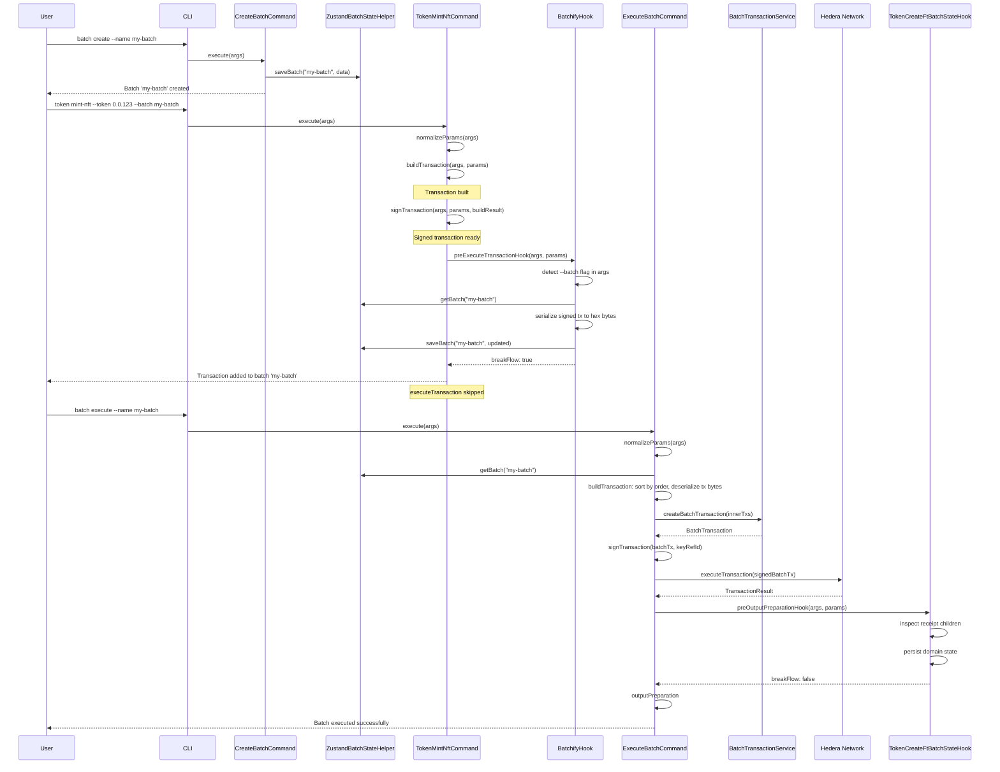
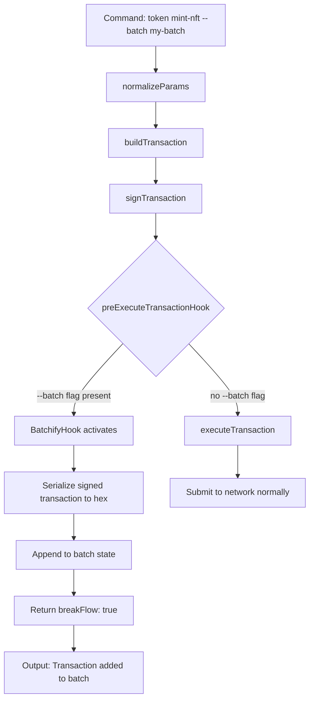

### ADR-010: Batch Transaction Plugin

- Status: Proposed
- Date: 2026-03-09
- Related: `src/plugins/batch/*`, `src/core/services/batch/*`, `src/core/commands/command.ts`, `src/core/hooks/abstract-hook.ts`, `docs/adr/ADR-001-plugin-architecture.md`, `docs/adr/ADR-009-class-based-handler-and-hook-architecture.md`

## Context

Hedera introduced `BatchTransaction` in [HIP-551](https://hips.hedera.com/hip/hip-551), which allows multiple inner transactions to be submitted atomically as a single network call. This is useful when a user wants to group operations (e.g. mint an NFT, create a topic, transfer tokens) and execute them together with all-or-nothing semantics.

The CLI already supports individual commands for token, topic, account, and contract operations, each building and executing transactions independently. To support batch workflows we need:

1. A way to **create** a named batch container with a signing key.
2. A way to **collect** inner transactions from arbitrary plugin commands (token mint, topic create, etc.) into that batch container, _without_ executing them immediately.
3. A way to **execute** the batch, deserializing all collected inner transactions, wrapping them in a `BatchTransaction`, and submitting them to the network.
4. A way for domain plugins (token, topic, account) to **persist their own state** after a successful batch execution (e.g. recording a newly created token ID).

This ADR builds on the class-based command system and hook architecture defined in ADR-009.

## Decision

### Part 1: Batch Plugin Structure

The batch plugin is located at `src/plugins/batch/` and exposes four commands: `create`, `execute`, `list`, and `delete`.

```
src/plugins/batch/
├── index.ts
├── manifest.ts
├── schema.ts
├── zustand-state-helper.ts
├── README.md
├── hooks/
│   └── batchify/
│       ├── handler.ts
│       ├── index.ts
│       ├── input.ts
│       ├── output.ts
│       └── types.ts
├── commands/
│   ├── create/
│   │   ├── handler.ts
│   │   ├── index.ts
│   │   ├── input.ts
│   │   └── output.ts
│   ├── execute/
│   │   ├── handler.ts
│   │   ├── index.ts
│   │   ├── input.ts
│   │   ├── output.ts
│   │   └── types.ts
│   ├── list/
│   │   ├── handler.ts
│   │   ├── index.ts
│   │   └── output.ts
│   └── delete/
│       ├── handler.ts
│       ├── index.ts
│       ├── input.ts
│       └── output.ts
└── __tests__/
    └── unit/
        ├── create.test.ts
        ├── execute.test.ts
        ├── list.test.ts
        ├── delete.test.ts
        ├── batchify.test.ts
        └── helpers/
```

### Part 2: State Model

Batch state is persisted via Zustand under the namespace `batch-batches`. The schema is defined in `src/plugins/batch/schema.ts`:

```ts
export const BatchTransactionItemSchema = z.object({
  transactionBytes: z.string().min(1).describe('Transaction raw bytes'),
  order: z
    .number()
    .int()
    .describe('Order of inner transaction in batch transaction'),
  command: z.string().min(1).describe('Name of the command entry point'),
  normalizedParams: z
    .record(z.string(), z.unknown())
    .default({})
    .describe(
      'Normalized params from the command that produced this transaction',
    ),
  transactionId: TransactionIdSchema.optional().describe(
    'Inner transaction ID',
  ),
});

export const BatchDataSchema = z.object({
  name: AliasNameSchema,
  keyRefId: z.string().min(1, 'Key reference ID is required'),
  executed: z.boolean().default(false).describe('Batch executed'),
  success: z.boolean().default(false).describe('Batch execution success'),
  transactions: z
    .array(BatchTransactionItemSchema)
    .default([])
    .describe('Inner transactions for a batch'),
});
```

| Field                             | Type                      | Purpose                                                                     |
| --------------------------------- | ------------------------- | --------------------------------------------------------------------------- |
| `name`                            | `string`                  | Unique batch alias (validated with `AliasNameSchema`)                       |
| `keyRefId`                        | `string`                  | Reference to the signing key resolved at batch creation time                |
| `executed`                        | `boolean`                 | Whether the batch has been executed                                         |
| `success`                         | `boolean`                 | Whether the batch execution succeeded                                       |
| `transactions`                    | `BatchTransactionItem[]`  | Ordered list of serialized inner transactions collected from other commands |
| `transactions[].transactionBytes` | `string`                  | Hex-encoded bytes of a signed Hedera `Transaction`                          |
| `transactions[].order`            | `number`                  | Integer determining execution order (ascending)                             |
| `transactions[].command`          | `string`                  | Name of the command that produced this transaction (e.g. `token_create-ft`) |
| `transactions[].normalizedParams` | `Record<string, unknown>` | Normalized params from the command (used by domain-state hooks)             |
| `transactions[].transactionId`    | `string?`                 | Inner transaction ID (set after execution)                                  |

**Storage key:** Batches are stored using `composeKey(network, name)` (e.g. `testnet:my-batch`) for per-network isolation.

State access is encapsulated in `ZustandBatchStateHelper` with methods: `saveBatch`, `getBatch`, `hasBatch`, `listBatches`, `deleteBatch`.

### Part 3: Create Command

`BatchCreateCommand` implements the `Command` interface directly (not `BaseTransactionCommand`) because it does not involve a network transaction -- it only persists local state.

```ts
// src/plugins/batch/commands/create/handler.ts
export class BatchCreateCommand implements Command {
  async execute(args: CommandHandlerArgs): Promise<CommandResult> {
    const { api, logger } = args;
    const batchState = new ZustandBatchStateHelper(api.state, logger);
    const validArgs = BatchCreateInputSchema.parse(args.args);
    const name = validArgs.name;
    const network = api.network.getCurrentNetwork();
    const key = composeKey(network, name);

    if (batchState.hasBatch(key)) {
      throw new ValidationError(`Batch with name '${key}' already exists`);
    }

    const keyManager =
      validArgs.keyManager ||
      api.config.getOption<KeyManagerName>('default_key_manager');

    const resolved = await api.keyResolver.resolveSigningKey(
      validArgs.key,
      keyManager,
      true,
      ['batch:signer'],
    );

    const batchData = {
      name,
      keyRefId: resolved.keyRefId,
      executed: false,
      success: false,
      transactions: [],
    };
    batchState.saveBatch(key, batchData);

    return { result: { name: batchData.name, keyRefId: batchData.keyRefId } };
  }
}
```

CLI usage: `hcli batch create --name my-batch --key <key>`

### Part 4: Execute Command

`BatchExecuteCommand` extends `BaseTransactionCommand` from ADR-009, decomposing execution into five lifecycle phases:

| Phase                | Responsibility                                                                                                                                                         |
| -------------------- | ---------------------------------------------------------------------------------------------------------------------------------------------------------------------- |
| `normalizeParams`    | Parse input, resolve batch from state by `composeKey(network, name)`, throw `NotFoundError` if missing or already executed                                             |
| `buildTransaction`   | Deserialize inner transactions, sort by `order`, sign each with batch key (+ operator if different), wrap in `BatchTransaction` via `api.batch.createBatchTransaction` |
| `signTransaction`    | Sign the `BatchTransaction` with the batch's `keyRefId`                                                                                                                |
| `executeTransaction` | Submit the signed `BatchTransaction` via `api.txExecute.execute`; update batch state (`executed`, `success`)                                                           |
| `outputPreparation`  | Map the `TransactionResult` into the output schema                                                                                                                     |

```ts
// src/plugins/batch/commands/execute/handler.ts (simplified)
export class BatchExecuteCommand extends BaseTransactionCommand<
  BatchNormalisedParams,
  BatchBuildTransactionResult,
  BatchSignTransactionResult,
  BatchExecuteTransactionResult
> {
  async buildTransaction(
    args,
    normalisedParams,
  ): Promise<BatchBuildTransactionResult> {
    const signingKeys = [normalisedParams.batchKey.keyRefId];
    if (
      normalisedParams.operatorKeyRefId !== normalisedParams.batchKey.keyRefId
    ) {
      signingKeys.push(normalisedParams.operatorKeyRefId);
    }
    const innerTransactions = await Promise.all(
      [...normalisedParams.batchData.transactions]
        .sort((a, b) => a.order - b.order)
        .map(async (txItem) => {
          const transaction = Transaction.fromBytes(
            Uint8Array.from(Buffer.from(txItem.transactionBytes, 'hex')),
          );
          return args.api.txSign.sign(transaction, signingKeys);
        }),
    );
    const result = args.api.batch.createBatchTransaction({
      transactions: innerTransactions,
      batchKey: normalisedParams.batchKey.publicKey,
    });
    return { transaction: result.transaction };
  }

  async signTransaction(
    args,
    normalisedParams,
    buildTransactionResult,
  ): Promise<BatchSignTransactionResult> {
    const signedTransaction = await args.api.txSign.sign(
      buildTransactionResult.transaction,
      [normalisedParams.batchData.keyRefId],
    );
    return { signedTransaction };
  }

  async executeTransaction(
    args,
    normalisedParams,
    _buildTransactionResult,
    signTransactionResult,
  ): Promise<BatchExecuteTransactionResult> {
    const result = await args.api.txExecute.execute(
      signTransactionResult.signedTransaction,
    );
    const updatedBatchData = {
      ...normalisedParams.batchData,
      executed: true,
      success: result.success,
    };
    const batchState = new ZustandBatchStateHelper(args.api.state, args.logger);
    batchState.saveBatch(normalisedParams.batchId, updatedBatchData);
    return { transactionResult: result, updatedBatchData };
  }
  // normalizeParams and outputPreparation omitted for brevity
}
```

CLI usage: `hcli batch execute --name my-batch`

### Part 5: BatchTransactionService

The core service at `src/core/services/batch/batch-transaction-service.ts` wraps the Hedera SDK `BatchTransaction` class:

```ts
export interface CreateBatchTransactionParams {
  transactions: Transaction[];
  batchKey: string; // Public key for the batch signer (HIP-551)
}

export class BatchTransactionServiceImpl implements BatchTransactionService {
  createBatchTransaction(
    params: CreateBatchTransactionParams,
  ): CreateBatchTransactionResult {
    const batchTransaction = new BatchTransaction();
    params.transactions.forEach((tx) => {
      batchTransaction.addInnerTransaction(tx);
    });
    return { transaction: batchTransaction };
  }
}
```

The service accepts an array of signed inner `Transaction` objects and a `batchKey` (public key string). It returns a `BatchTransaction` ready for signing with the batch key and submission.

### Part 6: Hook System

Because `ExecuteBatchCommand` extends `BaseTransactionCommand`, it participates in the full hook lifecycle defined in ADR-009. Two concrete hook types are planned to enable cross-plugin batch integration:

#### 6.1 BatchifyHook

**Owner:** Batch plugin (`src/plugins/batch/hooks/batchify/handler.ts`)

**Purpose:** Intercept transaction-producing commands from other plugins (e.g. `token mint-nft`, `token create-nft`, `topic create`) and, instead of submitting the transaction to the network, serialize it and append it to the active batch's state.

**Lifecycle points:**

- `preSignTransactionHook` -- Sets the batch key on the transaction via `transaction.setBatchKey()` so inner transactions are signed for batch context.
- `preExecuteTransactionHook` -- Fires after `buildTransaction` and `signTransaction` have produced a signed transaction. Serializes it, appends to batch state with `command` and `normalizedParams`, returns `breakFlow: true` to prevent execution.

**Flow control:** Returns `breakFlow: true` from `preExecuteTransactionHook` to prevent the original command from executing the transaction on-chain. The inner transaction bytes, command name, and normalized params are stored in batch state for later execution via `batch execute`.

**Hook registration:** Following ADR-009, the hook is defined in the batch plugin manifest. Each command that wants batch support opts in by including `'batchify'` in its `registeredHooks` array.

The hook declares an `options` array with a `--batch` / `-B` option. This option is automatically injected into every command that registers the hook (per ADR-009 Hook Option Injection), so commands do not need to declare it themselves.

**Batch limit:** Maximum 50 transactions per batch (`BatchifyHook.BATCH_MAXIMUM_SIZE`), per Hedera HIP-551.

**Registration in batch plugin manifest:**

```ts
// src/plugins/batch/manifest.ts (hooks section)
hooks: [
  {
    name: 'batchify',
    hook: new BatchifyHook(),
    options: [
      {
        name: 'batch',
        type: OptionType.STRING,
        description: 'Name of the batch',
        short: 'B',
      },
    ],
  },
],
```

**Commands opting in (examples):**

```ts
// src/plugins/token/manifest.ts (command example)
{
  name: 'mint-nft',
  summary: 'Mint an NFT',
  description: '...',
  options: [ /* ... token-specific options ... */ ],
  registeredHooks: ['batchify'],
  handler: tokenMintNft,
  output: { schema: TokenMintNftOutputSchema, humanTemplate: TOKEN_MINT_NFT_TEMPLATE },
}

// src/plugins/topic/manifest.ts (command example)
{
  name: 'create',
  summary: 'Create a new Hedera topic',
  description: '...',
  options: [ /* ... topic-specific options ... */ ],
  registeredHooks: ['batchify'],
  handler: topicCreate,
  output: { schema: TopicCreateOutputSchema, humanTemplate: TOPIC_CREATE_TEMPLATE },
}
```

Any command that includes `'batchify'` in its `registeredHooks` automatically gains the `--batch` / `-B` option without modifying its own option list.

**Hook implementation (simplified):**

```ts
// src/plugins/batch/hooks/batchify/handler.ts
export class BatchifyHook extends AbstractHook {
  static readonly BATCH_MAXIMUM_SIZE = 50;

  override preSignTransactionHook(args, params, _commandName): Promise<HookResult> {
    // When --batch is present: set batch key on transaction via
    // params.buildTransactionResult.transaction.setBatchKey(PublicKey.fromString(batchKey.publicKey))
    // Return breakFlow: false to continue to signTransaction
  }

  override async preExecuteTransactionHook(
    args: CommandHandlerArgs,
    params: PreExecuteTransactionParams<..., BatchifyBuildTransactionResult, BatchifySignTransactionResult>,
    commandName: string,
  ): Promise<HookResult> {
    const batchName = BatchifyInputSchema.parse(args.args).batch;
    if (!batchName) return { breakFlow: false, result: { message: 'No "batch" parameter found' } };

    const key = composeKey(network, batchName);
    const batch = batchState.getBatch(key);
    if (!batch) throw new NotFoundError(`Batch not found for name ${batchName}`);
    if (batch.transactions.length >= BatchifyHook.BATCH_MAXIMUM_SIZE) {
      throw new ValidationError(`...exceed batch transaction maximum size ${BatchifyHook.BATCH_MAXIMUM_SIZE}`);
    }

    const transaction = params.signTransactionResult.signedTransaction;
    const transactionBytes = Buffer.from(transaction.toBytes()).toString('hex');
    const nextOrder = batch.transactions.length === 0 ? 1 : Math.max(...batch.transactions.map(tx => tx.order)) + 1;

    batch.transactions.push({
      transactionBytes,
      order: nextOrder,
      command: commandName,
      normalizedParams: params.normalisedParams,
    });
    batchState.saveBatch(key, batch);

    return {
      breakFlow: true,
      result: { batchName, transactionOrder: nextOrder },
      schema: BatchifyOutputSchema,
      humanTemplate: BATCHIFY_TEMPLATE,
    };
  }
}
```

**How the `--batch` flag reaches the hook:** The `batchify` hook declares a `batch` option in its `HookSpec.options`. When a command lists `'batchify'` in its `registeredHooks`, `PluginManager` automatically injects the `--batch` / `-B` option into that command (as non-required). If the user passes `--batch my-batch`, the hook detects it in `args.args.batch` (parsed via `BatchifyInputSchema`) and activates the interception logic. If absent, the hook is a no-op and the command executes normally.

#### 6.2 Domain-State Hooks (e.g. TokenCreateFtBatchStateHook)

**Owner:** Each domain plugin (token, topic, account) that needs to persist state after batch execution.

**Purpose:** After `batch execute` successfully submits a `BatchTransaction` to the network, domain plugins need to update their own state to reflect the results of the inner transactions (e.g. store a new token ID, record a new topic, update account associations).

**Lifecycle point:** `preOutputPreparationHook` -- fires after `executeTransaction` has completed, before output preparation. Receives `params.executeTransactionResult.updatedBatchData` with transaction IDs populated for each inner transaction.

**Flow control:** Returns `breakFlow: false` to allow the batch execute command to continue to output preparation.

**Consuming command:** `batch execute` -- the `ExecuteBatchCommand` opts in to domain-state hooks by listing them in its `registeredHooks`.

**Registration in batch execute command:**

```ts
// src/plugins/batch/manifest.ts (execute command)
{
  name: 'execute',
  summary: 'Execute a batch',
  registeredHooks: [
    'account-create-batch-state',
    'account-update-batch-state',
    'account-delete-batch-state',
    'topic-create-batch-state',
    'token-create-ft-batch-state',
    'token-create-ft-from-file-batch-state',
    'token-create-nft-batch-state',
    'token-create-nft-from-file-batch-state',
    'token-associate-batch-state',
  ],
  handler: batchExecute,
  output: { schema: BatchExecuteOutputSchema, humanTemplate: BATCH_EXECUTE_TEMPLATE },
}
```

**Implementation pattern:** Each domain-state hook iterates over `batchData.transactions`, filters by `item.command === COMMAND_NAME`, calls `api.receipt.getReceipt({ transactionId: item.transactionId })` for each, then persists state using the normalized params and receipt result:

```ts
// src/plugins/token/hooks/batch-create-ft/handler.ts (pattern)
export class TokenCreateFtBatchStateHook extends AbstractHook {
  override async preOutputPreparationHook(
    args: CommandHandlerArgs,
    params: PreOutputPreparationParams<..., BatchExecuteTransactionResult>,
  ): Promise<HookResult> {
    const batchData = params.executeTransactionResult.updatedBatchData;
    if (!batchData.success) return { breakFlow: false, result: { message: 'Batch transaction status failure' } };

    for (const item of batchData.transactions.filter(i => i.command === TOKEN_CREATE_FT_COMMAND_NAME)) {
      const normalisedParams = CreateFtNormalisedParamsSchema.parse(item.normalizedParams);
      const receipt = await api.receipt.getReceipt({ transactionId: item.transactionId });
      // Persist token state using receipt.tokenId and normalisedParams
      tokenState.saveToken(key, buildTokenDataFromParams(receipt, normalisedParams));
      api.alias.register({ alias: normalisedParams.name, ... });
    }
    return { breakFlow: false, result: { message: 'success' } };
  }
}
```

| Hook Class                             | Plugin  | Purpose                                               |
| -------------------------------------- | ------- | ----------------------------------------------------- |
| `AccountCreateBatchStateHook`          | account | Persist newly created accounts                        |
| `AccountUpdateBatchStateHook`          | account | Update account key data in state after key rotation   |
| `AccountDeleteBatchStateHook`          | account | Remove deleted accounts from local state              |
| `TopicCreateBatchStateHook`            | topic   | Persist newly created topics                          |
| `TokenCreateFtBatchStateHook`          | token   | Persist FT tokens created via `create-ft`             |
| `TokenCreateFtFromFileBatchStateHook`  | token   | Persist FT tokens created via `create-ft-from-file`   |
| `TokenCreateNftBatchStateHook`         | token   | Persist NFT tokens created via `create-nft`           |
| `TokenCreateNftFromFileBatchStateHook` | token   | Persist NFT tokens created via `create-nft-from-file` |
| `TokenAssociateBatchStateHook`         | token   | Persist association results                           |

Each domain-state hook uses `item.normalizedParams` (validated by a schema) to determine what state changes are needed. Create hooks additionally call `api.receipt.getReceipt()` to fetch entity IDs from the receipt. Update and delete hooks work directly from `normalizedParams` without a receipt fetch.

## Execution Flow

### Full Batch Lifecycle



### BatchifyTransactionHook Interception Detail



## Pros and Cons

### Pros

- **Atomic multi-operation execution.** Multiple operations from different plugins (token, topic, account) can be grouped and submitted as a single `BatchTransaction`, providing all-or-nothing semantics at the network level.
- **Non-intrusive collection.** The `BatchifyHook` intercepts existing commands at `preExecuteTransactionHook` without modifying the command's own code. Adding batch support to a new command only requires listing `'batchify'` in the command's `registeredHooks` -- the `--batch` option is injected automatically via hook option injection (ADR-009).
- **Leverages ADR-009 architecture.** Both hooks (`BatchifyTransactionHook` and domain-state hooks) use the established `AbstractHook` lifecycle, `HookResult` flow control, command-driven hook registration (`registeredHooks`), and hook option injection, requiring no changes to the core framework.
- **Decoupled state persistence.** Domain plugins own their state hooks. The batch plugin does not need to know about token, topic, or account data models. The `batch execute` command registers domain-state hooks (e.g. `'token-batch-state'`) in its `registeredHooks`.
- **Order control.** The `order` field on `BatchTransactionItem` gives deterministic transaction ordering within the batch, important for operations with dependencies (e.g. create token before mint).
- **Incremental adoption.** Commands that are not yet migrated to `BaseTransactionCommand` (and therefore lack hook support) simply cannot participate in batching. Migration can happen command by command, with batch support becoming available automatically once a command adopts the class-based pattern.

### Cons

- **Deferred execution complexity.** When a transaction is added to a batch, the user does not get immediate feedback on whether it will succeed on-chain. Validation happens at build time, but network-level failures are only surfaced at `batch execute`.
- **State consistency risk.** If `batch execute` partially fails at the network level, the domain-state hooks may not fire, leaving state out of sync with the ledger. Recovery mechanisms (retry, rollback) are not yet defined.
- **Receipt parsing complexity.** Domain-state hooks must parse `BatchTransaction` child receipts to find results relevant to their domain. The mapping between inner transaction position and receipt child index must be reliable and well-documented.
- **Implicit coupling via `--batch` flag.** The `BatchifyHook` relies on a `--batch` option being present in `args.args`. While hook option injection (ADR-009) eliminates the need to manually declare the option in each command, the hook still assumes the option name convention.
- **No partial execution.** `BatchTransaction` is all-or-nothing. If one inner transaction fails, the entire batch fails. There is no mechanism for partial success or selective retry of individual inner transactions.

## Consequences

- Commands that produce transactions and need batch support must:
  1. Be migrated to `BaseTransactionCommand` (per ADR-009) so they participate in the hook lifecycle.
  2. Include `'batchify'` in their `registeredHooks` array. The `--batch` option is then injected automatically via hook option injection.
- Domain plugins that need to persist state after batch execution must define a state hook (e.g. `'token-batch-state'`) in their manifest. The `batch execute` command must list these hooks in its `registeredHooks`.
- The `order` field must be managed carefully. When `BatchifyTransactionHook` appends a transaction, it should assign the next sequential order value.
- Error handling in `batch execute` should provide clear messages about which inner transaction caused a failure, mapping back to the original command when possible.

## Testing Strategy

- **Unit: CreateBatchCommand.** Test that a batch is created in state with the correct name and key reference. Verify `ValidationError` when a duplicate name is used.
- **Unit: ExecuteBatchCommand phases.** Test each `BaseTransactionCommand` phase independently:
  - `normalizeParams`: verify `NotFoundError` for missing batch.
  - `buildTransaction`: verify transactions are sorted by `order` and deserialized correctly.
  - `signTransaction`: verify the batch transaction is signed with the correct `keyRefId`.
  - `executeTransaction`: verify `TransactionError` on failed submission.
  - `outputPreparation`: verify output schema conformance.
- **Unit: BatchifyHook.** Invoke `preExecuteTransactionHook` with mock args containing `--batch` flag. Assert that the transaction bytes, command, and normalizedParams are appended to batch state and `breakFlow: true` is returned. Invoke without `--batch` flag and assert `breakFlow: false`.
- **Unit: Domain-state hooks (e.g. TokenCreateFtBatchStateHook).** Invoke `preOutputPreparationHook` with mock `BatchExecuteTransactionResult` containing `updatedBatchData` with transactions. Assert that domain state is updated via receipt fetching. Invoke with a failed batch and assert no state changes.
- **Unit: BatchTransactionService.** Verify that `createBatchTransaction` correctly adds each inner transaction to the `BatchTransaction` via `addInnerTransaction`.
- **Unit: Schema validation.** Test `BatchDataSchema` and `BatchTransactionItemSchema` with valid and invalid inputs.
- **Integration: Full batch lifecycle.** Create a batch, run a command with `--batch` flag (verifying interception), then execute the batch and verify both the network submission and domain state updates.
- **Integration: Hook filtering.** Verify that `BatchifyTransactionHook` is only injected into commands that include `'batchify'` in their `registeredHooks` and not into unrelated commands.
- **Integration: Hook option injection.** Verify that commands with `registeredHooks: ['batchify']` automatically gain the `--batch` / `-b` option without declaring it in their own `CommandSpec.options`.
