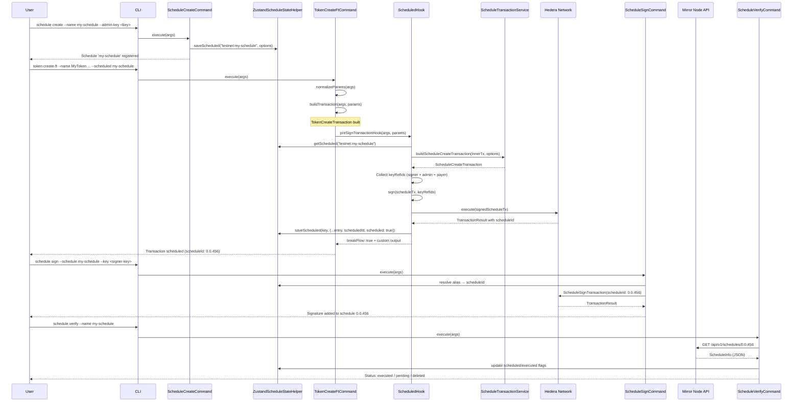
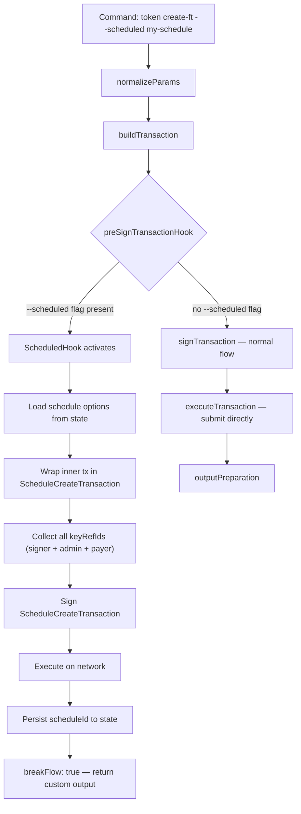

### ADR-011: Schedule Transaction Plugin

- Status: Proposed
- Date: 2026-03-26
- Related: `src/plugins/schedule/*`, `src/plugins/account/hooks/schedule-create/*`, `src/plugins/account/hooks/schedule-update/*`, `src/core/services/schedule-transaction/*`, `src/core/services/mirrornode/*`, `src/core/commands/command.ts`, `src/core/hooks/abstract-hook.ts`, `docs/adr/ADR-001-plugin-architecture.md`, `docs/adr/ADR-009-class-based-handler-and-hook-architecture.md`, `docs/adr/ADR-010-batch-transaction-plugin.md`

## Context

Hedera supports scheduled transactions via [HIP-423](https://hips.hedera.com/hip/hip-423), which allow a transaction to be deferred until all required signatures are collected. This is useful when a transaction requires approval from multiple parties (e.g. multi-sig accounts, treasury operations) and the signers are not all available at the same time.

The CLI already supports individual commands for token, topic, account, and HBAR operations, each building and executing transactions immediately. To support scheduled workflows we need:

1. A way to **register** schedule options (admin key, execution payer, memo, expiration, wait-for-expiry) in local state before any transaction is wrapped.
2. A **hook** that intercepts any supported command's built transaction and wraps it in a `ScheduleCreateTransaction`, submitting it to the network as a scheduled entity rather than executing it directly.
3. A way to **sign** a pending scheduled transaction with additional keys, collecting the signatures required for eventual execution.
4. A way to **delete** a pending scheduled transaction from the network (requires an admin key) — with smart state-only cleanup when the schedule is not yet on-chain or already executed.
5. A way to **verify** the on-chain status of a scheduled transaction (executed, deleted, expiration) via the Mirror Node REST API — particularly important when `waitForExpiry` is enabled.

This ADR builds on the class-based command system and hook architecture defined in ADR-009, and follows the same plugin-plus-hook pattern established by the batch transaction plugin in ADR-010.

## Decision

### Part 1: Schedule Plugin Structure

The schedule plugin is located at `src/plugins/schedule/` and exposes four commands (`create`, `sign`, `delete`, `verify`) and one hook (`scheduled`).

```
src/plugins/schedule/
├── index.ts
├── manifest.ts
├── schema.ts
├── zustand-state-helper.ts
├── schedule-helper.ts
├── shared/
│   └── types.ts
├── hooks/
│   └── scheduled/
│       ├── handler.ts
│       ├── input.ts
│       ├── output.ts
│       └── types.ts
├── commands/
│   ├── create/
│   │   ├── handler.ts
│   │   ├── index.ts
│   │   ├── input.ts
│   │   └── output.ts
│   ├── sign/
│   │   ├── handler.ts
│   │   ├── index.ts
│   │   ├── input.ts
│   │   ├── output.ts
│   │   └── types.ts
│   ├── delete/
│   │   ├── handler.ts
│   │   ├── index.ts
│   │   ├── input.ts
│   │   ├── output.ts
│   │   └── types.ts
│   └── verify/
│       ├── handler.ts
│       ├── index.ts
│       ├── input.ts
│       └── output.ts
└── __tests__/
    └── unit/
```

### Part 2: State Model

Schedule state is persisted via Zustand under the namespace `schedule-transactions`. The schema is defined in `src/plugins/schedule/schema.ts`:

```ts
export const SCHEDULE_NAMESPACE = 'schedule-transactions';

export const ScheduledTransactionDataSchema = z.object({
  name: AliasNameSchema,
  scheduledId: EntityIdSchema.optional(),
  network: z.enum(SupportedNetwork),
  keyManager: KeyManagerTypeSchema,
  adminKeyRefId: KeyReferenceSchema.optional(),
  adminPublicKey: PublicKeyDefinitionSchema.optional(),
  payerAccountId: EntityIdSchema.optional(),
  payerKeyRefId: KeyReferenceSchema.optional(),
  memo: z.string().max(100).optional(),
  expirationTime: z.string().optional(),
  waitForExpiry: z.boolean().default(false),
  scheduled: z.boolean().default(false),
  executed: z.boolean().default(false),
  normalizedParams: z
    .record(z.string(), z.unknown())
    .default({})
    .optional()
    .describe(
      'Normalized params from the command that produced this transaction',
    ),
  createdAt: z.string().optional(),
});
```

| Field              | Type                      | Purpose                                                                                  |
| ------------------ | ------------------------- | ---------------------------------------------------------------------------------------- |
| `name`             | `string`                  | Unique schedule alias (validated with `AliasNameSchema`)                                 |
| `scheduledId`      | `string?`                 | On-chain schedule entity ID (set after `ScheduleCreateTransaction` succeeds)             |
| `network`          | `SupportedNetwork`        | Network the schedule belongs to (`testnet`, `mainnet`, `localnet`)                       |
| `keyManager`       | `string`                  | Key manager used to resolve keys (`local` or `local_encrypted`)                          |
| `adminKeyRefId`    | `string?`                 | KMS reference for the admin key (enables delete; omit for immutable schedules)           |
| `adminPublicKey`   | `string?`                 | Public key string for the admin key                                                      |
| `payerAccountId`   | `string?`                 | Account that pays execution fees for the scheduled transaction                           |
| `payerKeyRefId`    | `string?`                 | KMS reference for the payer's key (needed for extra signing in the hook)                 |
| `memo`             | `string?`                 | Public schedule memo (max 100 bytes)                                                     |
| `expirationTime`   | `string?`                 | ISO 8601 expiration time (max 62 days from creation)                                     |
| `waitForExpiry`    | `boolean`                 | If `true`, execution is deferred until expiration even when all signatures are collected |
| `scheduled`        | `boolean`                 | Whether the `ScheduleCreateTransaction` has been submitted                               |
| `executed`         | `boolean`                 | Whether the scheduled transaction has been executed on-chain                             |
| `normalizedParams` | `Record<string, unknown>` | Normalized params from the command that produced the inner transaction                   |
| `createdAt`        | `string?`                 | ISO timestamp of local record creation                                                   |

**Storage key:** Schedule entries are stored using `composeKey(network, name)` (e.g. `testnet:my-schedule`) for per-network isolation.

State access is encapsulated in `ZustandScheduleStateHelper` with methods: `saveScheduled`, `getScheduled`, `hasScheduled`, `listScheduled`, `deleteScheduled`.

### Part 3: Schedule ID Resolution — `ScheduleHelper`

Schedule ID resolution is centralized in `ScheduleHelper` (`src/plugins/schedule/schedule-helper.ts`), which depends on `StateService`, `HederaMirrornodeService`, and `Logger` (no `CoreApi` dependency).

`ScheduleHelper` provides two resolution strategies:

1. **`resolveScheduleIdByEntityReference`** — used by `sign` and `delete` commands. Accepts a unified `ScheduleReferenceObjectSchema` value (which can be either an entity ID like `0.0.x` or a local alias). When the reference is an alias, it reads from local state. When it's an entity ID, it queries the Mirror Node REST API (`GET /api/v1/schedules/{scheduleId}`) to confirm the schedule exists and determine execution status.

2. **`resolveScheduleIdFromArgs`** — legacy method that accepts separate `name?` / `scheduleId?` fields.

```ts
export class ScheduleHelper {
  constructor(
    private readonly state: StateService,
    private readonly mirror: HederaMirrornodeService,
    private readonly logger: Logger,
  ) {}

  async resolveScheduleIdByEntityReference(
    params: ScheduleHelperResolveParams,
  ): Promise<ResolvedSchedule> {
    if (params.type === EntityReferenceType.ALIAS) {
      const scheduleState = new ZustandScheduleStateHelper(
        this.state,
        this.logger,
      );
      const key = composeKey(params.network, params.scheduleReference);
      const entry = scheduleState.getScheduled(key);
      if (!entry) {
        throw new NotFoundError(
          `No saved schedule found for name: ${params.scheduleReference}`,
        );
      }
      return {
        name: entry.name,
        scheduleId: entry.scheduledId,
        scheduled: entry.scheduled,
        executed: entry.executed,
      };
    } else {
      const response = await this.mirror.getScheduled(params.scheduleReference);
      return {
        scheduleId: response.schedule_id,
        scheduled: true,
        executed: !!response.executed_timestamp,
      };
    }
  }
}
```

The `ResolvedSchedule` type contains `name?`, `scheduleId?`, `scheduled`, and `executed`, allowing commands to make decisions based on schedule state (e.g. delete can skip on-chain submission if the schedule was never submitted or already executed).

### Part 4: Create Command

`ScheduleCreateCommand` implements the `Command` interface directly (not `BaseTransactionCommand`) because it does not submit a network transaction — it only persists schedule options in local state for later use by the `scheduled` hook.

The input schema uses `KeySchema` for `adminKey` and `payerAccount` (both optional), `MemoSchema`, `ScheduleExpirationSchema` (which validates ISO 8601, enforces max 62 days), and `WaitForExpirySchema`.

```ts
export class ScheduleCreateCommand implements Command {
  async execute(args: CommandHandlerArgs): Promise<CommandResult> {
    const { api, logger } = args;
    const scheduleState = new ZustandScheduleStateHelper(api.state, logger);
    const validArgs = ScheduleCreateInputSchema.parse(args.args);
    const name = validArgs.name;
    const network = api.network.getCurrentNetwork();

    if (scheduleState.hasScheduled(composeKey(network, name))) {
      throw new ValidationError(
        `Schedule with name '${name}' already exists on this network`,
      );
    }

    // Resolve payer account credentials and admin signing key from KeySchema
    // (already parsed by Zod — no double KeySchema.parse())
    let payerCredential, admin;
    if (validArgs.payerAccount) {
      payerCredential = await api.keyResolver.resolveAccountCredentials(
        validArgs.payerAccount,
        keyManager,
        true,
      );
    }
    if (validArgs.adminKey) {
      admin = await api.keyResolver.resolveSigningKey(
        validArgs.adminKey,
        keyManager,
        false,
        ['schedule:admin'],
      );
    }

    scheduleState.saveScheduled(composeKey(network, name), {
      name,
      network,
      keyManager,
      adminKeyRefId: admin?.keyRefId,
      adminPublicKey: admin?.publicKey,
      payerAccountId: payerCredential?.accountId,
      payerKeyRefId: payerCredential?.keyRefId,
      memo,
      expirationTime: expirationTime?.toISOString(),
      waitForExpiry,
      scheduled: false,
      executed: false,
      createdAt: new Date().toISOString(),
    });

    return {
      result: {
        name,
        network,
        payerAccountId,
        adminPublicKey,
        memo,
        expirationTime,
        waitForExpiry,
      },
    };
  }
}
```

CLI usage: `hcli schedule create --name my-schedule --admin-key <key> --payer-account <account> --memo "transfer approval" --expiration 2026-04-01T00:00:00Z --wait-for-expiry`

### Part 5: ScheduledHook (Core Mechanism)

The `ScheduledHook` is the central mechanism that enables any supported command to produce a scheduled transaction instead of executing immediately. It extends `AbstractHook` and operates analogously to the `BatchifyHook` from ADR-010.

**Key architectural difference from ADR-010:** The `ScheduledHook` uses **only** `preSignTransactionHook` and **returns `breakFlow: true`**. It builds, signs, executes, and persists the `ScheduleCreateTransaction` entirely within the hook, then breaks the flow so the original command does not also execute. This is because the wrapped transaction needs additional key signatures (admin, payer) that the original command's `signTransaction` phase would not know about.

**Owner:** Schedule plugin (`src/plugins/schedule/hooks/scheduled/handler.ts`)

**Purpose:** Intercept the built transaction from any registered command, wrap it in a `ScheduleCreateTransaction` with the stored schedule options, sign it with all required keys (command signer + admin + payer), execute it, persist the resulting `scheduleId` to state, and break the flow with a custom output.

**Registration in schedule plugin manifest:**

```ts
hooks: [
  {
    name: 'scheduled',
    hook: new ScheduledHook(),
    options: [
      {
        name: 'scheduled',
        short: 'X',
        type: OptionType.STRING,
        description:
          'Local schedule name (from schedule create). Wraps this command transaction in ScheduleCreateTransaction with stored options.',
      },
    ],
  },
],
```

**Hook implementation:**

```ts
export class ScheduledHook extends AbstractHook {
  override async preSignTransactionHook(
    args: CommandHandlerArgs,
    params: PreSignTransactionParams<
      ScheduledNormalizedParams,
      BaseBuildTransactionResult
    >,
    _commandName: string,
  ): Promise<HookResult> {
    const { api, logger } = args;
    const scheduledState = new ZustandScheduleStateHelper(api.state, logger);
    const validArgs = ScheduledInputSchema.parse(args.args);
    const scheduledName = validArgs.scheduled;
    const network = api.network.getCurrentNetwork();

    if (!scheduledName) {
      return Promise.resolve({
        breakFlow: false,
        result: { message: 'No "scheduled" parameter found' },
      });
    }

    const key = composeKey(network, scheduledName);
    const scheduledRecord = scheduledState.getScheduled(key);
    if (!scheduledRecord)
      throw new NotFoundError(`Scheduled not found for name ${scheduledName}`);
    if (scheduledRecord.scheduled)
      throw new ValidationError('Transaction is already scheduled');

    // Build ScheduleCreateTransaction wrapping the inner transaction
    const scheduleTx = api.schedule.buildScheduleCreateTransaction({
      innerTransaction: params.buildTransactionResult.transaction,
      payerAccountId: scheduledRecord.payerAccountId,
      adminKey: scheduledRecord.adminPublicKey,
      scheduleMemo: scheduledRecord.memo,
      expirationTime: scheduledRecord.expirationTime
        ? new Date(scheduledRecord.expirationTime)
        : undefined,
      waitForExpiry: scheduledRecord.waitForExpiry,
    });

    // Collect all required key references (command signer + admin + payer)
    const keyRefIds = params.normalisedParams.keyRefIds;
    if (scheduledRecord.adminKeyRefId)
      keyRefIds.push(scheduledRecord.adminKeyRefId);
    if (scheduledRecord.payerKeyRefId)
      keyRefIds.push(scheduledRecord.payerKeyRefId);

    // Sign and execute within the hook
    const signedTx = await api.txSign.sign(scheduleTx, keyRefIds);
    const result = await api.txExecute.execute(signedTx);

    if (!result.success)
      throw new TransactionError(
        `Failed to schedule (txId: ${result.transactionId})`,
        false,
      );
    if (!result.scheduleId)
      throw new StateError(
        'Transaction completed but did not return a schedule ID',
      );

    // Persist scheduleId and normalized params to state
    scheduledState.saveScheduled(key, {
      ...scheduledRecord,
      scheduledId: result.scheduleId,
      normalizedParams: params.normalisedParams,
      scheduled: true,
      executed: false,
    });

    return Promise.resolve({
      breakFlow: true,
      result: {
        scheduledName,
        scheduledId: result.scheduleId,
        network,
        transactionId: result.transactionId,
      },
      schema: ScheduledOutputSchema,
      humanTemplate: SCHEDULED_TEMPLATE,
    });
  }
}
```

**How the `--scheduled` flag reaches the hook:** The `scheduled` hook declares a `scheduled` option in its `HookSpec.options`. When a command lists `'scheduled'` in its `registeredHooks`, `PluginManager` automatically injects the `--scheduled` / `-X` option into that command (as non-required). If the user passes `--scheduled my-schedule`, the hook detects it in `args.args.scheduled` (parsed via `ScheduledInputSchema`) and activates the wrapping logic. If absent, the hook is a no-op and the command executes normally.

**Comparison with BatchifyHook:**

| Aspect                | BatchifyHook (ADR-010)                                | ScheduledHook (ADR-011)                                                        |
| --------------------- | ----------------------------------------------------- | ------------------------------------------------------------------------------ |
| Lifecycle points used | `preSignTransactionHook`, `preExecuteTransactionHook` | `preSignTransactionHook` only                                                  |
| Flow control          | `breakFlow: true` — prevents on-chain execution       | `breakFlow: true` — hook handles sign + execute + state persistence internally |
| Transaction wrapping  | Sets batch key on inner tx for later batch submission | Wraps inner tx in `ScheduleCreateTransaction` and executes immediately         |
| State persistence     | Serializes tx bytes to batch state                    | Persists `scheduleId` from receipt after execution                             |
| CLI flag              | `--batch` / `-B`                                      | `--scheduled` / `-X`                                                           |
| On-chain effect       | None (deferred to `batch execute`)                    | Submits `ScheduleCreateTransaction` immediately                                |
| Extra signatures      | N/A                                                   | Adds admin key + payer key refs to the signing set                             |

### Part 6: Sign, Delete, and Verify Commands

These three commands manage the lifecycle of a scheduled transaction after it has been created on-chain.

#### 6.1 Sign Command

`ScheduleSignCommand` extends `BaseTransactionCommand` (ADR-009) and submits a `ScheduleSignTransaction` to add a required signature to an existing scheduled transaction.

The input uses a unified `ScheduleReferenceObjectSchema` (`--schedule` flag) that accepts either an entity ID (`0.0.x`) or a local alias. When an entity ID is provided, the command queries the Mirror Node to verify the schedule exists and checks `scheduled` / `executed` status before proceeding.

| Phase                | Responsibility                                                                                    |
| -------------------- | ------------------------------------------------------------------------------------------------- |
| `normalizeParams`    | Parse input via `ScheduleReferenceObjectSchema`, resolve via `ScheduleHelper`, validate status    |
| `buildTransaction`   | `api.schedule.buildScheduleSignTransaction({ scheduleId })`                                       |
| `signTransaction`    | Sign with the signer's `keyRefId` via `keyRefIds` array                                           |
| `executeTransaction` | Submit via `api.txExecute.execute`; throw `TransactionError` on failure                           |
| `outputPreparation`  | Return `scheduleId`, `transactionId`, `network`, optional `name` (when resolved from local alias) |

```ts
export class ScheduleSignCommand extends BaseTransactionCommand<
  ScheduleSignNormalisedParams,
  ScheduleSignBuildTransactionResult,
  ScheduleSignSignTransactionResult,
  ScheduleSignExecuteTransactionResult
> {
  async normalizeParams(
    args: CommandHandlerArgs,
  ): Promise<ScheduleSignNormalisedParams> {
    const validArgs = ScheduleSignInputSchema.parse(args.args);
    const currentNetwork = api.network.getCurrentNetwork();
    const scheduleHelper = new ScheduleHelper(
      api.state,
      api.mirror,
      api.logger,
    );
    const schedule = await scheduleHelper.resolveScheduleIdByEntityReference({
      scheduleReference: validArgs.schedule.value,
      type: validArgs.schedule.type,
      network: currentNetwork,
    });

    // Validate schedule is on-chain and not already executed
    if (!schedule.scheduled)
      throw new ValidationError(
        `Schedule has not been yet submitted on Hedera network`,
      );
    if (schedule.executed)
      throw new ValidationError(`Schedule is already executed`);
    if (!schedule.scheduleId)
      throw new ValidationError(`Couldn't resolve schedule ID for signing`);

    // KeySchema already parsed key to Credential — pass directly, no double parse
    const signer = await api.keyResolver.resolveSigningKey(
      validArgs.key,
      keyManager,
      false,
      ['schedule:signer'],
    );

    return {
      scheduleName: schedule.name,
      scheduleId: schedule.scheduleId,
      scheduled: schedule.scheduled,
      executed: schedule.executed,
      network: currentNetwork,
      keyManager,
      signer,
      keyRefIds: [signer.keyRefId],
    };
  }
}
```

**Human-readable output template:**

```handlebars
✅ Schedule signed successfully:
{{hashscanLink scheduleId 'scheduled' network}}
{{#if name}}
  Name:
  {{name}}
{{/if}}
Transaction ID:
{{hashscanLink transactionId 'transaction' network}}
```

CLI usage: `hcli schedule sign --schedule my-schedule --key <signer-key>`
or: `hcli schedule sign --schedule 0.0.8452958 --key <signer-key>`

#### 6.2 Delete Command

`ScheduleDeleteCommand` extends `BaseTransactionCommand` and submits a `ScheduleDeleteTransaction`. It **overrides `execute()`** to add smart pre-flight logic: if the schedule was never submitted on-chain or is already executed, it performs a **state-only delete** without sending a network transaction.

```ts
export class ScheduleDeleteCommand extends BaseTransactionCommand<...> {
  override async execute(args: CommandHandlerArgs): Promise<CommandResult> {
    const validArgs = ScheduleDeleteInputSchema.parse(args.args);
    const scheduleHelper = new ScheduleHelper(api.state, api.mirror, api.logger);
    const schedule = await scheduleHelper.resolveScheduleIdByEntityReference({
      scheduleReference: validArgs.schedule.value,
      type: validArgs.schedule.type,
      network,
    });

    const submitOnChainDelete = schedule.scheduled && !schedule.executed;

    if (!submitOnChainDelete) {
      // State-only delete: remove from local state, skip on-chain transaction
      stateHelper.deleteScheduled(composeKey(network, schedule.name));
      return { result: { name: schedule.name, scheduleId: schedule.scheduleId, network } };
    }

    return super.execute(args); // Proceeds to normalizeParams → build → sign → execute → output
  }

  async normalizeParams(args: CommandHandlerArgs): Promise<ScheduleDeleteNormalisedParams> {
    // KeySchema already parsed adminKey to Credential — pass directly
    const admin = await api.keyResolver.resolveSigningKey(validArgs.adminKey, keyManager, false, ['schedule:admin']);
    return {
      scheduleName: schedule.name,
      scheduleId: schedule.scheduleId,
      scheduled: schedule.scheduled,
      executed: schedule.executed,
      network: currentNetwork,
      keyManager, admin,
      keyRefIds: [admin.keyRefId],
    };
  }

  async outputPreparation(...): Promise<CommandResult> {
    // After successful on-chain delete, also remove from local state
    if (normalisedParams.scheduleName) {
      stateHelper.deleteScheduled(composeKey(network, scheduleName));
    }
    return { result: { name: displayName, scheduleId, transactionId, network } };
  }
}
```

**Human-readable output template:**

```handlebars
✅ Scheduled record deleted successfully:
{{hashscanLink scheduleId 'scheduled' network}}
Name:
{{name}}
{{#if transactionId}}
  Transaction ID:
  {{hashscanLink transactionId 'transaction' network}}
{{/if}}
```

CLI usage: `hcli schedule delete --schedule my-schedule --admin-key <admin-key>`

#### 6.3 Verify Command

`ScheduleVerifyCommand` implements the `Command` interface directly (not `BaseTransactionCommand`) because it performs a **query** rather than a transaction. It uses the **Mirror Node REST API** (`GET /api/v1/schedules/{scheduleId}`) via `api.mirror.getScheduled()` to fetch the current state of a scheduled transaction.

When `--name` is provided:

- If a state record exists, verify updates `scheduled` and `executed` flags in local state.
- If no state record exists but a name is given, verify **creates** a new state record from the Mirror Node response, resolving admin and payer keys.

**Verify hooks (domain state):** The `schedule verify` command lists `registeredHooks` such as `account-create-schedule-state` and `account-update-schedule-state`. When an existing record was not yet marked executed and Mirror reports `executed_timestamp`, verify saves the updated record and invokes `AbstractHook.customHandlerHook` so account plugins can persist state: they call `api.mirror.getTransactionRecord(formatTransactionIdToDashFormat(innerTransactionId))` and use the Mirror row where `scheduled === true` (with `entity_id` / `result`) to validate the inner transaction.

```ts
export class ScheduleVerifyCommand implements Command {
  async execute(args: CommandHandlerArgs): Promise<CommandResult> {
    const validArgs = ScheduleVerifyInputSchema.parse(args.args);
    const stateHelper = new ZustandScheduleStateHelper(api.state, api.logger);
    const scheduleName = validArgs.name;
    const scheduleId = validArgs.scheduleId;
    const network = api.network.getCurrentNetwork();

    // Resolve schedule ID from name (state lookup) or use provided ID
    let scheduleRecord;
    if (scheduleName) {
      scheduleRecord = stateHelper.getScheduled(composeKey(network, scheduleName));
    }
    const resolvedScheduleId = scheduleRecord?.scheduledId ?? scheduleId;
    if (!resolvedScheduleId) throw new NotFoundError(`Schedule ID is missing`);

    // Query Mirror Node REST API
    const scheduleResponse = await api.mirror.getScheduled(resolvedScheduleId);

    // Update or create local state record; run registered verify hooks when execution first completes
    if (scheduleRecord && !scheduleRecord.executed) {
      const updatedScheduledRecord = {
        ...scheduleRecord,
        scheduled: true,
        executed: !!scheduleResponse.executed_timestamp,
      };
      stateHelper.saveScheduled(
        composeKey(network, scheduleRecord.name),
        updatedScheduledRecord,
      );
      if (updatedScheduledRecord.executed && updatedScheduledRecord.command) {
        await this.customHandlerHook(args, {
          customHandlerParams: { scheduledData: updatedScheduledRecord },
        });
      }
    } else if (scheduleName) {
      // Import schedule from Mirror Node into local state
      // Resolves payer and admin key references from the response
      stateHelper.saveScheduled(composeKey(network, scheduleName), { ... });
    }

    return {
      result: {
        scheduleId: resolvedScheduleId,
        network,
        name: scheduleName,
        executedAt: scheduleResponse.executed_timestamp ? hederaTimestampToIso(...) : undefined,
        deleted: scheduleResponse.deleted,
        waitForExpiry: scheduleResponse.wait_for_expiry,
        scheduleMemo: scheduleResponse.memo,
        expirationTime: scheduleResponse.expiration_time ? hederaTimestampToIso(...) : undefined,
        payerAccountId: scheduleResponse.payer_account_id,
      },
    };
  }
}
```

**Human-readable output template:**

```handlebars
✅ Schedule verified:
{{hashscanLink scheduleId 'scheduled' network}}
{{#if name}}
  Name:
  {{name}}
{{/if}}
{{#if executedAt}}
  Executed:
  {{executedAt}}
{{/if}}
Deleted:
{{deleted}}
Wait for expiry:
{{waitForExpiry}}
{{#if scheduleMemo}}
  Memo:
  {{scheduleMemo}}
{{/if}}
{{#if expirationTime}}
  Expiration:
  {{expirationTime}}
{{/if}}
{{#if payerAccountId}}
  Payer:
  {{payerAccountId}}
{{/if}}
```

CLI usage: `hcli schedule verify --name my-schedule`
or: `hcli schedule verify --schedule-id 0.0.456`

### Part 7: Mirror Node Integration

The `verify` command queries the Hedera Mirror Node REST API rather than the SDK's `ScheduleInfoQuery`. This avoids the need for a `Client` instance and leverages the existing `HederaMirrornodeService` infrastructure.

**New service method:** `getScheduled(scheduleId: string): Promise<ScheduleInfo>` on `HederaMirrornodeService`, calling `GET /api/v1/schedules/{scheduleId}`.

**Zod schemas:** `ScheduleInfoSchema` and `ScheduleSignatureInfoSchema` in `src/core/services/mirrornode/schemas.ts` validate the Mirror Node response, following the same `parseWithSchema` pattern as `getTokenInfo`.

**Types:** `ScheduleInfo` and `ScheduleSignatureInfo` in `src/core/services/mirrornode/types.ts`.

**Transaction records:** Domain hooks that need the inner transaction after execution use `getTransactionRecord(transactionId, nonce?)` (`GET /api/v1/transactions/{transactionId}`). Pass the inner transaction id in the **dash** path form (see `formatTransactionIdToDashFormat` in core utils), not the SDK `@` form.

```ts
export interface ScheduleInfo {
  admin_key?: MirrorNodeTokenKey | null;
  consensus_timestamp: string;
  creator_account_id: string;
  deleted: boolean;
  executed_timestamp?: string | null;
  expiration_time?: string | null;
  memo: string;
  payer_account_id: string;
  schedule_id: string;
  signatures?: ScheduleSignatureInfo[];
  transaction_body?: string;
  wait_for_expiry: boolean;
}
```

### Part 8: ScheduleTransactionService

The core service at `src/core/services/schedule-transaction/` wraps the Hedera SDK schedule transaction classes:

```ts
export interface ScheduleTransactionService {
  buildScheduleCreateTransaction(
    params: ScheduleCreateParams,
  ): ScheduleCreateTransaction;
  buildScheduleSignTransaction(
    params: ScheduleSignTransactionParams,
  ): ScheduleSignTransaction;
  buildScheduleDeleteTransaction(
    params: ScheduleDeleteTransactionParams,
  ): ScheduleDeleteTransaction;
}
```

```ts
export interface ScheduleCreateParams {
  innerTransaction: Transaction;
  payerAccountId?: string;
  adminKey?: string;
  scheduleMemo?: string;
  expirationTime?: Date;
  waitForExpiry: boolean;
}
```

The implementation uses `ScheduleCreateTransaction.setScheduledTransaction()`, `setWaitForExpiry()`, and conditionally sets `setPayerAccountId()`, `setAdminKey()`, `setScheduleMemo()`, and `setExpirationTime(Timestamp.fromDate(...))`.

The service is wired into `CoreApi` as `api.schedule` and only depends on `Logger`.

**Receipt mapping:** `src/core/utils/receipt-mapper.ts` reads `receipt.scheduleId` and passes it through on `TransactionResult.scheduleId`. This is how the `ScheduledHook` reads the schedule entity ID after execution.

### Part 9: Input Schemas — `ScheduleReferenceObjectSchema`

The `sign` and `delete` commands use `ScheduleReferenceObjectSchema` from `src/core/schemas/common-schemas.ts` for their `--schedule` argument. This schema accepts a string and transforms it into a discriminated union:

```ts
export const ScheduleReferenceObjectSchema = z
  .string()
  .trim()
  .min(1, 'Schedule identifier cannot be empty')
  .transform((val): { type: EntityReferenceType; value: string } => {
    if (EntityIdSchema.safeParse(val).success) {
      return { type: EntityReferenceType.ENTITY_ID, value: val };
    }
    if (AliasNameSchema.safeParse(val).success) {
      return { type: EntityReferenceType.ALIAS, value: val };
    }
    throw new ValidationError(
      'Schedule reference must be a valid Hedera ID (0.0.xxx) or alias name',
    );
  });
```

**Important:** Since `KeySchema` and `ScheduleReferenceObjectSchema` are Zod `.transform()` schemas, the parsed output is already the transformed type (e.g. `Credential` for keys, `{ type, value }` for schedule references). Handlers must **not** double-parse with `KeySchema.parse(validArgs.key)` — this would fail with "expected string, received object".

## Execution Flow

### Full Schedule Lifecycle



### ScheduledHook Interception Detail



## Pros and Cons

### Pros

- **Non-intrusive scheduling.** The `ScheduledHook` intercepts existing commands at `preSignTransactionHook` without modifying the command's own code. Adding schedule support to a new command only requires listing `'scheduled'` in the command's `registeredHooks` — the `--scheduled` option is injected automatically via hook option injection (ADR-009).
- **Leverages ADR-009 architecture.** The hook uses the established `AbstractHook` lifecycle, `HookResult` flow control, command-driven hook registration (`registeredHooks`), and hook option injection, requiring no changes to the core framework.
- **Familiar pattern.** The plugin structure, state model, and hook approach mirror the batch plugin (ADR-010), making it straightforward for developers already familiar with the codebase.
- **Complete lifecycle management.** The four commands (`create`, `sign`, `delete`, `verify`) cover the entire scheduled transaction lifecycle: registration, submission via hook, additional signature collection, cancellation (with smart state-only cleanup), and status verification via Mirror Node.
- **Immediate on-chain submission.** The scheduled hook wraps and submits the `ScheduleCreateTransaction` immediately, giving the user an on-chain `scheduleId` right away. Error handling is straightforward — the user knows immediately whether the schedule was created successfully.
- **Smart delete.** The delete command checks whether the schedule was submitted and not yet executed before sending an on-chain delete. State-only entries and already-executed schedules are cleaned up locally without a network transaction.
- **Mirror Node verification.** The verify command uses the REST API rather than an SDK query, avoiding `Client` management. It can also **import** a schedule from the network into local state when given a `--name`, bridging the gap between on-chain and local state.
- **Unified schedule reference.** The `sign` and `delete` commands use `ScheduleReferenceObjectSchema`, accepting either `0.0.x` entity IDs or local aliases in a single `--schedule` flag. Entity IDs are verified against the Mirror Node; aliases are resolved from local state.
- **Coexistence with batch.** Commands can register both `'batchify'` and `'scheduled'` hooks simultaneously. The hooks are independent — the user activates one at a time via `--batch` or `--scheduled` flags.

### Cons

- **Multi-step UX complexity.** Scheduling a transaction requires at least two commands (`schedule create` + original command with `--scheduled`), plus additional `schedule sign` calls for each required signer.
- **State–network divergence.** Local state tracks whether a schedule has been created (`scheduledId` present) but may become stale if the schedule is deleted or executed externally. The `verify` command mitigates this but requires manual invocation.
- **waitForExpiry uncertainty.** When `waitForExpiry` is `true`, the user has no feedback on whether all required signatures have been collected until expiration time passes and they run `schedule verify`. There is no notification mechanism.
- **No automatic state cleanup.** If a scheduled transaction expires without execution or is deleted externally, the local state entry remains. Manual cleanup via `schedule delete` (which handles state-only cleanup) or `schedule verify` (which updates flags) is needed.

## Consequences

- Commands that produce transactions and need schedule support must:
  1. Be migrated to `BaseTransactionCommand` (per ADR-009) so they participate in the hook lifecycle.
  2. Include `'scheduled'` in their `registeredHooks` array. The `--scheduled` option is then injected automatically.
  3. Expose `keyRefIds` on their normalized params (`BaseNormalizedParams`) so the hook can append admin/payer key references.
- The `ScheduleTransactionService` is wired into `CoreApi` as `api.schedule`, alongside existing services.
- `HederaMirrornodeService` gains a `getScheduled` method querying `GET /api/v1/schedules/{scheduleId}`, with `ScheduleInfoSchema` / `ScheduleSignatureInfoSchema` Zod schemas for response validation. Account schedule verify hooks additionally use `getTransactionRecord` for the inner transaction id after execution.
- `TransactionResult` in `src/core/types/shared.types.ts` includes an optional `scheduleId` field, and `receipt-mapper.ts` populates it from the SDK receipt.
- The `verify` command should be used to check the status of scheduled transactions with `waitForExpiry: true`, since execution is deferred and no automatic notification is provided.
- Zod `.transform()` schemas (`KeySchema`, `ScheduleReferenceObjectSchema`) produce parsed objects — handlers must pass the parsed value directly to service methods rather than double-parsing.

## Testing Strategy

- **Unit: ScheduleCreateCommand.** Test that a schedule entry is created in state with the correct name, network, and options. Verify `ValidationError` when a duplicate name is used on the same network.
- **Unit: ScheduleSignCommand phases.** Test each `BaseTransactionCommand` phase independently:
  - `normalizeParams`: verify `ValidationError` for not-yet-submitted schedule, already-executed schedule, and unresolvable schedule ID. Verify Mirror Node is queried when entity ID is provided directly.
  - `buildTransaction`: verify `ScheduleSignTransaction` is built with the correct `scheduleId`.
  - `signTransaction`: verify the transaction is signed with the correct signer `keyRefId` via `keyRefIds`.
  - `executeTransaction`: verify `TransactionError` on failed submission.
  - `outputPreparation`: verify output includes optional `name` only when resolved from alias.
- **Unit: ScheduleDeleteCommand phases.** Test the `execute()` override: state-only delete when `scheduled === false` or `executed === true`; on-chain delete path (via `super.execute()`) otherwise. Test `outputPreparation` removes local state entry after successful on-chain delete.
- **Unit: ScheduleVerifyCommand.** Mock `api.mirror.getScheduled()` response and verify that the output includes correct `executedAt`, `deleted` (boolean), `waitForExpiry`, `scheduleMemo`, `expirationTime`, and `payerAccountId` values. Verify state is updated when `--name` is provided. Verify new state record is created when a name is given but no existing state record exists. When testing hook integration, mock `getTransactionRecord` with a `transactions` entry where `scheduled: true` for account schedule-state hooks.
- **Unit: ScheduledHook.** Invoke `preSignTransactionHook` with mock args containing `--scheduled` flag. Assert that the hook builds, signs, and executes the `ScheduleCreateTransaction`, persists `scheduleId` to state, and returns `breakFlow: true` with `ScheduledOutputSchema`. Invoke without `--scheduled` flag and assert `breakFlow: false`.
- **Unit: ScheduleHelper.** Test `resolveScheduleIdByEntityReference` for alias resolution (state lookup), entity ID resolution (Mirror Node query), and EVM address rejection. Test `resolveScheduleIdFromArgs` for error when both/neither args provided.
- **Unit: ScheduleTransactionService.** Verify that `buildScheduleCreateTransaction` correctly sets `scheduledTransaction`, `waitForExpiry`, and optional fields (payer, admin key, memo, expiration). Verify `buildScheduleSignTransaction` and `buildScheduleDeleteTransaction` set the correct `scheduleId`.
- **Unit: Mirror Node getScheduled.** Verify correct URL construction, Zod schema parsing, 404 → `NotFoundError`, and network error handling.
- **Unit: Schema validation.** Test `ScheduledTransactionDataSchema` with valid and invalid inputs, including expiration boundary (62 days).
- **Integration: Full schedule lifecycle.** Create a schedule, run a command with `--scheduled` flag (verifying wrapping and on-chain submission), add signatures via `schedule sign`, then verify status via `schedule verify`.
- **Integration: Hook option injection.** Verify that commands with `registeredHooks: ['batchify', 'scheduled']` automatically gain both `--batch` / `-B` and `--scheduled` / `-X` options.
