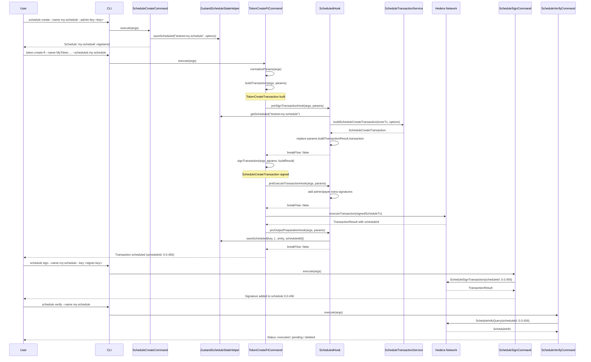
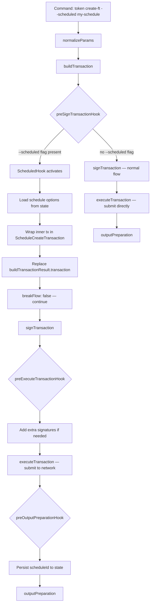

### ADR-011: Schedule Transaction Plugin

- Status: Proposed
- Date: 2026-03-26
- Related: `src/plugins/schedule/*`, `src/core/services/schedule-transaction/*`, `src/core/commands/command.ts`, `src/core/hooks/abstract-hook.ts`, `docs/adr/ADR-001-plugin-architecture.md`, `docs/adr/ADR-009-class-based-handler-and-hook-architecture.md`, `docs/adr/ADR-010-batch-transaction-plugin.md`

## Context

Hedera supports scheduled transactions via [HIP-423](https://hips.hedera.com/hip/hip-423), which allow a transaction to be deferred until all required signatures are collected. This is useful when a transaction requires approval from multiple parties (e.g. multi-sig accounts, treasury operations) and the signers are not all available at the same time.

The CLI already supports individual commands for token, topic, account, and HBAR operations, each building and executing transactions immediately. To support scheduled workflows we need:

1. A way to **register** schedule options (admin key, execution payer, memo, expiration, wait-for-expiry) in local state before any transaction is wrapped.
2. A **hook** that intercepts any supported command's built transaction and wraps it in a `ScheduleCreateTransaction`, submitting it to the network as a scheduled entity rather than executing it directly.
3. A way to **sign** a pending scheduled transaction with additional keys, collecting the signatures required for eventual execution.
4. A way to **delete** a pending scheduled transaction from the network (requires an admin key).
5. A way to **verify** the on-chain status of a scheduled transaction (executed, deleted, expiration) — particularly important when `waitForExpiry` is enabled, since the transaction will not execute until its expiration time even if all signatures are collected.

This ADR builds on the class-based command system and hook architecture defined in ADR-009, and follows the same plugin-plus-hook pattern established by the batch transaction plugin in ADR-010.

## Decision

### Part 1: Schedule Plugin Structure

The schedule plugin is located at `src/plugins/schedule/` and exposes four commands (`create`, `sign`, `delete`, `verify`) and one hook (`scheduled`).

```
src/plugins/schedule/
├── index.ts
├── manifest.ts
├── schema.ts
├── zustand-state-helper.ts
├── resolve-schedule-id.ts
├── hooks/
│   └── scheduled/
│       ├── handler.ts
│       ├── input.ts
│       ├── output.ts
│       └── types.ts
├── commands/
│   ├── create/
│   │   ├── handler.ts
│   │   ├── index.ts
│   │   ├── input.ts
│   │   ├── output.ts
│   │   └── types.ts
│   ├── sign/
│   │   ├── handler.ts
│   │   ├── index.ts
│   │   ├── input.ts
│   │   ├── output.ts
│   │   └── types.ts
│   ├── delete/
│   │   ├── handler.ts
│   │   ├── index.ts
│   │   ├── input.ts
│   │   ├── output.ts
│   │   └── types.ts
│   └── verify/
│       ├── handler.ts
│       ├── index.ts
│       ├── input.ts
│       └── output.ts
└── __tests__/
    └── unit/
        ├── create.test.ts
        ├── sign.test.ts
        ├── delete.test.ts
        ├── verify.test.ts
        ├── scheduled-hook.test.ts
        └── helpers/
```

### Part 2: State Model

Schedule state is persisted via Zustand under the namespace `schedule-transactions`. The schema is defined in `src/plugins/schedule/schema.ts`:

```ts
export const SCHEDULE_NAMESPACE = 'schedule-transactions';

export const ScheduledTransactionDataSchema = z.object({
  name: AliasNameSchema,
  scheduledId: EntityIdSchema.optional(),
  network: z.enum(SupportedNetwork),
  keyManager: KeyManagerTypeSchema,
  adminKeyRefId: KeyReferenceSchema.optional(),
  adminPublicKey: PublicKeyDefinitionSchema.optional(),
  payerAccountId: EntityIdSchema.optional(),
  payerKeyRefId: KeyReferenceSchema.optional(),
  memo: z.string().max(100).optional(),
  expirationTime: z.string().optional(),
  waitForExpiry: z.boolean().default(false),
  scheduled: z.boolean().default(false),
  executed: z.boolean().default(false),
  normalizedParams: z
    .record(z.string(), z.unknown())
    .default({})
    .optional()
    .describe(
      'Normalized params from the command that produced this transaction',
    ),
  createdAt: z.string().optional(),
});
```

| Field              | Type                      | Purpose                                                                                  |
| ------------------ | ------------------------- | ---------------------------------------------------------------------------------------- |
| `name`             | `string`                  | Unique schedule alias (validated with `AliasNameSchema`)                                 |
| `scheduledId`      | `string?`                 | On-chain schedule entity ID (set after `ScheduleCreateTransaction` succeeds)             |
| `network`          | `SupportedNetwork`        | Network the schedule belongs to (`testnet`, `mainnet`, `localnet`)                       |
| `keyManager`       | `string`                  | Key manager used to resolve keys (`local` or `local_encrypted`)                          |
| `adminKeyRefId`    | `string?`                 | KMS reference for the admin key (enables delete; omit for immutable schedules)           |
| `adminPublicKey`   | `string?`                 | Public key string for the admin key                                                      |
| `payerAccountId`   | `string?`                 | Account that pays execution fees for the scheduled transaction                           |
| `payerKeyRefId`    | `string?`                 | KMS reference for the payer's key (needed for extra signing in the hook)                 |
| `memo`             | `string?`                 | Public schedule memo (max 100 bytes)                                                     |
| `expirationTime`   | `string?`                 | ISO 8601 expiration time (max 62 days from creation)                                     |
| `waitForExpiry`    | `boolean`                 | If `true`, execution is deferred until expiration even when all signatures are collected |
| `scheduled`        | `boolean`                 | Whether the `ScheduleCreateTransaction` has been submitted                               |
| `executed`         | `boolean`                 | Whether the scheduled transaction has been executed on-chain                             |
| `normalizedParams` | `Record<string, unknown>` | Normalized params from the command that produced the inner transaction                   |
| `createdAt`        | `string?`                 | ISO timestamp of local record creation                                                   |

**Storage key:** Schedule entries are stored using `composeKey(network, name)` (e.g. `testnet:my-schedule`) for per-network isolation.

State access is encapsulated in `ZustandScheduleStateHelper` with methods: `saveScheduled`, `getScheduled`, `hasScheduled`, `listScheduled`, `deleteScheduled`.

### Part 3: Create Command

`ScheduleCreateCommand` implements the `Command` interface directly (not `BaseTransactionCommand`) because it does not submit a network transaction — it only persists schedule options in local state for later use by the `scheduled` hook.

```ts
// src/plugins/schedule/commands/create/handler.ts
export class ScheduleCreateCommand implements Command {
  async execute(args: CommandHandlerArgs): Promise<CommandResult> {
    const { api, logger } = args;
    const scheduleState = new ZustandScheduleStateHelper(api.state, logger);
    const validArgs = ScheduleCreateInputSchema.parse(args.args);
    const name = validArgs.name;
    const network = api.network.getCurrentNetwork();
    const scheduleKey = composeKey(network, name);

    if (scheduleState.hasScheduled(scheduleKey)) {
      throw new ValidationError(
        `Schedule with name '${name}' already exists on this network`,
      );
    }

    let payerCredential: ResolvedAccountCredential | undefined;
    if (payer) {
      payerCredential = await api.keyResolver.resolveAccountCredentials(
        KeySchema.parse(payer),
        keyManager,
        true,
      );
    }

    let admin: ResolvedPublicKey | undefined;
    if (adminKey) {
      admin = await api.keyResolver.resolveSigningKey(
        adminKey,
        keyManager,
        false,
        ['schedule:admin'],
      );
    }

    scheduleState.saveScheduled(scheduleKey, {
      name,
      network,
      adminKeyRefId: admin?.keyRefId,
      payerAccountId: payerCredential?.accountId,
      payerKeyRefId: payerCredential?.keyRefId,
      memo,
      expirationTime,
      waitForExpiry,
      createdAt: new Date().toISOString(),
    });

    return {
      result: {
        name,
        network,
        payerAccountId,
        adminPublicKey,
        memo,
        expirationTime,
        waitForExpiry,
      },
    };
  }
}
```

CLI usage: `hcli schedule create --name my-schedule --admin-key <key> --payer <account> --memo "transfer approval" --expiration 2026-04-01T00:00:00Z --wait-for-expiry`

### Part 4: ScheduledHook (Core Mechanism)

The `ScheduledHook` is the central mechanism that enables any supported command to produce a scheduled transaction instead of executing immediately. It extends `AbstractHook` and operates analogously to the `BatchifyHook` from ADR-010, but with a key architectural difference: **it does not break the execution flow**. Instead of serializing the transaction for later execution (like batchify), it **wraps** the inner transaction in a `ScheduleCreateTransaction` and lets the command proceed to execute it on-chain immediately.

**Owner:** Schedule plugin (`src/plugins/schedule/hooks/scheduled/handler.ts`)

**Purpose:** Intercept the built transaction from any registered command (e.g. `token create-ft`, `topic create`, `hbar transfer`), wrap it in a `ScheduleCreateTransaction` with the stored schedule options, add necessary extra signatures, and persist the resulting `scheduleId` back to local state after execution.

**Lifecycle points:**

| Point                       | Responsibility                                                                                            |
| --------------------------- | --------------------------------------------------------------------------------------------------------- |
| `preSignTransactionHook`    | Replace the built transaction with a `ScheduleCreateTransaction` that wraps it, using options from state  |
| `preExecuteTransactionHook` | Add extra signatures (admin key, execution payer key) to the signed transaction before network submission |
| `preOutputPreparationHook`  | Read `scheduleId` from the execution receipt and persist it back to the schedule entry in state           |

**Flow control:** All three lifecycle points return `breakFlow: false`. The wrapped `ScheduleCreateTransaction` is submitted to the network by the original command's `executeTransaction` phase — unlike batchify, no deferred execution is needed.

**Hook registration:** The hook is defined in the schedule plugin manifest. Each command that wants schedule support opts in by including `'scheduled'` in its `registeredHooks` array.

The hook declares an `options` array with a `--scheduled` / `-S` option. This option is automatically injected into every command that registers the hook (per ADR-009 Hook Option Injection), so commands do not need to declare it themselves.

**Registration in schedule plugin manifest:**

```ts
// src/plugins/schedule/manifest.ts (hooks section)
hooks: [
  {
    name: 'scheduled',
    hook: new ScheduledHook(),
    options: [
      {
        name: 'scheduled',
        short: 'S',
        type: OptionType.STRING,
        description:
          'Local schedule name (from schedule create). Wraps this command transaction in ScheduleCreateTransaction with stored options.',
      },
    ],
  },
],
```

**Commands opting in (examples):**

```ts
// src/plugins/token/manifest.ts (command example)
{
  name: 'create-ft',
  summary: 'Create a new fungible token',
  options: [ /* ... token-specific options ... */ ],
  registeredHooks: ['batchify', 'scheduled'],
  handler: tokenCreateFt,
  output: { schema: TokenCreateFtOutputSchema, humanTemplate: TOKEN_CREATE_FT_TEMPLATE },
}

// src/plugins/hbar/manifest.ts (command example)
{
  name: 'transfer',
  summary: 'Transfer HBAR',
  options: [ /* ... transfer-specific options ... */ ],
  registeredHooks: ['batchify', 'scheduled'],
  handler: hbarTransfer,
  output: { schema: HbarTransferOutputSchema, humanTemplate: HBAR_TRANSFER_TEMPLATE },
}
```

Any command that includes `'scheduled'` in its `registeredHooks` automatically gains the `--scheduled` / `-S` option without modifying its own option list.

**Hook implementation:**

```ts
// src/plugins/schedule/hooks/scheduled/handler.ts
export class ScheduledHook extends AbstractHook {
  override preSignTransactionHook(
    args: CommandHandlerArgs,
    params: PreSignTransactionParams<Record<string, unknown>, BuildTx>,
    _commandName: string,
  ): Promise<HookResult> {
    const { api, logger } = args;
    const parsed = ScheduledHookArgsSchema.safeParse(args.args);
    const scheduleName = parsed.success ? parsed.data.scheduled : undefined;

    if (!scheduleName) {
      return Promise.resolve({ breakFlow: false, result: {} });
    }

    const network = api.network.getCurrentNetwork();
    const state = new ZustandScheduleStateHelper(api.state, logger);
    const key = composeKey(network, scheduleName);
    const entry = state.getScheduled(key);
    if (!entry) {
      throw new NotFoundError(
        `No schedule state for name "${scheduleName}". Run: schedule create --name ${scheduleName} ...`,
      );
    }
    if (entry.scheduledId) {
      throw new ValidationError(
        `Schedule "${scheduleName}" already has schedule id ${entry.scheduledId} on chain.`,
      );
    }

    // Resolve admin key from KMS if present
    let adminKey: PublicKey | undefined;
    if (entry.adminKeyRefId) {
      const rec = api.kms.get(entry.adminKeyRefId);
      adminKey = PublicKey.fromString(rec.publicKey);
    }

    // Wrap the inner transaction in ScheduleCreateTransaction
    const inner = params.buildTransactionResult.transaction;
    const scheduleTx = api.schedule.buildScheduleCreateTransactionWrapping({
      innerTransaction: inner,
      options: {
        payerAccountId: entry.executionPayerAccountId,
        adminKey,
        scheduleMemo: entry.scheduleMemo,
        expirationTime: expirationDate,
        waitForExpiry: entry.waitForExpiry,
      },
    });

    params.buildTransactionResult.transaction = scheduleTx;
    return Promise.resolve({ breakFlow: false, result: {} });
  }

  override async preExecuteTransactionHook(
    args: CommandHandlerArgs,
    params: PreExecuteTransactionParams<...>,
    _commandName: string,
  ): Promise<HookResult> {
    // Add extra signatures (admin key, execution payer key) if configured
    const extraKeys = new Set<string>();
    if (entry.adminKeyRefId) extraKeys.add(entry.adminKeyRefId);
    if (entry.executionPayerKeyRefId) extraKeys.add(entry.executionPayerKeyRefId);

    if (extraKeys.size > 0) {
      await api.txSign.sign(params.signTransactionResult.signedTransaction, [...extraKeys]);
    }
    return Promise.resolve({ breakFlow: false, result: {} });
  }

  override preOutputPreparationHook(
    args: CommandHandlerArgs,
    params: PreOutputPreparationParams<..., TransactionResult>,
    _commandName: string,
  ): Promise<HookResult> {
    // Persist scheduleId from the receipt back to state
    const scheduledId = params.executeTransactionResult.scheduledId;
    if (scheduledId && exec.success) {
      state.saveScheduled(key, { ...entry, scheduledId });
    }
    return Promise.resolve({ breakFlow: false, result: {} });
  }
}
```

**How the `--scheduled` flag reaches the hook:** The `scheduled` hook declares a `scheduled` option in its `HookSpec.options`. When a command lists `'scheduled'` in its `registeredHooks`, `PluginManager` automatically injects the `--scheduled` / `-S` option into that command (as non-required). If the user passes `--scheduled my-schedule`, the hook detects it in `args.args.scheduled` (parsed via `ScheduledHookArgsSchema`) and activates the wrapping logic. If absent, the hook is a no-op and the command executes normally.

**Comparison with BatchifyHook:**

| Aspect                | BatchifyHook (ADR-010)                                | ScheduledHook (ADR-011)                                                           |
| --------------------- | ----------------------------------------------------- | --------------------------------------------------------------------------------- |
| Lifecycle points used | `preSignTransactionHook`, `preExecuteTransactionHook` | `preSignTransactionHook`, `preExecuteTransactionHook`, `preOutputPreparationHook` |
| Flow control          | `breakFlow: true` — prevents on-chain execution       | `breakFlow: false` — transaction executes immediately                             |
| Transaction wrapping  | Sets batch key on inner tx for later batch submission | Replaces inner tx with `ScheduleCreateTransaction`                                |
| State persistence     | Serializes tx bytes to batch state                    | Persists `scheduleId` from receipt after execution                                |
| CLI flag              | `--batch` / `-B`                                      | `--scheduled` / `-S`                                                              |
| On-chain effect       | None (deferred to `batch execute`)                    | Submits `ScheduleCreateTransaction` immediately                                   |

### Part 5: Sign, Delete, and Verify Commands

These three commands manage the lifecycle of a scheduled transaction after it has been created on-chain.

#### 5.1 Sign Command

`ScheduleSignCommand` extends `BaseTransactionCommand` (ADR-009) and submits a `ScheduleSignTransaction` to add a required signature to an existing scheduled transaction.

| Phase                | Responsibility                                                                |
| -------------------- | ----------------------------------------------------------------------------- |
| `normalizeParams`    | Parse input, resolve schedule ID (by name or explicit ID), resolve signer key |
| `buildTransaction`   | `api.schedule.buildScheduleSignTransaction({ scheduleId })`                   |
| `signTransaction`    | Sign with the signer's `keyRefId`                                             |
| `executeTransaction` | Submit via `api.txExecute.execute`; throw `TransactionError` on failure       |
| `outputPreparation`  | Return `scheduleId`, `transactionId`, `network`, optional `status`            |

```ts
// src/plugins/schedule/commands/sign/handler.ts (simplified)
export class ScheduleSignCommand extends BaseTransactionCommand<
  ScheduleSignNormalisedParams,
  ScheduleSignBuildTransactionResult,
  ScheduleSignSignTransactionResult,
  ScheduleSignExecuteTransactionResult
> {
  async normalizeParams(
    args: CommandHandlerArgs,
  ): Promise<ScheduleSignNormalisedParams> {
    const validArgs = ScheduleSignInputSchema.parse(args.args);
    const currentNetwork = api.network.getCurrentNetwork();
    const scheduleId = resolveScheduleIdFromArgs(api, logger, currentNetwork, {
      name: validArgs.name,
      scheduleId: validArgs.scheduleId,
    });
    const signer = await api.keyResolver.resolveSigningKey(
      KeySchema.parse(validArgs.key),
      keyManager,
      false,
      ['schedule:signer'],
    );
    return { scheduleId, currentNetwork, keyManager, signer };
  }

  async buildTransaction(
    args,
    normalisedParams,
  ): Promise<ScheduleSignBuildTransactionResult> {
    const transaction = args.api.schedule.buildScheduleSignTransaction({
      scheduleId: normalisedParams.scheduleId,
    });
    return { transaction };
  }
  // signTransaction, executeTransaction, outputPreparation follow BaseTransactionCommand pattern
}
```

CLI usage: `hcli schedule sign --name my-schedule --key <signer-key>`

#### 5.2 Delete Command

`ScheduleDeleteCommand` extends `BaseTransactionCommand` and submits a `ScheduleDeleteTransaction`. Deletion requires the admin key that was set during schedule creation.

```ts
// src/plugins/schedule/commands/delete/handler.ts (simplified)
export class ScheduleDeleteCommand extends BaseTransactionCommand<
  ScheduleDeleteNormalisedParams,
  ScheduleDeleteBuildTransactionResult,
  ScheduleDeleteSignTransactionResult,
  ScheduleDeleteExecuteTransactionResult
> {
  async normalizeParams(
    args: CommandHandlerArgs,
  ): Promise<ScheduleDeleteNormalisedParams> {
    const validArgs = ScheduleDeleteInputSchema.parse(args.args);
    const currentNetwork = api.network.getCurrentNetwork();
    const scheduleId = resolveScheduleIdFromArgs(api, logger, currentNetwork, {
      name: validArgs.name,
      scheduleId: validArgs.scheduleId,
    });
    const admin = await api.keyResolver.resolveSigningKey(
      KeySchema.parse(validArgs.adminKey),
      keyManager,
      false,
      ['schedule:admin'],
    );
    return { scheduleId, currentNetwork, keyManager, admin };
  }

  async buildTransaction(
    args,
    normalisedParams,
  ): Promise<ScheduleDeleteBuildTransactionResult> {
    const transaction = args.api.schedule.buildScheduleDeleteTransaction({
      scheduleId: normalisedParams.scheduleId,
    });
    return { transaction };
  }
  // signTransaction, executeTransaction, outputPreparation follow BaseTransactionCommand pattern
}
```

CLI usage: `hcli schedule delete --name my-schedule --admin-key <admin-key>`

#### 5.3 Verify Command

`ScheduleVerifyCommand` implements the `Command` interface directly (not `BaseTransactionCommand`) because it performs a **query** rather than a transaction. It uses `ScheduleInfoQuery` to fetch the current state of a scheduled transaction from the network.

This command is particularly important when `waitForExpiry` is set to `true`: in that case the scheduled transaction will not execute until its expiration time, even if all signatures are collected. The user needs a way to check whether execution has occurred.

```ts
// src/plugins/schedule/commands/verify/handler.ts (simplified)
export class ScheduleVerifyCommand implements Command {
  async execute(args: CommandHandlerArgs): Promise<CommandResult> {
    const validArgs = ScheduleVerifyInputSchema.parse(args.args);
    const currentNetwork = api.network.getCurrentNetwork();
    const scheduleId = resolveScheduleIdFromArgs(api, logger, currentNetwork, {
      name: validArgs.name,
      scheduleId: validArgs.scheduleId,
    });

    const client = api.kms.createClient(currentNetwork);
    try {
      const info = await new ScheduleInfoQuery()
        .setScheduleId(scheduleId)
        .execute(client);

      return {
        result: {
          scheduleId,
          network: currentNetwork,
          executedAt: tsToIso(info.executed),
          deletedAt: tsToIso(info.deleted),
          waitForExpiry: info.waitForExpiry,
          scheduledTransactionId:
            info.scheduledTransactionId?.toString() ?? null,
          scheduleMemo: info.scheduleMemo,
          expirationTime: tsToIso(info.expirationTime),
          payerAccountId: info.payerAccountId?.toString() ?? null,
        },
      };
    } finally {
      client.close();
    }
  }
}
```

CLI usage: `hcli schedule verify --name my-schedule`

#### 5.4 Schedule ID Resolution

All three commands (`sign`, `delete`, `verify`) accept either `--name` (local alias) or `--schedule-id` (on-chain ID), but not both. Resolution is centralized in `resolveScheduleIdFromArgs`:

```ts
// src/plugins/schedule/resolve-schedule-id.ts
export function resolveScheduleIdFromArgs(
  api: CoreApi,
  logger: Logger,
  network: SupportedNetwork,
  args: { name?: string; scheduleId?: string },
): string {
  if (args.scheduleId && args.name) {
    throw new ValidationError('Provide only one of: name, schedule-id');
  }
  if (!args.scheduleId && !args.name) {
    throw new ValidationError('Provide one of: name, schedule-id');
  }
  if (args.scheduleId) return args.scheduleId;

  const entry = new ZustandScheduleStateHelper(api.state, logger).getScheduled(
    composeKey(network, args.name!),
  );
  if (!entry)
    throw new NotFoundError(`No saved schedule found for name: ${args.name}`);
  if (!entry.scheduledId) {
    throw new ValidationError(
      `Schedule "${args.name}" has no schedule id yet. Submit a transaction with --scheduled ${args.name} first.`,
    );
  }
  return entry.scheduledId;
}
```

### Part 6: ScheduleTransactionService

The core service at `src/core/services/schedule-transaction/` wraps the Hedera SDK schedule transaction classes:

```ts
// src/core/services/schedule-transaction/schedule-transaction-service.interface.ts
export interface ScheduleTransactionService {
  buildScheduleCreateTransaction(
    params: ScheduleCreateParams,
  ): ScheduleCreateTransaction;
  buildScheduleSignTransaction(
    params: ScheduleSignTransactionParams,
  ): ScheduleSignTransaction;
  buildScheduleDeleteTransaction(
    params: ScheduleDeleteTransactionParams,
  ): ScheduleDeleteTransaction;
}
```

```ts
// src/core/services/schedule-transaction/types.ts
export interface ScheduleCreateParams {
  innerTransaction: Transaction;
  payerAccountId?: string;
  adminKey?: string;
  scheduleMemo?: string;
  expirationTime?: Date;
  waitForExpiry: boolean;
}

export interface ScheduleSignTransactionParams {
  scheduleId: string;
}

export interface ScheduleDeleteTransactionParams {
  scheduleId: string;
}
```

```ts
// src/core/services/schedule-transaction/schedule-transaction-service.ts (simplified)
export class ScheduleTransactionServiceImpl implements ScheduleTransactionService {
  buildScheduleCreateTransaction(
    params: ScheduleCreateParams,
  ): ScheduleCreateTransaction {
    let tx = new ScheduleCreateTransaction()
      .setScheduledTransaction(params.innerTransaction)
      .setWaitForExpiry(params.waitForExpiry);

    if (params.payerAccountId)
      tx = tx.setPayerAccountId(AccountId.fromString(params.payerAccountId));
    if (params.adminKey)
      tx = tx.setAdminKey(PublicKey.fromString(params.adminKey));
    if (params.scheduleMemo) tx = tx.setScheduleMemo(params.scheduleMemo);
    if (params.expirationTime)
      tx = tx.setExpirationTime(Timestamp.fromDate(params.expirationTime));

    return tx;
  }

  buildScheduleSignTransaction(
    params: ScheduleSignTransactionParams,
  ): ScheduleSignTransaction {
    return new ScheduleSignTransaction().setScheduleId(params.scheduleId);
  }

  buildScheduleDeleteTransaction(
    params: ScheduleDeleteTransactionParams,
  ): ScheduleDeleteTransaction {
    return new ScheduleDeleteTransaction().setScheduleId(params.scheduleId);
  }
}
```

The service is wired into `CoreApi` as `api.schedule` and only depends on `Logger`.

**Receipt mapping:** `src/core/utils/receipt-mapper.ts` was updated to read `receipt.scheduleId` and pass it through on `TransactionResult.scheduleId`. The `src/core/types/shared.types.ts` `TransactionResult` type includes an optional `scheduleId: string` field. This is how the `scheduled` hook's `preOutputPreparationHook` reads the schedule entity ID after execution.

**Hashscan support:** `src/core/utils/hashscan-link.ts` includes `'schedule'` in `HashscanEntityType`, enabling explorer links for schedule IDs in command output templates.

## Execution Flow

### Full Schedule Lifecycle



### ScheduledHook Interception Detail



## Pros and Cons

### Pros

- **Non-intrusive scheduling.** The `ScheduledHook` intercepts existing commands at `preSignTransactionHook` without modifying the command's own code. Adding schedule support to a new command only requires listing `'scheduled'` in the command's `registeredHooks` — the `--scheduled` option is injected automatically via hook option injection (ADR-009).
- **Leverages ADR-009 architecture.** The hook uses the established `AbstractHook` lifecycle, `HookResult` flow control, command-driven hook registration (`registeredHooks`), and hook option injection, requiring no changes to the core framework.
- **Familiar pattern.** The plugin structure, state model, and hook approach mirror the batch plugin (ADR-010), making it straightforward for developers already familiar with the codebase. The `ScheduledHook` is to `schedule create` what `BatchifyHook` is to `batch create`.
- **Complete lifecycle management.** The four commands (`create`, `sign`, `delete`, `verify`) cover the entire scheduled transaction lifecycle: registration, submission via hook, additional signature collection, cancellation, and status verification.
- **Immediate on-chain submission.** Unlike batchify which defers execution, the scheduled hook wraps and submits the `ScheduleCreateTransaction` immediately, giving the user an on-chain `scheduleId` right away. This simplifies error handling — the user knows immediately whether the schedule was created successfully.
- **Incremental adoption.** Commands that are not yet migrated to `BaseTransactionCommand` (and therefore lack hook support) simply cannot participate in scheduling. Migration can happen command by command, with schedule support becoming available automatically once a command adopts the class-based pattern.
- **Coexistence with batch.** Commands can register both `'batchify'` and `'scheduled'` hooks simultaneously. The hooks are independent — the user activates one at a time via `--batch` or `--scheduled` flags.

### Cons

- **Multi-step UX complexity.** Scheduling a transaction requires at least two commands (`schedule create` + original command with `--scheduled`), plus additional `schedule sign` calls for each required signer. This is inherently more complex than direct execution, though it reflects the nature of multi-party approval workflows.
- **State–network divergence.** Local state tracks whether a schedule has been created (`scheduledId` present) but may become stale if the schedule is deleted or executed externally (e.g. by another party or via expiration). The `verify` command mitigates this but requires manual invocation.
- **waitForExpiry uncertainty.** When `waitForExpiry` is `true`, the user has no feedback on whether all required signatures have been collected until expiration time passes and they run `schedule verify`. There is no notification mechanism.
- **Implicit coupling via `--scheduled` flag.** The `ScheduledHook` relies on a `--scheduled` option being present in `args.args`. While hook option injection (ADR-009) eliminates the need to manually declare the option in each command, the hook still assumes the option name convention.
- **No automatic state cleanup.** If a scheduled transaction expires without execution or is deleted externally, the local state entry remains. Manual cleanup via `schedule delete` (which also removes the local entry) or future garbage collection would be needed.

## Consequences

- Commands that produce transactions and need schedule support must:
  1. Be migrated to `BaseTransactionCommand` (per ADR-009) so they participate in the hook lifecycle.
  2. Include `'scheduled'` in their `registeredHooks` array. The `--scheduled` option is then injected automatically via hook option injection.
- The `ScheduleTransactionService` is wired into `CoreApi` as `api.schedule`, alongside existing services like `api.batch`, `api.txSign`, and `api.txExecute`.
- `TransactionResult` in `src/core/types/shared.types.ts` includes an optional `scheduleId` field, and `receipt-mapper.ts` populates it from the SDK receipt. This is a cross-cutting change that enables the hook's `preOutputPreparationHook` to persist the on-chain schedule ID.
- The `verify` command should be used to check the status of scheduled transactions with `waitForExpiry: true`, since execution is deferred and no automatic notification is provided.
- Error handling in `sign` and `delete` should provide clear messages when a schedule does not exist or has already been executed/deleted on-chain.

## Testing Strategy

- **Unit: ScheduleCreateCommand.** Test that a schedule entry is created in state with the correct name, network, and options. Verify `ValidationError` when a duplicate name is used on the same network.
- **Unit: ScheduleSignCommand phases.** Test each `BaseTransactionCommand` phase independently:
  - `normalizeParams`: verify `NotFoundError` for missing schedule name, `ValidationError` when both `name` and `scheduleId` are provided.
  - `buildTransaction`: verify `ScheduleSignTransaction` is built with the correct `scheduleId`.
  - `signTransaction`: verify the transaction is signed with the correct signer `keyRefId`.
  - `executeTransaction`: verify `TransactionError` on failed submission.
  - `outputPreparation`: verify output schema conformance.
- **Unit: ScheduleDeleteCommand phases.** Same pattern as sign, but with admin key resolution and `ScheduleDeleteTransaction`.
- **Unit: ScheduleVerifyCommand.** Mock `ScheduleInfoQuery` response and verify that the output includes correct `executedAt`, `deletedAt`, `waitForExpiry`, `scheduleMemo`, `expirationTime`, and `payerAccountId` values. Verify error when schedule ID does not exist on-chain.
- **Unit: ScheduledHook.** Invoke `preSignTransactionHook` with mock args containing `--scheduled` flag. Assert that the transaction is replaced with a `ScheduleCreateTransaction` wrapping the original and `breakFlow: false` is returned. Invoke without `--scheduled` flag and assert the transaction is unchanged. Test `preExecuteTransactionHook` adds extra signatures when admin/payer keys are present. Test `preOutputPreparationHook` persists `scheduleId` to state when execution succeeds.
- **Unit: ScheduleTransactionService.** Verify that `buildScheduleCreateTransaction` correctly sets `scheduledTransaction`, `waitForExpiry`, and optional fields (payer, admin key, memo, expiration). Verify `buildScheduleSignTransaction` and `buildScheduleDeleteTransaction` set the correct `scheduleId`.
- **Unit: Schema validation.** Test `ScheduledTransactionDataSchema` with valid and invalid inputs, including expiration boundary (62 days).
- **Unit: resolveScheduleIdFromArgs.** Verify error when both `name` and `scheduleId` are provided, error when neither is provided, resolution from state when `name` is used, pass-through when `scheduleId` is used directly.
- **Integration: Full schedule lifecycle.** Create a schedule, run a command with `--scheduled` flag (verifying wrapping and on-chain submission), add signatures via `schedule sign`, then verify status via `schedule verify`.
- **Integration: Hook filtering.** Verify that `ScheduledHook` is only injected into commands that include `'scheduled'` in their `registeredHooks` and not into unrelated commands.
- **Integration: Hook option injection.** Verify that commands with `registeredHooks: ['batchify', 'scheduled']` automatically gain both `--batch` / `-B` and `--scheduled` / `-S` options without declaring them in their own `CommandSpec.options`.
