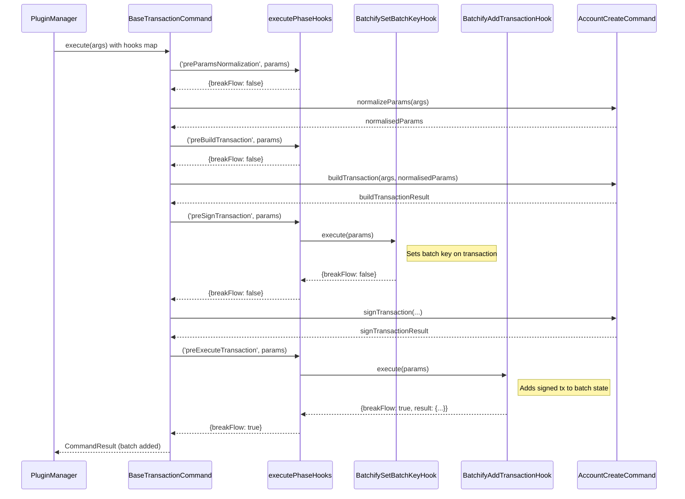
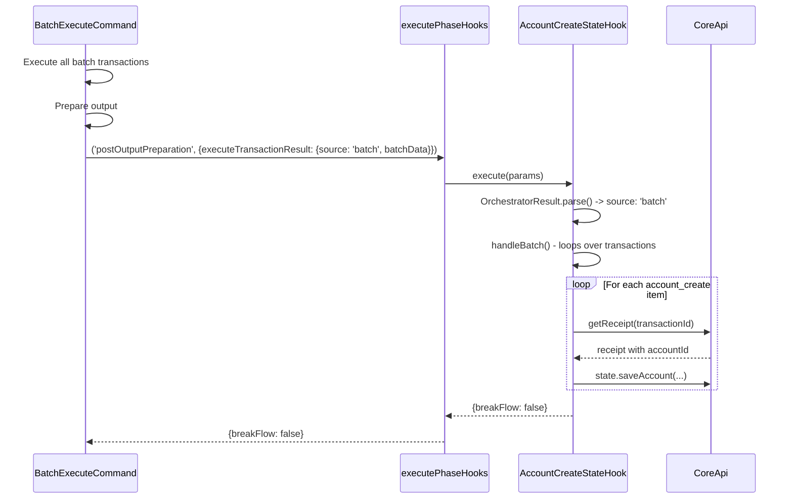
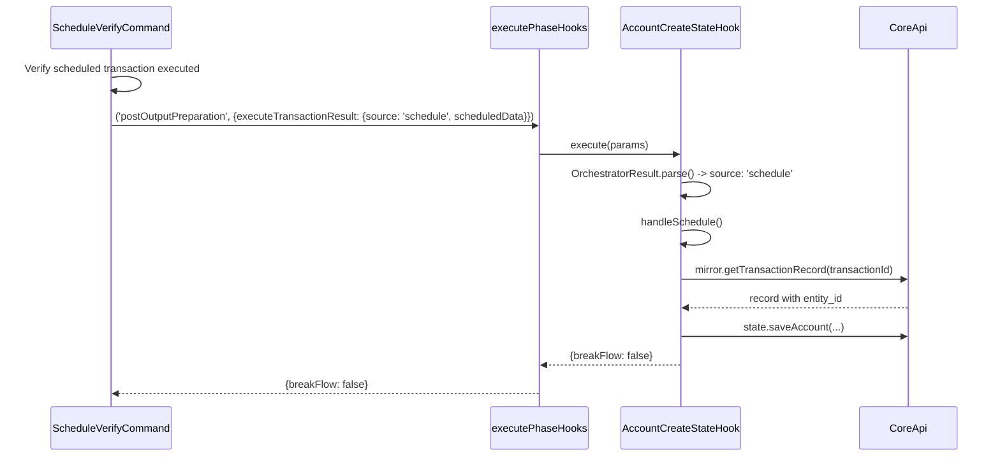

### ADR-012: Unified Hook Interface with Phase-Bound Registration

- Status: Proposed
- Date: 2026-04-10
- Related: `docs/adr/ADR-009-class-based-handler-and-hook-architecture.md`, `docs/adr/ADR-010-batch-transaction-plugin.md`, `docs/adr/ADR-011-schedule-transaction-plugin.md`, `src/core/hooks/abstract-hook.ts`, `src/core/commands/command.ts`, `src/core/plugins/plugin-manager.ts`, `src/core/plugins/plugin.types.ts`, `src/core/hooks/types.ts`

## Context

ADR-009 introduced `AbstractHook` -- an abstract class with seven lifecycle methods (`preParamsPreparationAndNormalizationHook`, `preBuildTransactionHook`, `preSignTransactionHook`, `preExecuteTransactionHook`, `preOutputPreparationHook`, `postOutputPreparationHook`, `customHandlerHook`). Concrete hooks extend this class and override the methods they care about. Commands declare which hooks they want via `registeredHooks: string[]` on `CommandSpec`.

This design has several problems:

**Problem 1: Duplicated business logic across contexts.** Each state-persisting hook must be implemented separately for batch and schedule contexts, even though the core logic (e.g., "parse params, resolve account ID, save to state") is identical. The only difference is which lifecycle method to override (`preOutputPreparationHook` for batch, `customHandlerHook` for schedule) and how to unwrap the context-specific params.

Current state hook inventory showing the duplication:

| Domain Entity    | Batch Hook Class               | Schedule Hook Class              | Core Logic |
| ---------------- | ------------------------------ | -------------------------------- | ---------- |
| Account Create   | `AccountCreateBatchStateHook`  | `AccountCreateScheduleStateHook` | Same       |
| Account Update   | `AccountUpdateBatchStateHook`  | `AccountUpdateScheduleStateHook` | Same       |
| Account Delete   | `AccountDeleteBatchStateHook`  | _(not yet implemented)_          | Same       |
| Token Create FT  | `TokenCreateFtBatchStateHook`  | _(not yet implemented)_          | Same       |
| Token Create NFT | `TokenCreateNftBatchStateHook` | _(not yet implemented)_          | Same       |
| Topic Create     | `TopicCreateBatchStateHook`    | _(not yet implemented)_          | Same       |
| ...              | 12 batch hooks total           | 2 schedule hooks total (growing) |            |

Every new entity command requires a batch state hook AND a schedule state hook -- two classes with near-identical `saveX()` methods.

**Problem 2: No phase binding.** The current `registeredHooks: string[]` only names hooks -- it does not specify at which lifecycle phase each hook should fire. The hook itself decides by overriding specific methods on `AbstractHook`. This means the command author cannot control when a hook runs, and a single hook class can override multiple methods with unrelated logic (see Problem 5).

**Problem 3: `customHandlerHook` is a workaround.** The `customHandlerHook` method on `AbstractHook` exists solely because `ScheduleVerifyCommand` is not a `BaseTransactionCommand` and cannot use lifecycle methods. It's a catch-all escape hatch that breaks the type safety of the hook system -- it accepts `CustomHandlerHookParams<unknown>`, losing all param typing.

**Problem 4: `ScheduleVerifyCommand` duplicates infrastructure.** Because `ScheduleVerifyCommand` implements `Command` directly (not `BaseTransactionCommand`), it must duplicate `executeHooks()` and `processHookResult()` from `BaseTransactionCommand`.

**Problem 5: Multi-responsibility hooks.** `BatchifyHook` overrides both `preSignTransactionHook` (to set the batch key) and `preExecuteTransactionHook` (to intercept execution and add the transaction to batch state). These are two distinct responsibilities in one class, making the hook harder to reason about and test.

**Problem 6: Missing hook point for schedule sign.** When `ScheduleSignCommand` provides the final signature and the scheduled transaction auto-executes, state hooks should fire to persist the resulting entity. Currently there is no mechanism for this -- the sign command has no registered state hooks.

**Problem 7: Only `BaseTransactionCommand` supports hooks.** Custom `Command` implementations cannot participate in the hook system without duplicating the hook execution infrastructure.

### Goals

- Unified `Hook<TParams>` interface with a single `execute()` method
- Phase-bound hook registration: commands declare which hook fires at which phase
- One hook class per concern, reusable across multiple commands
- Type-safe params via generics
- Any `Command` (not just `BaseTransactionCommand`) can execute hooks via a shared utility
- Remove `AbstractHook`, `customHandlerHook`, and the duplicated `executeHooks` in `ScheduleVerifyCommand`

### Non-Goals

- Changing the command lifecycle phases themselves (normalize -> build -> sign -> execute -> output)
- Async/parallel hook execution (remains sequential)
- Dynamic hook registration at runtime (all hooks declared in manifests)

### Schedulable Transaction Types

Not all Hedera transactions support scheduling. As of Consensus Node Release 0.57, the schedulable transaction types are:

- TransferTransaction
- TokenMintTransaction
- TokenBurnTransaction
- AccountCreateTransaction
- AccountUpdateTransaction
- FileUpdateTransaction
- SystemDeleteTransaction
- SystemUndeleteTransaction
- FreezeTransactions
- ContractExecuteTransaction
- ContractCreateTransaction
- ContractUpdateTransaction
- ContractDeleteTransaction

This constrains which commands can register the `ScheduledHook` and which state hooks need schedule-context support.

## Decision

### Part 1: Unified `Hook<TParams>` Interface

Replace `AbstractHook` with a single-method generic interface:

```ts
// src/core/hooks/hook.interface.ts
import type { HookResult } from '@/core/hooks/types';

export interface Hook<TParams = unknown> {
  execute(params: TParams): Promise<HookResult>;
}
```

Every hook -- whether it modifies transactions, breaks flow, or persists state -- implements this interface. The hook receives typed params and returns a `HookResult`. The hook does not know or care which lifecycle phase it runs in.

Note: the `name` field is on `HookSpec` (registration), not on the `Hook` interface (execution). The hook itself has no need to know its own registry name.

### Part 2: `HookResult` Type

`HookResult` is a discriminated union. When `breakFlow` is `false`, no result is needed. When `breakFlow` is `true`, the hook provides the result that becomes the command output:

```ts
// src/core/hooks/types.ts
import type { z } from 'zod';

export type HookResult =
  | { breakFlow: false }
  | {
      breakFlow: true;
      result: object;
      schema?: z.ZodTypeAny;
      humanTemplate?: string;
    };
```

This eliminates the meaningless `{ breakFlow: false, result: { message: 'success' } }` pattern throughout the codebase.

### Part 3: Hook Definition in Manifests

Hooks are defined in the manifest of the plugin that owns them. A `HookSpec` declares the hook's name, instance, and optional CLI options:

```ts
// src/core/plugins/plugin.types.ts

export interface HookSpec {
  name: string;
  hook: Hook<any>;
  options?: HookOption[];
}

export interface HookOption {
  name: string;
  type: OptionType;
  description?: string;
  short: string;
}
```

The hook definition does NOT specify where the hook is invoked. That is the command's responsibility (see Part 4).

### Part 4: Phase-Bound Hook Registration on Commands

Commands declare which hooks fire and at which phase via `registeredHooks` on `CommandSpec`. This replaces the current `string[]` with a structured array:

```ts
// src/core/plugins/plugin.types.ts

export type HookPhase =
  | 'preParamsNormalization'
  | 'preBuildTransaction'
  | 'preSignTransaction'
  | 'preExecuteTransaction'
  | 'preOutputPreparation'
  | 'postOutputPreparation';

export interface RegisteredHook {
  hook: string; // Hook name (matches HookSpec.name)
  phase: HookPhase; // Lifecycle phase at which this hook fires
}

export interface CommandSpec {
  name: string;
  summary: string;
  description: string;
  options?: CommandOption[];
  command?: Command;
  handler: CommandHandler;
  output: CommandOutputSpec;
  excessArguments?: boolean;
  registeredHooks?: RegisteredHook[];
  requireConfirmation?: string;
}
```

**The order of entries in `registeredHooks` determines execution order within the same phase.** When multiple hooks are registered at the same phase, they execute sequentially in array order. The command manifest author controls sequencing explicitly.

Example:

```ts
// src/plugins/account/manifest.ts — account create
{
  name: 'create',
  registeredHooks: [
    { hook: 'batchify-set-batch-key', phase: 'preSignTransaction' },
    { hook: 'scheduled', phase: 'preSignTransaction' },           // runs after batchify
    { hook: 'batchify-add-transaction', phase: 'preExecuteTransaction' },
  ],
  // ...
}
```

### Part 5: PluginManager Hook Resolution

During `registerCommands()`, `PluginManager` resolves hook references, validates them, and builds a phase-grouped hook map per command:

```ts
// In PluginManager

private allHookSpecs: HookSpec[] = [];

registerCommands(program: Command): void {
  this.allHookSpecs = Array.from(this.loadedPlugins.values()).flatMap(
    (plugin) => plugin.manifest.hooks ?? [],
  );
  this.validateUniqueHookNames(this.allHookSpecs);

  for (const plugin of this.loadedPlugins.values()) {
    this.registerPluginCommands(program, plugin);
  }
}
```

When registering a single command, `PluginManager` resolves the `registeredHooks` references into a `Map<HookPhase, Hook<any>[]>`:

```ts
private buildPhaseHookMap(commandSpec: CommandSpec): Map<HookPhase, Hook<any>[]> {
  const phaseHooks = new Map<HookPhase, Hook<any>[]>();
  const registeredHooks = commandSpec.registeredHooks ?? [];

  for (const registration of registeredHooks) {
    const hookSpec = this.allHookSpecs.find((h) => h.name === registration.hook);
    if (!hookSpec) {
      throw new ConfigurationError(
        `Command "${commandSpec.name}" references hook "${registration.hook}" which does not exist`,
      );
    }

    const existing = phaseHooks.get(registration.phase) ?? [];
    existing.push(hookSpec.hook);
    phaseHooks.set(registration.phase, existing);
  }

  return phaseHooks;
}
```

**Hook option injection:** `PluginManager` merges CLI options from all hooks registered on a command. Options are deduplicated by name -- if two hooks declare the same option name, the first one wins. Conflicting definitions (same name, different type/short) cause a `ConfigurationError`:

```ts
private resolveHookOptions(commandSpec: CommandSpec): HookOption[] {
  const registeredHooks = commandSpec.registeredHooks ?? [];
  const seenOptions = new Map<string, HookOption>();

  for (const registration of registeredHooks) {
    const hookSpec = this.allHookSpecs.find((h) => h.name === registration.hook);
    if (!hookSpec?.options) continue;

    for (const option of hookSpec.options) {
      const existing = seenOptions.get(option.name);
      if (existing) {
        if (existing.type !== option.type || existing.short !== option.short) {
          throw new ConfigurationError(
            `Hook option "${option.name}" has conflicting definitions`,
          );
        }
        continue; // deduplicate
      }
      seenOptions.set(option.name, option);
    }
  }

  return Array.from(seenOptions.values());
}
```

### Part 6: Hook Delivery via CommandHandlerArgs

`CommandHandlerArgs` receives a single `hooks` field -- a `Map<HookPhase, Hook<any>[]>` for the current command:

```ts
// src/core/plugins/plugin.interface.ts

export interface CommandHandlerArgs {
  args: Record<string, unknown>;
  api: CoreApi;
  state: StateManager;
  config: ConfigView;
  logger: Logger;
  hooks: Map<HookPhase, Hook<any>[]>;
}
```

`PluginManager.executePluginCommand()` builds the hook map and passes it:

```ts
const handlerArgs: CommandHandlerArgs = {
  args: { ...options, _: commandArgs },
  api: this.coreApi,
  state: this.coreApi.state,
  config: this.coreApi.config,
  logger: this.logger,
  hooks: this.buildPhaseHookMap(commandSpec),
};
```

**Type safety trade-off:** The `Map<HookPhase, Hook<any>[]>` uses `any` for the hook type parameter. This means the compiler does not enforce that hooks at `preSignTransaction` receive `PreSignTransactionHookParams`. This is an accepted trade-off -- the phase-to-params contract is enforced by `BaseTransactionCommand`'s implementation (which constructs the correct params at each phase) and by custom commands that call `executePhaseHooks`. The contract is documented and tested, not compiler-enforced.

### Part 7: Hook Execution Utility

A shared utility replaces the `executeHooks` methods on `BaseTransactionCommand` and `ScheduleVerifyCommand`:

```ts
// src/core/hooks/hook-executor.ts
import type { Hook } from '@/core/hooks/hook.interface';
import type { HookResult } from '@/core/hooks/types';
import type { HookPhase } from '@/core/plugins/plugin.types';
import type { CommandResult } from '@/core';

/**
 * Execute all hooks registered at a specific phase, sequentially.
 * Stops and returns immediately if any hook returns { breakFlow: true }.
 */
export async function executePhaseHooks<TParams>(
  hooks: Map<HookPhase, Hook<any>[]>,
  phase: HookPhase,
  params: TParams,
): Promise<HookResult> {
  const phaseHooks = hooks.get(phase);
  if (!phaseHooks || phaseHooks.length === 0) {
    return { breakFlow: false };
  }
  for (const hook of phaseHooks) {
    const hookResult = await hook.execute(params);
    if (hookResult.breakFlow) {
      return hookResult;
    }
  }
  return { breakFlow: false };
}

/**
 * Convert a breakFlow HookResult into a CommandResult.
 */
export function processHookResult(
  hookResult: HookResult & { breakFlow: true },
): CommandResult {
  return {
    result: hookResult.result,
    overrideSchema: hookResult.schema,
    overrideHumanTemplate: hookResult.humanTemplate,
  };
}
```

Any command -- `BaseTransactionCommand` or custom `Command` -- uses this utility. No more duplicated hook execution logic.

**Custom commands that register hooks MUST call `executePhaseHooks` for every phase that appears in their `registeredHooks`.** This is a contract obligation -- `PluginManager` validates that the hook names exist, but cannot verify that the command implementation actually calls the utility at the correct point. Failure to call `executePhaseHooks` for a declared phase means those hooks silently never fire.

### Part 8: BaseTransactionCommand Changes

`BaseTransactionCommand` uses `executePhaseHooks` at each lifecycle point:

```ts
// src/core/commands/command.ts
import {
  executePhaseHooks,
  processHookResult,
} from '@/core/hooks/hook-executor';

export abstract class BaseTransactionCommand<
  TNormalisedParams = unknown,
  TBuildTransactionResult = unknown,
  TSignTransactionResult = unknown,
  TExecuteTransactionResult = unknown,
> implements Command {
  private commandName: string;

  constructor(commandName: string) {
    this.commandName = commandName;
  }

  async execute(args: CommandHandlerArgs): Promise<CommandResult> {
    const hooks = args.hooks;

    // Pre-params normalization
    const preNormResult = await executePhaseHooks(
      hooks,
      'preParamsNormalization',
      {
        args,
        commandName: this.commandName,
      } satisfies PreParamsNormalizationHookParams,
    );
    if (preNormResult.breakFlow) return processHookResult(preNormResult);
    const normalisedParams = await this.normalizeParams(args);

    // Pre-build transaction
    const preBuildResult = await executePhaseHooks(
      hooks,
      'preBuildTransaction',
      {
        args,
        commandName: this.commandName,
        normalisedParams,
      } satisfies PreBuildTransactionHookParams<TNormalisedParams>,
    );
    if (preBuildResult.breakFlow) return processHookResult(preBuildResult);
    const buildTransactionResult = await this.buildTransaction(
      args,
      normalisedParams,
    );

    // Pre-sign transaction
    const preSignResult = await executePhaseHooks(hooks, 'preSignTransaction', {
      args,
      commandName: this.commandName,
      normalisedParams,
      buildTransactionResult,
    } satisfies PreSignTransactionHookParams<
      TNormalisedParams,
      TBuildTransactionResult
    >);
    if (preSignResult.breakFlow) return processHookResult(preSignResult);
    const signTransactionResult = await this.signTransaction(
      args,
      normalisedParams,
      buildTransactionResult,
    );

    // Pre-execute transaction
    const preExecResult = await executePhaseHooks(
      hooks,
      'preExecuteTransaction',
      {
        args,
        commandName: this.commandName,
        normalisedParams,
        buildTransactionResult,
        signTransactionResult,
      } satisfies PreExecuteTransactionHookParams<
        TNormalisedParams,
        TBuildTransactionResult,
        TSignTransactionResult
      >,
    );
    if (preExecResult.breakFlow) return processHookResult(preExecResult);
    const executeTransactionResult = await this.executeTransaction(
      args,
      normalisedParams,
      buildTransactionResult,
      signTransactionResult,
    );

    // Pre-output preparation
    const preOutputResult = await executePhaseHooks(
      hooks,
      'preOutputPreparation',
      {
        args,
        commandName: this.commandName,
        normalisedParams,
        buildTransactionResult,
        signTransactionResult,
        executeTransactionResult,
      } satisfies PreOutputPreparationHookParams<
        TNormalisedParams,
        TBuildTransactionResult,
        TSignTransactionResult,
        TExecuteTransactionResult
      >,
    );
    if (preOutputResult.breakFlow) return processHookResult(preOutputResult);
    const result = await this.outputPreparation(
      args,
      normalisedParams,
      buildTransactionResult,
      signTransactionResult,
      executeTransactionResult,
    );

    // Post-output preparation
    const postOutputResult = await executePhaseHooks(
      hooks,
      'postOutputPreparation',
      {
        args,
        commandName: this.commandName,
        normalisedParams,
        buildTransactionResult,
        signTransactionResult,
        executeTransactionResult,
        outputResult: result,
      } satisfies PostOutputPreparationHookParams<
        TNormalisedParams,
        TBuildTransactionResult,
        TSignTransactionResult,
        TExecuteTransactionResult
      >,
    );
    if (postOutputResult.breakFlow) return processHookResult(postOutputResult);
    return result;
  }

  // ... abstract methods unchanged
}
```

The `satisfies` keyword provides compile-time validation that each phase passes the correct params type, without affecting the runtime `any` erasure in the hook map.

### Part 9: Hook Param Types

Each lifecycle phase has a strongly-typed params interface:

```ts
// src/core/hooks/types.ts
import type { z } from 'zod';
import type { CommandHandlerArgs, CommandResult } from '@/core';

export type HookResult =
  | { breakFlow: false }
  | {
      breakFlow: true;
      result: object;
      schema?: z.ZodTypeAny;
      humanTemplate?: string;
    };

export interface PreParamsNormalizationHookParams {
  args: CommandHandlerArgs;
  commandName: string;
}

export interface PreBuildTransactionHookParams<TNormalisedParams = unknown> {
  args: CommandHandlerArgs;
  commandName: string;
  normalisedParams: TNormalisedParams;
}

export interface PreSignTransactionHookParams<
  TNormalisedParams = unknown,
  TBuildTransactionResult = unknown,
> {
  args: CommandHandlerArgs;
  commandName: string;
  normalisedParams: TNormalisedParams;
  buildTransactionResult: TBuildTransactionResult;
}

export interface PreExecuteTransactionHookParams<
  TNormalisedParams = unknown,
  TBuildTransactionResult = unknown,
  TSignTransactionResult = unknown,
> {
  args: CommandHandlerArgs;
  commandName: string;
  normalisedParams: TNormalisedParams;
  buildTransactionResult: TBuildTransactionResult;
  signTransactionResult: TSignTransactionResult;
}

export interface PreOutputPreparationHookParams<
  TNormalisedParams = unknown,
  TBuildTransactionResult = unknown,
  TSignTransactionResult = unknown,
  TExecuteTransactionResult = unknown,
> {
  args: CommandHandlerArgs;
  commandName: string;
  normalisedParams: TNormalisedParams;
  buildTransactionResult: TBuildTransactionResult;
  signTransactionResult: TSignTransactionResult;
  executeTransactionResult: TExecuteTransactionResult;
}

export interface PostOutputPreparationHookParams<
  TNormalisedParams = unknown,
  TBuildTransactionResult = unknown,
  TSignTransactionResult = unknown,
  TExecuteTransactionResult = unknown,
> {
  args: CommandHandlerArgs;
  commandName: string;
  normalisedParams: TNormalisedParams;
  buildTransactionResult: TBuildTransactionResult;
  signTransactionResult: TSignTransactionResult;
  executeTransactionResult: TExecuteTransactionResult;
  outputResult: CommandResult;
}
```

### Part 10: Orchestrator Result Discrimination via Zod

State hooks that fire on orchestrator commands (`batch_execute`, `schedule_verify`, `schedule_sign`) receive `PostOutputPreparationHookParams` where `executeTransactionResult` varies by context. To safely discriminate, orchestrators wrap their results with a `source` discriminator and state hooks validate using Zod discriminated unions:

```ts
// src/core/hooks/orchestrator-result.ts
import { z } from 'zod';
import { BatchDataSchema } from '@/plugins/batch/schema';
import { ScheduledDataSchema } from '@/plugins/schedule/schema';

export const BatchOrchestratorResult = z.object({
  source: z.literal('batch'),
  batchData: BatchDataSchema,
});

export const ScheduleOrchestratorResult = z.object({
  source: z.literal('schedule'),
  scheduledData: ScheduledDataSchema,
});

export const OrchestratorResult = z.discriminatedUnion('source', [
  BatchOrchestratorResult,
  ScheduleOrchestratorResult,
]);

export type OrchestratorResult = z.infer<typeof OrchestratorResult>;
```

Orchestrator commands construct the discriminated result when calling `executePhaseHooks`:

```ts
// In batch execute, when calling postOutputPreparation hooks:
await executePhaseHooks(hooks, 'postOutputPreparation', {
  args,
  commandName: 'batch_execute',
  normalisedParams,
  buildTransactionResult,
  signTransactionResult,
  executeTransactionResult: {
    source: 'batch' as const,
    batchData: updatedBatchData,
  },
  outputResult: result,
});

// In schedule verify, when calling postOutputPreparation hooks:
await executePhaseHooks(hooks, 'postOutputPreparation', {
  args,
  commandName: SCHEDULE_VERIFY_COMMAND_NAME,
  normalisedParams: {},
  buildTransactionResult: undefined,
  signTransactionResult: undefined,
  executeTransactionResult: {
    source: 'schedule' as const,
    scheduledData: updatedScheduledRecord,
  },
  outputResult: { result: outputData },
});
```

State hooks parse the result to safely narrow the type:

```ts
// In AccountCreateStateHook
async execute(params: PostOutputPreparationHookParams): Promise<HookResult> {
  const parsed = OrchestratorResult.safeParse(params.executeTransactionResult);
  if (!parsed.success) {
    return { breakFlow: false };
  }

  const { api, logger } = params.args;

  switch (parsed.data.source) {
    case 'batch':
      await this.handleBatch(api, logger, parsed.data.batchData);
      break;
    case 'schedule':
      await this.handleSchedule(api, logger, parsed.data.scheduledData);
      break;
  }

  return { breakFlow: false };
}
```

This approach gives runtime validation with type narrowing via Zod, and fails loudly if the data shape changes rather than silently producing `undefined`.

### Part 11: Concrete Hook Migration

#### BatchifyHook -> Two Single-Responsibility Hooks

```ts
// src/plugins/batch/hooks/batchify-set-batch-key/handler.ts
export class BatchifySetBatchKeyHook implements Hook<
  PreSignTransactionHookParams<
    Record<string, unknown>,
    BaseBuildTransactionResult
  >
> {
  async execute(
    params: PreSignTransactionHookParams<
      Record<string, unknown>,
      BaseBuildTransactionResult
    >,
  ): Promise<HookResult> {
    const { args, buildTransactionResult } = params;
    const validArgs = BatchifyInputSchema.parse(args.args);
    const batchName = validArgs.batch;
    if (!batchName) {
      return { breakFlow: false };
    }
    // ... set batch key on transaction (existing preSignTransactionHook body)
  }
}

// src/plugins/batch/hooks/batchify-add-transaction/handler.ts
export class BatchifyAddTransactionHook implements Hook<
  PreExecuteTransactionHookParams<
    BatchifyHookBaseParams,
    BaseBuildTransactionResult,
    BaseSignTransactionResult
  >
> {
  async execute(
    params: PreExecuteTransactionHookParams<
      BatchifyHookBaseParams,
      BaseBuildTransactionResult,
      BaseSignTransactionResult
    >,
  ): Promise<HookResult> {
    const { args, commandName, normalisedParams, signTransactionResult } =
      params;
    const validArgs = BatchifyInputSchema.parse(args.args);
    const batchName = validArgs.batch;
    if (!batchName) {
      return { breakFlow: false };
    }
    // ... add signed transaction to batch state, return breakFlow: true
    // (existing preExecuteTransactionHook body)
  }
}
```

Batch plugin manifest:

```ts
// src/plugins/batch/manifest.ts
hooks: [
  {
    name: 'batchify-set-batch-key',
    hook: new BatchifySetBatchKeyHook(),
    options: [
      { name: 'batch', short: 'B', type: OptionType.STRING, description: 'Name of the batch' },
    ],
  },
  {
    name: 'batchify-add-transaction',
    hook: new BatchifyAddTransactionHook(),
    // No options -- the --batch option is injected by batchify-set-batch-key
    // and deduplicated by PluginManager
  },
],
```

#### ScheduledHook -> Single Lifecycle Hook

```ts
// src/plugins/schedule/hooks/scheduled/handler.ts
export class ScheduledHook implements Hook<
  PreSignTransactionHookParams<
    ScheduledNormalizedParams,
    BaseBuildTransactionResult
  >
> {
  async execute(
    params: PreSignTransactionHookParams<
      ScheduledNormalizedParams,
      BaseBuildTransactionResult
    >,
  ): Promise<HookResult> {
    const { args, commandName, normalisedParams, buildTransactionResult } =
      params;
    // ... existing preSignTransactionHook body
  }
}
```

Schedule plugin manifest:

```ts
// src/plugins/schedule/manifest.ts
hooks: [
  {
    name: 'scheduled',
    hook: new ScheduledHook(),
    options: [
      { name: 'scheduled', short: 'X', type: OptionType.STRING, description: 'Name of the schedule record' },
    ],
  },
],
```

#### State Hooks -> Unified Per-Entity Hooks

Each domain entity gets one hook class that handles both batch and schedule contexts:

```ts
// src/plugins/account/hooks/account-create-state/handler.ts
import { OrchestratorResult } from '@/core/hooks/orchestrator-result';

export class AccountCreateStateHook implements Hook<PostOutputPreparationHookParams> {
  async execute(params: PostOutputPreparationHookParams): Promise<HookResult> {
    const parsed = OrchestratorResult.safeParse(
      params.executeTransactionResult,
    );
    if (!parsed.success) {
      return { breakFlow: false };
    }

    const { api, logger } = params.args;

    switch (parsed.data.source) {
      case 'batch':
        await this.handleBatch(api, logger, parsed.data.batchData);
        break;
      case 'schedule':
        await this.handleSchedule(api, logger, parsed.data.scheduledData);
        break;
    }

    return { breakFlow: false };
  }

  private async handleBatch(
    api: CoreApi,
    logger: Logger,
    batchData: BatchData,
  ): Promise<void> {
    if (!batchData.success) return;

    for (const item of batchData.transactions) {
      if (item.command !== ACCOUNT_CREATE_COMMAND_NAME) continue;
      await this.saveAccount(
        api,
        logger,
        item.normalizedParams,
        item.transactionId,
        'batch',
      );
    }
  }

  private async handleSchedule(
    api: CoreApi,
    logger: Logger,
    scheduledData: ScheduledData,
  ): Promise<void> {
    if (scheduledData.command !== ACCOUNT_CREATE_COMMAND_NAME) return;
    await this.saveAccount(
      api,
      logger,
      scheduledData.normalizedParams,
      scheduledData.transactionId,
      'schedule',
    );
  }

  private async saveAccount(
    api: CoreApi,
    logger: Logger,
    rawNormalizedParams: unknown,
    transactionId: string | undefined,
    source: 'batch' | 'schedule',
  ): Promise<void> {
    const parseResult =
      AccountCreateNormalisedParamsSchema.safeParse(rawNormalizedParams);
    if (!parseResult.success) {
      logger.warn('Problem parsing data schema. State will not be saved.');
      return;
    }
    const normalisedParams = parseResult.data;

    if (!transactionId) {
      logger.warn('No transaction ID found. State will not be saved.');
      return;
    }

    const accountId = await this.resolveAccountId(api, transactionId, source);
    if (!accountId) {
      throw new StateError('Could not resolve account ID from transaction');
    }

    const evmAddress = buildEvmAddressFromAccountId(accountId);

    if (normalisedParams.alias) {
      const receipt = await api.receipt.getReceipt({ transactionId });
      api.alias.register({
        alias: normalisedParams.alias,
        type: AliasType.Account,
        network: normalisedParams.network,
        entityId: accountId,
        evmAddress,
        publicKey: normalisedParams.publicKey,
        keyRefId: normalisedParams.keyRefId,
        createdAt: receipt.consensusTimestamp,
      });
    }

    const accountData: AccountData = {
      name: normalisedParams.name,
      accountId,
      type: normalisedParams.keyType,
      publicKey: normalisedParams.publicKey,
      evmAddress,
      keyRefId: normalisedParams.keyRefId,
      network: normalisedParams.network,
    };
    const accountKey = composeKey(normalisedParams.network, accountId);
    const accountState = new ZustandAccountStateHelper(api.state, logger);
    accountState.saveAccount(accountKey, accountData);
  }

  private async resolveAccountId(
    api: CoreApi,
    transactionId: string,
    source: 'batch' | 'schedule',
  ): Promise<string | undefined> {
    if (source === 'batch') {
      const receipt = await api.receipt.getReceipt({ transactionId });
      return receipt.accountId;
    }
    // source === 'schedule'
    const txRecord = await api.mirror.getTransactionRecord(
      formatTransactionIdToDashFormat(transactionId),
    );
    const scheduledTx = txRecord.transactions.find(
      (tx) => tx.scheduled === true,
    );
    return scheduledTx?.entity_id ?? undefined;
  }
}
```

Account plugin manifest:

```ts
// src/plugins/account/manifest.ts
hooks: [
  { name: 'account-create-state', hook: new AccountCreateStateHook() },
  { name: 'account-update-state', hook: new AccountUpdateStateHook() },
  { name: 'account-delete-state', hook: new AccountDeleteStateHook() },
],
```

### Part 12: Custom Commands with Hook Support

Custom `Command` implementations (like `ScheduleVerifyCommand`) call `executePhaseHooks` directly at the points where they want hooks to fire:

```ts
// src/plugins/schedule/commands/verify/handler.ts
import {
  executePhaseHooks,
  processHookResult,
} from '@/core/hooks/hook-executor';

export class ScheduleVerifyCommand implements Command {
  async execute(args: CommandHandlerArgs): Promise<CommandResult> {
    const hooks = args.hooks;

    // ... schedule verify logic ...

    if (updatedScheduledRecord?.executed) {
      const postOutputResult = await executePhaseHooks(
        hooks,
        'postOutputPreparation',
        {
          args,
          commandName: SCHEDULE_VERIFY_COMMAND_NAME,
          normalisedParams: {},
          buildTransactionResult: undefined,
          signTransactionResult: undefined,
          executeTransactionResult: {
            source: 'schedule' as const,
            scheduledData: updatedScheduledRecord,
          },
          outputResult: { result: outputData },
        },
      );
      if (postOutputResult.breakFlow) {
        return processHookResult(postOutputResult);
      }
    }

    return { result: outputData };
  }
}
```

No more `customHandlerHook`, no more duplicated `executeHooks()` / `processHookResult()`.

**Contract:** Custom commands that declare hooks in their `registeredHooks` MUST call `executePhaseHooks` for every phase that appears. `PluginManager` validates hook names exist at startup but cannot verify the command implementation actually calls the utility.

### Part 13: ScheduleSignCommand with State Hook Support

`ScheduleSignCommand` (a `BaseTransactionCommand`) registers state hooks at `postOutputPreparation`. After executing the sign transaction, the command checks via the mirror node whether the scheduled transaction auto-executed. If so, it enriches the `executeTransactionResult` with the scheduled data so that post-output hooks receive the full context:

```ts
// In ScheduleSignCommand.executeTransaction():
async executeTransaction(
  args: CommandHandlerArgs,
  normalisedParams: ScheduleSignNormalisedParams,
  buildTransactionResult: ScheduleSignBuildTransactionResult,
  signTransactionResult: ScheduleSignSignTransactionResult,
): Promise<ScheduleSignExecuteTransactionResult> {
  const result = await args.api.txExecute.execute(
    signTransactionResult.signedTransaction,
  );
  if (!result.success) {
    throw new TransactionError(
      `Schedule sign failed for ${normalisedParams.scheduleId}`,
      false,
    );
  }

  // Check if the scheduled transaction auto-executed after this signature
  const scheduleResponse = await args.api.mirror.getScheduled(
    normalisedParams.scheduleId,
  );
  const autoExecuted = !!scheduleResponse.executed_timestamp;

  return {
    transactionId: result.transactionId,
    success: result.success,
    status: result.receipt?.status?.status,
    // Enriched for state hooks when auto-executed:
    ...(autoExecuted && scheduledRecord ? {
      source: 'schedule' as const,
      scheduledData: {
        ...scheduledRecord,
        executed: true,
      },
    } : {}),
  };
}
```

Schedule sign command manifest:

```ts
// src/plugins/schedule/manifest.ts
{
  name: 'sign',
  summary: 'Add a signature to a scheduled transaction',
  registeredHooks: [
    { hook: 'account-create-state', phase: 'postOutputPreparation' },
    { hook: 'account-update-state', phase: 'postOutputPreparation' },
    // ... other state hooks for schedulable entity commands
  ],
  // ...
}
```

## Manifest Examples (Before and After)

### Account Plugin

**Before:**

```ts
hooks: [
  { name: 'account-create-batch-state', hook: new AccountCreateBatchStateHook(), options: [] },
  { name: 'account-update-batch-state', hook: new AccountUpdateBatchStateHook(), options: [] },
  { name: 'account-delete-batch-state', hook: new AccountDeleteBatchStateHook(), options: [] },
  { name: 'account-create-schedule-state', hook: new AccountCreateScheduleStateHook(), options: [] },
  { name: 'account-update-schedule-state', hook: new AccountUpdateScheduleStateHook(), options: [] },
],
commands: [
  { name: 'create', registeredHooks: ['batchify', 'scheduled'], ... },
  { name: 'update', registeredHooks: ['batchify', 'scheduled'], ... },
  { name: 'delete', registeredHooks: ['batchify'], ... },
]
```

**After:**

```ts
hooks: [
  { name: 'account-create-state', hook: new AccountCreateStateHook() },
  { name: 'account-update-state', hook: new AccountUpdateStateHook() },
  { name: 'account-delete-state', hook: new AccountDeleteStateHook() },
],
commands: [
  {
    name: 'create',
    registeredHooks: [
      { hook: 'batchify-set-batch-key', phase: 'preSignTransaction' },
      { hook: 'scheduled', phase: 'preSignTransaction' },
      { hook: 'batchify-add-transaction', phase: 'preExecuteTransaction' },
    ],
    ...
  },
  {
    name: 'update',
    registeredHooks: [
      { hook: 'batchify-set-batch-key', phase: 'preSignTransaction' },
      { hook: 'scheduled', phase: 'preSignTransaction' },
      { hook: 'batchify-add-transaction', phase: 'preExecuteTransaction' },
    ],
    ...
  },
  {
    name: 'delete',
    registeredHooks: [
      { hook: 'batchify-set-batch-key', phase: 'preSignTransaction' },
      { hook: 'batchify-add-transaction', phase: 'preExecuteTransaction' },
    ],
    ...
  },
]
```

### Batch Plugin

**Before:**

```ts
hooks: [
  { name: 'batchify', hook: new BatchifyHook(), options: [{ name: 'batch', short: 'B', ... }] },
],
commands: [
  {
    name: 'execute',
    registeredHooks: [
      'account-create-batch-state', 'account-update-batch-state', 'account-delete-batch-state',
      'topic-create-batch-state', 'topic-delete-batch-state', 'topic-update-batch-state',
      'token-create-ft-batch-state', 'token-create-ft-from-file-batch-state',
      'token-create-nft-batch-state', 'token-create-nft-from-file-batch-state',
      'token-associate-batch-state', 'token-delete-batch-state',
    ],
    ...
  },
]
```

**After:**

```ts
hooks: [
  {
    name: 'batchify-set-batch-key',
    hook: new BatchifySetBatchKeyHook(),
    options: [{ name: 'batch', short: 'B', type: OptionType.STRING, description: 'Name of the batch' }],
  },
  {
    name: 'batchify-add-transaction',
    hook: new BatchifyAddTransactionHook(),
  },
],
commands: [
  {
    name: 'execute',
    registeredHooks: [
      { hook: 'account-create-state', phase: 'postOutputPreparation' },
      { hook: 'account-update-state', phase: 'postOutputPreparation' },
      { hook: 'account-delete-state', phase: 'postOutputPreparation' },
      { hook: 'topic-create-state', phase: 'postOutputPreparation' },
      { hook: 'topic-update-state', phase: 'postOutputPreparation' },
      { hook: 'topic-delete-state', phase: 'postOutputPreparation' },
      { hook: 'token-create-ft-state', phase: 'postOutputPreparation' },
      { hook: 'token-create-nft-state', phase: 'postOutputPreparation' },
      { hook: 'token-associate-state', phase: 'postOutputPreparation' },
      { hook: 'token-delete-state', phase: 'postOutputPreparation' },
    ],
    ...
  },
]
```

### Schedule Plugin

**Before:**

```ts
hooks: [
  { name: 'scheduled', hook: new ScheduledHook(), options: [{ name: 'scheduled', short: 'X', ... }] },
],
commands: [
  { name: 'verify', registeredHooks: ['account-create-schedule-state', 'account-update-schedule-state'], ... },
  { name: 'sign', ... },  // No hooks
]
```

**After:**

```ts
hooks: [
  {
    name: 'scheduled',
    hook: new ScheduledHook(),
    options: [{ name: 'scheduled', short: 'X', type: OptionType.STRING, description: 'Name of the schedule record' }],
  },
],
commands: [
  {
    name: 'verify',
    registeredHooks: [
      { hook: 'account-create-state', phase: 'postOutputPreparation' },
      { hook: 'account-update-state', phase: 'postOutputPreparation' },
    ],
    ...
  },
  {
    name: 'sign',
    registeredHooks: [
      { hook: 'account-create-state', phase: 'postOutputPreparation' },
      { hook: 'account-update-state', phase: 'postOutputPreparation' },
    ],
    ...
  },
]
```

## Execution Flow

### Lifecycle Hooks (Account Create with Batchify)



### State Hooks (Batch Execute -> Account Create State)



### State Hooks (Schedule Verify -> Account Create State)



## Hook Inventory: Before and After

### Before (16 hook classes)

| Hook Class                             | Methods Overridden                                    |
| -------------------------------------- | ----------------------------------------------------- |
| `BatchifyHook`                         | `preSignTransactionHook`, `preExecuteTransactionHook` |
| `ScheduledHook`                        | `preSignTransactionHook`                              |
| `AccountCreateBatchStateHook`          | `preOutputPreparationHook`                            |
| `AccountUpdateBatchStateHook`          | `preOutputPreparationHook`                            |
| `AccountDeleteBatchStateHook`          | `preOutputPreparationHook`                            |
| `AccountCreateScheduleStateHook`       | `customHandlerHook`                                   |
| `AccountUpdateScheduleStateHook`       | `customHandlerHook`                                   |
| `TokenCreateFtBatchStateHook`          | `preOutputPreparationHook`                            |
| `TokenCreateFtFromFileBatchStateHook`  | `preOutputPreparationHook`                            |
| `TokenCreateNftBatchStateHook`         | `preOutputPreparationHook`                            |
| `TokenCreateNftFromFileBatchStateHook` | `preOutputPreparationHook`                            |
| `TokenAssociateBatchStateHook`         | `preOutputPreparationHook`                            |
| `TokenDeleteBatchStateHook`            | `preOutputPreparationHook`                            |
| `TopicCreateBatchStateHook`            | `preOutputPreparationHook`                            |
| `TopicUpdateBatchStateHook`            | `preOutputPreparationHook`                            |
| `TopicDeleteBatchStateHook`            | `preOutputPreparationHook`                            |

### After (12 hook classes)

| Hook Class                   | Interface                               | Registered On                                       |
| ---------------------------- | --------------------------------------- | --------------------------------------------------- |
| `BatchifySetBatchKeyHook`    | `Hook<PreSignTransactionHookParams>`    | All batchable commands @ `preSignTransaction`       |
| `BatchifyAddTransactionHook` | `Hook<PreExecuteTransactionHookParams>` | All batchable commands @ `preExecuteTransaction`    |
| `ScheduledHook`              | `Hook<PreSignTransactionHookParams>`    | All schedulable commands @ `preSignTransaction`     |
| `AccountCreateStateHook`     | `Hook<PostOutputPreparationHookParams>` | `batch_execute`, `schedule_verify`, `schedule_sign` |
| `AccountUpdateStateHook`     | `Hook<PostOutputPreparationHookParams>` | `batch_execute`, `schedule_verify`, `schedule_sign` |
| `AccountDeleteStateHook`     | `Hook<PostOutputPreparationHookParams>` | `batch_execute`                                     |
| `TokenCreateFtStateHook`     | `Hook<PostOutputPreparationHookParams>` | `batch_execute`, `schedule_verify`, `schedule_sign` |
| `TokenCreateNftStateHook`    | `Hook<PostOutputPreparationHookParams>` | `batch_execute`                                     |
| `TokenAssociateStateHook`    | `Hook<PostOutputPreparationHookParams>` | `batch_execute`                                     |
| `TokenDeleteStateHook`       | `Hook<PostOutputPreparationHookParams>` | `batch_execute`                                     |
| `TopicCreateStateHook`       | `Hook<PostOutputPreparationHookParams>` | `batch_execute`                                     |
| `TopicUpdateStateHook`       | `Hook<PostOutputPreparationHookParams>` | `batch_execute`                                     |

Net change: 16 -> 12 classes. Zero duplication of business logic across batch/schedule contexts. `TokenCreateFtFromFileBatchStateHook` and `TokenCreateNftFromFileBatchStateHook` merge into `TokenCreateFtStateHook` and `TokenCreateNftStateHook` respectively.

## Migration Strategy

### Phase 1: Introduce New Types (Non-Breaking)

1. Add `Hook<TParams>` interface in `src/core/hooks/hook.interface.ts`
2. Add `HookPhase`, `RegisteredHook` types in `src/core/plugins/plugin.types.ts`
3. Update `HookResult` to discriminated union in `src/core/hooks/types.ts`
4. Add `executePhaseHooks` and `processHookResult` utility in `src/core/hooks/hook-executor.ts`
5. Add `OrchestratorResult` Zod schemas in `src/core/hooks/orchestrator-result.ts`
6. Remove `name` from `Hook` interface (keep only on `HookSpec`)
7. Remove `targets` from `HookSpec` (hook definition is passive)

### Phase 2: Migrate Lifecycle Hooks

1. Split `BatchifyHook` into `BatchifySetBatchKeyHook` and `BatchifyAddTransactionHook` implementing `Hook<TParams>`
2. Migrate `ScheduledHook` to implement `Hook<TParams>`
3. Update batch plugin manifest with new hook definitions
4. Update domain command manifests: change `registeredHooks` from `string[]` to `RegisteredHook[]` with phase binding
5. Update `PluginManager`: `buildPhaseHookMap()`, `resolveHookOptions()` with deduplication
6. Update `BaseTransactionCommand` to use `executePhaseHooks` utility with `satisfies` annotations
7. Update `CommandHandlerArgs` to `hooks: Map<HookPhase, Hook<any>[]>`

### Phase 3: Migrate State Hooks

1. Create unified state hooks per entity (`AccountCreateStateHook`, etc.) implementing `Hook<PostOutputPreparationHookParams>`
2. Update account, token, and topic plugin manifests with new hook definitions
3. Update `BatchExecuteCommand` to construct `{ source: 'batch', batchData }` for `executeTransactionResult`
4. Update `ScheduleVerifyCommand` to use `executePhaseHooks` with `{ source: 'schedule', scheduledData }` -- remove `customHandlerHook`, `executeHooks`, `processHookResult`
5. Update `ScheduleSignCommand` to check for auto-execution and enrich `executeTransactionResult` with scheduled data
6. Update batch, schedule verify, and schedule sign manifests with state hook registrations
7. Remove old batch/schedule state hook variants

### Phase 4: Cleanup

1. Remove `AbstractHook` class
2. Remove `customHandlerHook` and `CustomHandlerHookParams` from types
3. Remove old hook param types (`PreBuildTransactionParams`, `PreSignTransactionParams`, etc.) -- replaced by new `*HookParams` types
4. Update ADR-009 status to `Superseded by ADR-012`

## Pros and Cons

### Pros

- **Command-controlled invocation.** The command manifest author decides which hooks fire and in what order. No hook can inject itself uninvited. This is explicit, auditable, and safe.
- **Phase-bound registration.** `{ hook: 'batchify-set-batch-key', phase: 'preSignTransaction' }` is self-documenting. You can read the manifest and know exactly when every hook fires.
- **Deterministic ordering.** Hook execution order within a phase matches array order in `registeredHooks`. The manifest author controls sequencing explicitly.
- **Eliminates business logic duplication.** One state hook per entity command handles both batch and schedule contexts via Zod discriminated unions.
- **Single-method interface.** `Hook<TParams>` has one method (`execute`). No seven-method abstract class with no-op defaults.
- **Type-safe params via `satisfies`.** `BaseTransactionCommand` uses `satisfies` annotations at each phase to ensure compile-time correctness of the phase-to-params mapping.
- **Zod discriminated unions for orchestrator results.** State hooks safely narrow batch vs. schedule context with runtime validation and type narrowing. Shape changes fail loudly at the parse site.
- **Any command can use hooks.** Custom commands call `executePhaseHooks` directly -- no need to extend `BaseTransactionCommand` or duplicate infrastructure.
- **Clean `HookResult`.** Discriminated union eliminates meaningless `{ breakFlow: false, result: { message: 'success' } }` throughout the codebase.
- **Hook option deduplication.** `PluginManager` deduplicates options by name and detects conflicting definitions at startup.
- **Single-responsibility hooks.** `BatchifyHook` splits into two focused, testable hooks.
- **Removes workarounds.** `customHandlerHook`, duplicated `executeHooks` in `ScheduleVerifyCommand` -- all gone.
- **Enables schedule sign state persistence.** `ScheduleSignCommand` can now fire state hooks when auto-execution occurs.

### Cons

- **Orchestrator manifests still enumerate state hooks.** `batch_execute` must list every entity state hook. When a new entity plugin is added, the batch and schedule manifests need updating. This is the same trade-off as the current design for state hooks, but is accepted because it provides explicit control and auditability.
- **Runtime type checking in state hooks.** State hooks use Zod to parse `executeTransactionResult` at runtime. The `Hook<any>` map means the compiler does not enforce that the right params reach the right hook. This is accepted as a pragmatic trade-off -- the contract is enforced by `BaseTransactionCommand`'s `satisfies` annotations and documented conventions.
- **Custom command phase contract is unenforced.** When a custom command lists hooks in `registeredHooks`, nothing validates that the command actually calls `executePhaseHooks` at those phases. This is a documentation contract.
- **Migration effort.** Touching 16 hook classes, 6+ manifests, `BaseTransactionCommand`, `PluginManager`, `ScheduleVerifyCommand`, and `ScheduleSignCommand`. Mitigated by phased rollout.

## Consequences

- All new hooks must implement `Hook<TParams>`.
- All hook invocations are declared in the target command's `registeredHooks` with explicit phase binding.
- Hook execution order within a phase is determined by array order in `registeredHooks`.
- Hook options are defined on `HookSpec` and deduplicated by `PluginManager` when merging into commands.
- Orchestrator commands (`batch_execute`, `schedule_verify`, `schedule_sign`) must wrap their results with a `source` discriminator for state hooks to parse via `OrchestratorResult`.
- Custom commands that declare `registeredHooks` MUST call `executePhaseHooks` for every phase that appears.
- `AbstractHook` is removed after migration. No new code should extend it.
- ADR-009's hook architecture section is superseded by this ADR.

## Testing Strategy

- **Unit: `Hook<TParams>` implementations.** Test each hook's `execute()` with mock params. State hooks should be tested with both `{ source: 'batch' }` and `{ source: 'schedule' }` orchestrator results.
- **Unit: `executePhaseHooks` utility.** Verify sequential execution, `breakFlow` short-circuiting, empty hook list handling, and correct ordering.
- **Unit: `PluginManager.buildPhaseHookMap`.** Verify correct grouping of hooks by phase from `RegisteredHook[]`. Verify `ConfigurationError` when a hook name doesn't exist.
- **Unit: Hook option deduplication.** Verify `resolveHookOptions` deduplicates by name, and throws `ConfigurationError` on conflicting definitions (same name, different type/short).
- **Unit: `OrchestratorResult` Zod schemas.** Verify parse succeeds for valid batch/schedule shapes and fails for invalid/missing `source` discriminator.
- **Unit: `HookResult` discriminated union.** Verify that `processHookResult` only accepts `{ breakFlow: true }` variants.
- **Integration: Lifecycle hooks.** Execute `account create --batch myBatch` and verify `BatchifySetBatchKeyHook` fires at `preSignTransaction` and `BatchifyAddTransactionHook` fires at `preExecuteTransaction` with `breakFlow: true`.
- **Integration: State hooks via batch.** Execute a batch containing account create transactions and verify `AccountCreateStateHook` fires at `postOutputPreparation` and persists account state.
- **Integration: State hooks via schedule verify.** Schedule an account create, verify it, and confirm the same `AccountCreateStateHook` persists state.
- **Integration: State hooks via schedule sign.** Sign a scheduled transaction that auto-executes and verify state hooks fire.
- **Integration: Hook ordering.** Register two hooks at the same phase on a command and verify they execute in `registeredHooks` array order.
- **Integration: Cross-plugin hooks.** Verify hooks defined in one plugin correctly execute when registered by commands in another plugin.
