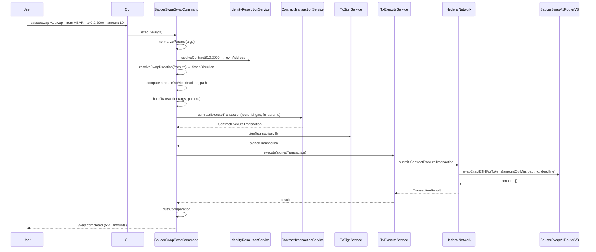
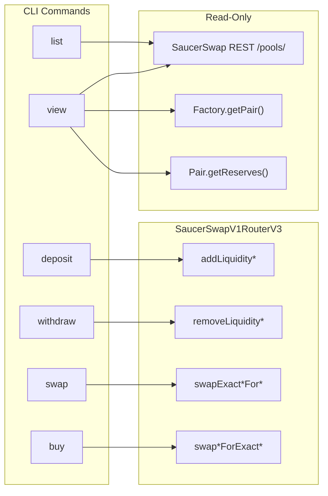

### ADR-013: SaucerSwap V1 DEX Plugin

- Status: Proposed
- Date: 2026-04-01
- Related: `src/plugins/saucerswap-v1/*`, `src/core/services/contract-transaction/*`, `src/core/services/contract-query/*`, `src/core/services/identity-resolution/*`, `docs/adr/ADR-001-plugin-architecture.md`, `docs/adr/ADR-008-smart-contract-plugin-implementation-strategy.md`, `docs/adr/ADR-009-class-based-handler-and-hook-architecture.md`, `docs/adr/ADR-013-saucerswap-v2-dex-plugin.md`

> **Scope:** This ADR covers **SaucerSwap V1** only — a Uniswap V2-style constant-product AMM with uniform liquidity and fungible LP tokens. For the concentrated-liquidity V2 protocol (Uniswap V3-style, NFT positions, fee tiers), see [ADR-013](ADR-014-saucerswap-v2-dex-plugin).

## Context

;[SaucerSwap](https://www.saucerswap.finance/) is the leading decentralized exchange (DEX) on the Hedera network, implementing a Uniswap V2-style constant-product AMM. The CLI already supports generic smart contract interactions via the `contract`, `contract-erc20`, and `contract-erc721` plugins, but these require users to manually construct `ContractFunctionParameters` and know the exact Solidity function signatures. For DEX operations — which involve multi-step workflows (token association, spender allowance, liquidity management, swaps) — a dedicated plugin with domain-specific commands significantly reduces friction and error potential.

The SaucerSwap V1 protocol exposes its functionality through two on-chain contracts and a public REST API:

| Component                | Mainnet ID                                                                                                 | Purpose                                                                |
| ------------------------ | ---------------------------------------------------------------------------------------------------------- | ---------------------------------------------------------------------- |
| **SaucerSwapV1RouterV3** | `0.0.3045981`                                                                                              | All write operations: pool creation, add/remove liquidity, swaps       |
| **UniswapV2Factory**     | `0.0.2895920`                                                                                              | Pool existence checks (`getPair`), pool creation fee (`pairCreateFee`) |
| **WHBAR**                | `0.0.1456986`                                                                                              | Wrapped HBAR token used when HBAR is one side of a pair                |
| **SaucerSwap REST API**  | `https://api.saucerswap.finance/pools/` (mainnet) / `https://test-api.saucerswap.finance/pools/` (testnet) | Read-only pool listing with metadata                                   |

This ADR proposes a `saucerswap-v1` plugin that wraps these contracts and API into six CLI commands, reusing existing core services (`ContractTransactionService`, `ContractQueryService`, `IdentityResolutionService`, `TxSignService`, `TxExecuteService`) and a small **`SaucerSwapApiService`** on `CoreApi` for REST pool data (see Part 5).

Reference documentation: [SaucerSwap V1 Developer Docs](https://docs.saucerswap.finance/v/developer/saucerswap-v1/).

## Decision

### Part 1: Plugin Structure

The plugin is located at `src/plugins/saucerswap-v1/` and exposes six commands.

```
src/plugins/saucerswap-v1/
├── index.ts
├── manifest.ts
├── constants.ts
├── utils/
│   ├── hbar-detection.ts
│   ├── slippage.ts
│   └── deadline.ts
├── commands/
│   ├── deposit/
│   │   ├── handler.ts
│   │   ├── index.ts
│   │   ├── input.ts
│   │   ├── output.ts
│   │   └── types.ts
│   ├── withdraw/
│   │   ├── handler.ts
│   │   ├── index.ts
│   │   ├── input.ts
│   │   ├── output.ts
│   │   └── types.ts
│   ├── swap/
│   │   ├── handler.ts
│   │   ├── index.ts
│   │   ├── input.ts
│   │   ├── output.ts
│   │   └── types.ts
│   ├── buy/
│   │   ├── handler.ts
│   │   ├── index.ts
│   │   ├── input.ts
│   │   ├── output.ts
│   │   └── types.ts
│   ├── list/
│   │   ├── handler.ts
│   │   ├── index.ts
│   │   └── output.ts
│   └── view/
│       ├── handler.ts
│       ├── index.ts
│       ├── input.ts
│       └── output.ts
└── __tests__/
    └── unit/
```

### Part 2: Network-Specific Constants

`src/plugins/saucerswap-v1/constants.ts` stores contract IDs and API URLs per network:

```ts
import { SupportedNetwork } from '@/core/types/shared.types';

export interface SaucerSwapNetworkConfig {
  routerContractId: string;
  factoryContractId: string;
  whbarTokenId: string;
  apiBaseUrl: string;
}

export const SAUCERSWAP_CONFIG: Partial<
  Record<SupportedNetwork, SaucerSwapNetworkConfig>
> = {
  [SupportedNetwork.MAINNET]: {
    routerContractId: '0.0.3045981',
    factoryContractId: '0.0.2895920', // UniswapV2Factory
    whbarTokenId: '0.0.1456986',
    apiBaseUrl: 'https://api.saucerswap.finance',
  },
  [SupportedNetwork.TESTNET]: {
    routerContractId: '0.0.19264',
    factoryContractId: '0.0.1062784',
    whbarTokenId: '0.0.15058',
    apiBaseUrl: 'https://test-api.saucerswap.finance',
  },
};

export const DEFAULT_SWAP_GAS = 250_000;
export const DEFAULT_LIQUIDITY_GAS = 240_000;
export const DEFAULT_REMOVE_LIQUIDITY_GAS = 2_800_000;
export const DEFAULT_DEADLINE_SECONDS = 180;
export const DEFAULT_SLIPPAGE_PERCENT = 0.5;
```

### Part 3: HBAR Detection and Routing

A core design concern is that SaucerSwap uses different Solidity functions depending on whether one of the tokens is HBAR (represented as WHBAR on-chain). The plugin automatically detects this and routes to the correct function variant.

```ts
// src/plugins/saucerswap-v1/utils/hbar-detection.ts
export function isHbar(tokenIdOrAlias: string): boolean {
  const normalized = tokenIdOrAlias.toUpperCase();
  return normalized === 'HBAR';
}
```

This detection affects which Solidity function is called:

| Operation          | Both tokens are HTS        | One token is HBAR                                  |
| ------------------ | -------------------------- | -------------------------------------------------- |
| Deposit            | `addLiquidity`             | `addLiquidityETH`                                  |
| Withdraw           | `removeLiquidity`          | `removeLiquidityETH`                               |
| Swap (exact input) | `swapExactTokensForTokens` | `swapExactETHForTokens` or `swapExactTokensForETH` |
| Buy (exact output) | `swapTokensForExactTokens` | `swapETHForExactTokens` or `swapTokensForExactETH` |

### Part 4: Slippage and Deadline Utilities

```ts
// src/plugins/saucerswap-v1/utils/slippage.ts
export function computeMinOutput(
  amount: bigint,
  slippagePercent: number,
): bigint {
  // Use 10000n for basis points (0.01%) to avoid floating point errors with BigInt
  const slippageBps = BigInt(Math.floor(slippagePercent * 100));
  return (amount * (10000n - slippageBps)) / 10000n;
}

// src/plugins/saucerswap-v1/utils/deadline.ts
export function computeDeadline(secondsFromNow: number): number {
  return Math.floor(Date.now() / 1000) + secondsFromNow;
}
```

### Part 5: SaucerSwap REST API (core service + shared schemas)

**Decision:** Do **not** implement a separate `saucerswap-v1-api.ts` under the plugin. SaucerSwap HTTP access and response validation live in **`core`**, consistent with other external integrations (e.g. mirror node).

1. **Zod schemas** — Add to `src/core/schemas/common-schemas.ts` (and re-export via `@/core/schemas`), e.g.:
   - `SaucerSwapV1ApiTokenSchema`, `SaucerSwapV1ApiLpTokenSchema`, `SaucerSwapV1ApiLiquidityPoolSchema`
   - `SaucerSwapV1ApiLiquidityPoolArraySchema` (or parse with `z.array(SaucerSwapV1ApiLiquidityPoolSchema)`)
   - Exported types: `SaucerSwapV1ApiLiquidityPool`, etc.

2. **Service interface** — `src/core/services/saucerswap-api/saucerswap-api-service.interface.ts` defines `SaucerSwapApiService` with at least:
   - `fetchAllPools(apiBaseUrl: string): Promise<SaucerSwapV1ApiLiquidityPool[]>` — `GET {apiBaseUrl}/pools/`

3. **Implementation** — `src/core/services/saucerswap-api/saucerswap-api-service.ts` (`SaucerSwapApiServiceImpl`): calls `fetch`, throws `NetworkError` on non-OK responses, validates JSON with `parseWithSchema` / the array schema from `common-schemas` (same pattern as `HederaMirrornodeService`).

4. **Core API** — `CoreApi` exposes `saucerSwapApi: SaucerSwapApiService`; `CoreApiImplementation` constructs `SaucerSwapApiServiceImpl` in its constructor.

5. **Plugins** — `saucerswap-v1` commands call `api.saucerSwapApi.fetchAllPools(config.apiBaseUrl)` (no duplicate fetch logic in the plugin).

Illustrative shape:

```ts
// src/core/services/saucerswap-api/saucerswap-api-service.interface.ts
import type { SaucerSwapV1ApiLiquidityPool } from '@/core/schemas/common-schemas';

export interface SaucerSwapApiService {
  fetchAllPools(apiBaseUrl: string): Promise<SaucerSwapV1ApiLiquidityPool[]>;
  // V2 methods (pools / positions) live on the same service — see ADR-014.
}
```

```ts
// src/core/services/saucerswap-api/saucerswap-api-service.ts (sketch)
import { NetworkError } from '@/core/errors';
import { SaucerSwapV1ApiLiquidityPoolArraySchema } from '@/core/schemas/common-schemas';
import { parseWithSchema } from '@/core/shared/validation/parse-with-schema.zod';

export class SaucerSwapApiServiceImpl implements SaucerSwapApiService {
  async fetchAllPools(apiBaseUrl: string) {
    const url = `${apiBaseUrl.replace(/\/+$/, '')}/pools/`;
    const response = await fetch(url);
    if (!response.ok) {
      throw new NetworkError(`SaucerSwap API error: ${response.status}`, {
        recoverable: true,
      });
    }
    const data: unknown = await response.json();
    return parseWithSchema(
      SaucerSwapV1ApiLiquidityPoolArraySchema,
      data,
      'SaucerSwap V1 pools',
    );
  }
}
```

### Part 6: Commands

#### 6.1 Deposit (Add Liquidity)

`SaucerSwapDepositCommand` extends `BaseTransactionCommand`. Adds liquidity to an **existing** pool.

**Solidity functions:**

- HBAR/token: `addLiquidityETH(address token, uint amountTokenDesired, uint amountTokenMin, uint amountETHMin, address to, uint deadline)` — gas ~240,000
- Token/token: `addLiquidity(address tokenA, address tokenB, uint amountADesired, uint amountBDesired, uint amountAMin, uint amountBMin, address to, uint deadline)` — gas ~240,000

**CLI options:** Same as `create-pool` except default gas is 240,000 and no pool creation fee is included.

CLI usage:

```
hcli saucerswap-v1 deposit --token-a HBAR --token-b 0.0.2000 --amount-a 10 --amount-b 5000
hcli saucerswap-v1 deposit --token-a 0.0.2000 --token-b 0.0.3000 --amount-a 100 --amount-b 200
```

**Pre-checks:**

1. LP token must be associated to the client account.
2. Router contract must have spender allowance for the input HTS tokens.

#### 6.2 Withdraw (Remove Liquidity)

`SaucerSwapWithdrawCommand` extends `BaseTransactionCommand`. Removes liquidity from an existing pool.

**Solidity functions:**

- HBAR/token: `removeLiquidityETH(address token, uint liquidity, uint amountTokenMin, uint amountETHMin, address to, uint deadline)` — gas ~2,800,000
- Token/token: `removeLiquidity(address tokenA, address tokenB, uint liquidity, uint amountAMin, uint amountBMin, address to, uint deadline)` — gas ~1,600,000

**CLI options:**

| Option           | Short | Type   | Required | Description                     |
| ---------------- | ----- | ------ | -------- | ------------------------------- |
| `--token-a`      | `-a`  | STRING | yes      | First token                     |
| `--token-b`      | `-b`  | STRING | yes      | Second token                    |
| `--liquidity`    | `-l`  | STRING | yes      | LP token amount to remove       |
| `--min-amount-a` |       | STRING | no       | Minimum token A to receive      |
| `--min-amount-b` |       | STRING | no       | Minimum token B to receive      |
| `--deadline`     | `-d`  | NUMBER | no       | Deadline seconds (default: 180) |
| `--gas`          | `-g`  | NUMBER | no       | Gas limit (default: 2,800,000)  |
| `--key-manager`  | `-k`  | STRING | no       | Key manager                     |

**Pre-checks:** Router contract must have spender allowance for the LP token.

CLI usage:

```
hcli saucerswap-v1 withdraw --token-a HBAR --token-b 0.0.2000 --liquidity 1000000
hcli saucerswap-v1 withdraw --token-a 0.0.2000 --token-b 0.0.3000 --liquidity 500000
```

#### 6.3 Swap (Exact Input)

`SaucerSwapSwapCommand` extends `BaseTransactionCommand`. Swaps an exact amount of input token for at least a minimum amount of output token.

**Solidity functions (selected by `SwapDirection`):**

| Input | Output | Function                                                                                                |
| ----- | ------ | ------------------------------------------------------------------------------------------------------- |
| HBAR  | Token  | `swapExactETHForTokens(uint amountOutMin, address[] path, address to, uint deadline)`                   |
| Token | HBAR   | `swapExactTokensForETH(uint amountIn, uint amountOutMin, address[] path, address to, uint deadline)`    |
| Token | Token  | `swapExactTokensForTokens(uint amountIn, uint amountOutMin, address[] path, address to, uint deadline)` |

**CLI options:**

| Option          | Short | Type   | Required | Description                                |
| --------------- | ----- | ------ | -------- | ------------------------------------------ |
| `--from`        | `-f`  | STRING | yes      | Input token (Hedera ID, alias, or `HBAR`)  |
| `--to`          | `-t`  | STRING | yes      | Output token                               |
| `--amount`      | `-a`  | STRING | yes      | Exact input amount (human-readable)        |
| `--min-output`  |       | STRING | no       | Minimum output amount (overrides slippage) |
| `--slippage`    | `-s`  | NUMBER | no       | Slippage % (default: 0.5)                  |
| `--deadline`    | `-d`  | NUMBER | no       | Deadline seconds (default: 180)            |
| `--gas`         | `-g`  | NUMBER | no       | Gas limit (default: 250,000)               |
| `--key-manager` | `-k`  | STRING | no       | Key manager                                |

**Path construction:** The `path` parameter is an ordered array of EVM addresses. For a direct swap: `[fromEvmAddress, toEvmAddress]`. When HBAR is involved, the WHBAR EVM address is used in the path.

**Swap direction enum** (defined in `commands/swap/types.ts`):

```ts
export enum SwapDirection {
  HBAR_FOR_TOKEN = 'HBAR_FOR_TOKEN',
  TOKEN_FOR_HBAR = 'TOKEN_FOR_HBAR',
  TOKEN_FOR_TOKEN = 'TOKEN_FOR_TOKEN',
}

export function resolveSwapDirection(from: string, to: string): SwapDirection {
  if (isHbar(from)) return SwapDirection.HBAR_FOR_TOKEN;
  if (isHbar(to)) return SwapDirection.TOKEN_FOR_HBAR;
  return SwapDirection.TOKEN_FOR_TOKEN;
}
```

**Handler flow (simplified):**

```ts
async buildTransaction(args, params): Promise<BuildTransactionResult> {
  const path = [params.fromEvmAddress, params.toEvmAddress];
  const deadline = computeDeadline(params.deadlineSeconds);

  switch (params.swapDirection) {
    case SwapDirection.HBAR_FOR_TOKEN:
      return this.buildHbarForToken(params, path, deadline);
    case SwapDirection.TOKEN_FOR_HBAR:
      return this.buildTokenForHbar(params, path, deadline);
    case SwapDirection.TOKEN_FOR_TOKEN:
      return this.buildTokenForToken(params, path, deadline);
  }
}

private buildHbarForToken(
  params: SwapNormalizedParams,
  path: string[],
  deadline: number,
): BuildTransactionResult {
  const functionParameters = new ContractFunctionParameters()
    .addUint256(params.amountOutMin)
    .addAddressArray(path)
    .addAddress(params.recipientEvm)
    .addUint256(deadline);

  const result = api.contract.contractExecuteTransaction({
    contractId: params.config.routerContractId,
    gas: params.gas,
    functionName: 'swapExactETHForTokens',
    functionParameters,
    payableAmount: params.amountIn,
  });
  return { transaction: result.transaction };
}

private buildTokenForHbar(
  params: SwapNormalizedParams,
  path: string[],
  deadline: number,
): BuildTransactionResult {
  const functionParameters = new ContractFunctionParameters()
    .addUint256(params.amountIn)
    .addUint256(params.amountOutMin)
    .addAddressArray(path)
    .addAddress(params.recipientEvm)
    .addUint256(deadline);

  return api.contract.contractExecuteTransaction({
    contractId: params.config.routerContractId,
    gas: params.gas,
    functionName: 'swapExactTokensForETH',
    functionParameters,
  });
}

private buildTokenForToken(
  params: SwapNormalizedParams,
  path: string[],
  deadline: number,
): BuildTransactionResult {
  const functionParameters = new ContractFunctionParameters()
    .addUint256(params.amountIn)
    .addUint256(params.amountOutMin)
    .addAddressArray(path)
    .addAddress(params.recipientEvm)
    .addUint256(deadline);

  return api.contract.contractExecuteTransaction({
    contractId: params.config.routerContractId,
    gas: params.gas,
    functionName: 'swapExactTokensForTokens',
    functionParameters,
  });
}
```

**Pre-checks:**

1. Output token must be associated to the recipient account.
2. Router contract must have spender allowance for the input token (when input is not HBAR).

CLI usage:

```
hcli saucerswap-v1 swap --from HBAR --to 0.0.2000 --amount 10 --slippage 1
hcli saucerswap-v1 swap --from 0.0.2000 --to 0.0.3000 --amount 500 --min-output 480
hcli saucerswap-v1 swap --from 0.0.2000 --to HBAR --amount 1000
```

#### 6.4 Buy (Exact Output)

`SaucerSwapBuyCommand` extends `BaseTransactionCommand`. The inverse of `swap` — the user specifies the **exact output** amount they want to receive, and the command computes the maximum input.

**Solidity functions:**

| Input | Output | Function                                                                                                |
| ----- | ------ | ------------------------------------------------------------------------------------------------------- |
| HBAR  | Token  | `swapETHForExactTokens(uint amountOut, address[] path, address to, uint deadline)`                      |
| Token | HBAR   | `swapTokensForExactETH(uint amountOut, uint amountInMax, address[] path, address to, uint deadline)`    |
| Token | Token  | `swapTokensForExactTokens(uint amountOut, uint amountInMax, address[] path, address to, uint deadline)` |

**CLI options:**

| Option          | Short | Type   | Required | Description                           |
| --------------- | ----- | ------ | -------- | ------------------------------------- |
| `--from`        | `-f`  | STRING | yes      | Input token                           |
| `--to`          | `-t`  | STRING | yes      | Output token                          |
| `--amount`      | `-a`  | STRING | yes      | Exact output amount desired           |
| `--max-input`   |       | STRING | yes      | Maximum input amount willing to spend |
| `--deadline`    | `-d`  | NUMBER | no       | Deadline seconds (default: 180)       |
| `--gas`         | `-g`  | NUMBER | no       | Gas limit (default: 250,000)          |
| `--key-manager` | `-k`  | STRING | no       | Key manager                           |

CLI usage:

```
hcli saucerswap-v1 buy --from HBAR --to 0.0.2000 --amount 5000 --max-input 15
hcli saucerswap-v1 buy --from 0.0.2000 --to HBAR --amount 10 --max-input 6000
```

#### 6.5 List Pools

`SaucerSwapListCommand` implements the `Command` interface directly (no transaction). It queries the SaucerSwap public REST API and optionally filters by a token.

**CLI options:**

| Option    | Short | Type   | Required | Description                                         |
| --------- | ----- | ------ | -------- | --------------------------------------------------- |
| `--token` | `-t`  | STRING | no       | Filter pools that contain this token (ID or symbol) |

**Handler flow:**

```ts
export class SaucerSwapListCommand implements Command {
  async execute(args: CommandHandlerArgs): Promise<CommandResult> {
    const validArgs = SaucerSwapListInputSchema.parse(args.args);
    const network = api.network.getCurrentNetwork();
    const config = getSaucerSwapConfig(network);

    const pools = await api.saucerSwapApi.fetchAllPools(config.apiBaseUrl);

    const filtered = validArgs.token
      ? pools.filter(
          (p) =>
            p.tokenA.id === validArgs.token ||
            p.tokenB.id === validArgs.token ||
            p.tokenA.symbol.toUpperCase() === validArgs.token.toUpperCase() ||
            p.tokenB.symbol.toUpperCase() === validArgs.token.toUpperCase() ||
            p.tokenA.name
              .toUpperCase()
              .includes(validArgs.token.toUpperCase()) ||
            p.tokenB.name.toUpperCase().includes(validArgs.token.toUpperCase()),
        )
      : pools;

    return {
      result: {
        network,
        poolCount: filtered.length,
        pools: filtered.map((p) => ({
          id: p.id,
          contractId: p.contractId,
          tokenA: `${p.tokenA.symbol} (${p.tokenA.id})`,
          tokenB: `${p.tokenB.symbol} (${p.tokenB.id})`,
          reserveA: p.tokenReserveA,
          reserveB: p.tokenReserveB,
        })),
      },
    };
  }
}
```

**Human-readable output template:**

```handlebars
Found
{{poolCount}}
pool(s) on
{{network}}
{{#each pools}}
  Pool #{{this.id}}:
  {{this.tokenA}}
  /
  {{this.tokenB}}
  Contract:
  {{this.contractId}}
  Reserves:
  {{this.reserveA}}
  /
  {{this.reserveB}}
{{/each}}
```

CLI usage:

```
hcli saucerswap-v1 list
hcli saucerswap-v1 list --token 0.0.2000
hcli saucerswap-v1 list --token SAUCE
```

#### 6.6 View Pool

`SaucerSwapViewCommand` implements the `Command` interface directly. It shows detailed information about a specific pool identified by its two tokens.

**CLI options:**

| Option      | Short | Type   | Required | Description  |
| ----------- | ----- | ------ | -------- | ------------ |
| `--token-a` | `-a`  | STRING | yes      | First token  |
| `--token-b` | `-b`  | STRING | yes      | Second token |

**Data sources:**

1. SaucerSwap REST API — pool metadata, LP token info, price.
2. Factory `getPair(tokenA, tokenB)` via `api.contractQuery.queryContractFunction()` — confirms on-chain existence.
3. Pair `getReserves()` via `api.contractQuery.queryContractFunction()` — live reserve data.

**Output includes:** pool contract ID, LP token ID, token A/B symbols, reserves, price ratio, LP token total supply.

CLI usage:

```
hcli saucerswap-v1 view --token-a HBAR --token-b 0.0.2000
hcli saucerswap-v1 view --token-a 0.0.2000 --token-b 0.0.3000
```

### Part 7: Command Classification

| Command    | Base Class               | On-Chain Effect                      | SaucerSwap Contract Function             |
| ---------- | ------------------------ | ------------------------------------ | ---------------------------------------- |
| `deposit`  | `BaseTransactionCommand` | Adds liquidity to existing pool      | `addLiquidityETH` / `addLiquidity`       |
| `withdraw` | `BaseTransactionCommand` | Removes liquidity from existing pool | `removeLiquidityETH` / `removeLiquidity` |
| `swap`     | `BaseTransactionCommand` | Swaps exact input for minimum output | `swapExact*For*` variants                |
| `buy`      | `BaseTransactionCommand` | Swaps maximum input for exact output | `swap*ForExact*` variants                |
| `list`     | `Command`                | None (REST API query)                | N/A                                      |
| `view`     | `Command`                | None (REST API + JSON RPC query)     | Factory `getPair` + Pair `getReserves`   |

## Execution Flow

### Swap Lifecycle



### Command-to-Contract Mapping



## Pros and Cons

### Pros

- **Minimal core surface.** The plugin reuses existing `ContractTransactionService`, `ContractQueryService`, `IdentityResolutionService`, `TxSignService`, and `TxExecuteService`. REST pool listing uses a dedicated **`SaucerSwapApiService`** on `CoreApi` (see Part 5) with Zod schemas in `common-schemas`, so HTTP and validation stay in core rather than duplicated per plugin.
- **Domain-specific UX.** Users interact with high-level concepts (swap, deposit, withdraw) rather than raw Solidity function names and hex-encoded parameters. The plugin handles HBAR/WHBAR routing, slippage computation, deadline calculation, and path construction automatically.
- **Follows established patterns.** Write commands extend `BaseTransactionCommand` (ADR-009), read-only commands implement `Command` directly. The file structure mirrors `contract-erc20` and other existing plugins.
- **Testable.** Each command handler is independently unit-testable by mocking `api.contract`, `api.identityResolution`, `api.contractQuery`, and `api.saucerSwapApi.fetchAllPools` where needed, following the same test patterns as `contract-erc20`.
- **Typed API responses.** The SaucerSwap REST API responses are parsed with Zod schemas, catching API changes at parse time rather than at runtime.

### Cons

- **External API dependency.** The `list` and `view` commands depend on SaucerSwap's public REST API (`api.saucerswap.finance`), which may have rate limits, downtime, or schema changes. The plugin should handle API errors gracefully with informative messages.
- **Network-specific configuration.** Contract IDs differ between mainnet, testnet, and localnet. Testnet IDs may not be available or may change. The plugin must validate that configuration exists for the current network before executing.
- **Gas estimation.** Recommended gas values are hardcoded based on SaucerSwap documentation. Actual gas requirements may vary for tokens with custom fees. Users can override with `--gas`.
- **Token decimal handling.** The plugin must correctly convert human-readable amounts to smallest-unit integers using each token's decimal places (fetched via `api.mirror.getTokenInfo` or `contract-erc20 decimals`). Incorrect conversion leads to unexpected swap amounts.
- **Pre-check responsibility.** Token association and spender allowance must be handled by the user before invoking SaucerSwap commands. The plugin does not automatically associate tokens or approve allowances — these are separate CLI commands (`token associate`, `contract-erc20 approve`).

## Consequences

- A new plugin directory `src/plugins/saucerswap-v1/` is created with the structure described above.
- The plugin manifest is registered in `src/core/shared/config/cli-options.ts` `DEFAULT_PLUGIN_STATE` array.
- Core adds **`SaucerSwapApiService`**, **`SaucerSwapApiServiceImpl`**, Zod schemas in **`src/core/schemas/common-schemas.ts`**, and **`saucerSwapApi`** on `CoreApi` (see Part 5). Other existing services remain unchanged.
- Commands that produce transactions (`deposit`, `withdraw`, `swap`, `buy`) are compatible with the batch and schedule hooks via `registeredHooks: ['batchify', 'scheduled']` in the manifest.
- Users must ensure token associations and spender allowances are in place before using the plugin. Documentation should include common prerequisite commands.
- The `constants.ts` file must be updated when testnet contract IDs are determined.
- Multi-hop swap routing and custom-fee token variants (`*SupportingFeeOnTransferTokens`) can be added as future enhancements without changing the command structure.
- SaucerSwap V2 (concentrated liquidity, Uniswap V3-style) is covered separately in [ADR-013](ADR-014-saucerswap-v2-dex-plugin). The two plugins coexist as `saucerswap-v1` and `saucerswap-v2`.

## Testing Strategy

- **Unit: SaucerSwapSwapCommand phases.** Test `normalizeParams` with HBAR→Token, Token→HBAR, and Token→Token inputs; verify correct Solidity function selection and path construction. Test `buildTransaction` produces correct `ContractFunctionParameters`. Mock `api.contract.contractExecuteTransaction` and verify function name, contract ID, and gas are correct.
- **Unit: SaucerSwapBuyCommand phases.** Same as swap but verify "exact output" function variants (`swap*ForExact*`) are selected and `amountInMax` / `amountOut` are correctly placed in parameters.
- **Unit: SaucerSwapDepositCommand.** Verify `addLiquidity` vs `addLiquidityETH` routing. Verify slippage computation produces correct `amountMin` values.
- **Unit: SaucerSwapWithdrawCommand.** Verify `removeLiquidity` vs `removeLiquidityETH` routing. Verify LP amount and minimum output amounts are correctly passed.
- **Unit: SaucerSwapListCommand.** Mock `api.saucerSwapApi.fetchAllPools` and verify filtering by token ID and symbol. Verify empty result handling.
- **Unit: SaucerSwapViewCommand.** Mock REST API response and contract queries (`getPair`, `getReserves`). Verify output includes reserves, price ratio, LP token info.
- **Unit: HBAR detection.** Test `isHbar` with `HBAR`, `hbar`, WHBAR token ID, and regular token IDs.
- **Unit: Slippage and deadline utilities.** Test `computeMinOutput` with various amounts and slippage percentages. Test `computeDeadline` produces correct Unix timestamp.
- **Unit: SaucerSwapApiService (core).** Mock `fetch` and verify Zod parsing via `common-schemas` and `NetworkError` on non-200 responses.
- **Unit: Constants.** Verify config exists for mainnet. Verify `getSaucerSwapConfig` throws `ConfigurationError` for unsupported networks.
- **Integration: Swap lifecycle.** With mocked network, verify full flow from CLI args through `normalizeParams` → `buildTransaction` → `signTransaction` → `executeTransaction` → `outputPreparation`.
