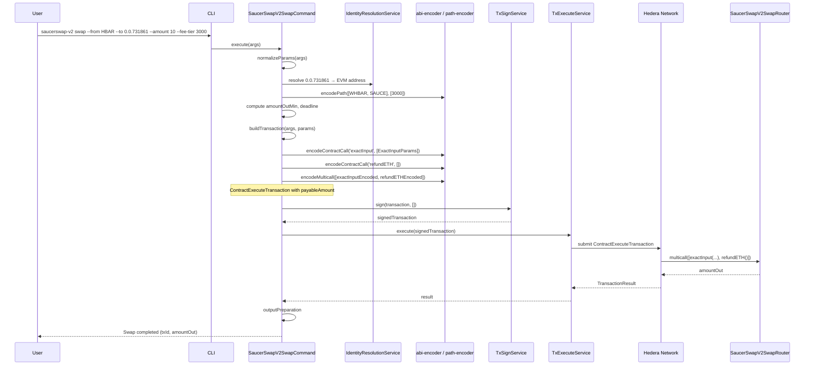
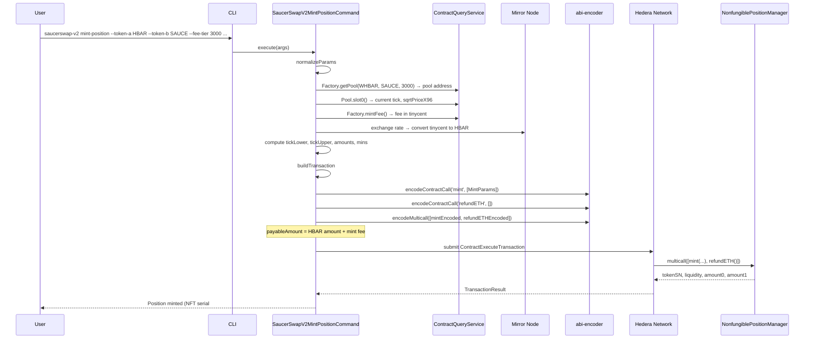
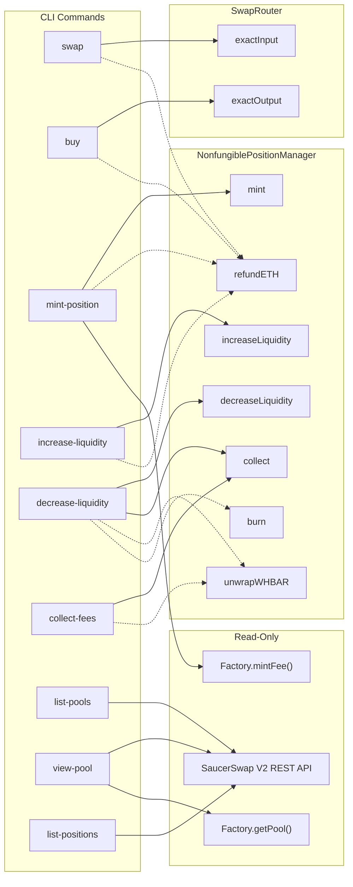

### ADR-014: SaucerSwap V2 Concentrated Liquidity Plugin

- Status: Proposed
- Date: 2026-04-09
- Related: `src/plugins/saucerswap-v2/*`, `src/core/services/contract-transaction/*`, `src/core/services/contract-query/*`, `src/core/services/identity-resolution/*`, `docs/adr/ADR-001-plugin-architecture.md`, `docs/adr/ADR-008-smart-contract-plugin-implementation-strategy.md`, `docs/adr/ADR-009-class-based-handler-and-hook-architecture.md`, `docs/adr/ADR-013-saucerswap-v1-dex-plugin.md`

## Context

ADR-013 introduced a `saucerswap-v1` plugin for SaucerSwap **V1** — a Uniswap V2-style constant-product AMM with uniform liquidity, fungible LP tokens, and named Solidity functions (`addLiquidity`, `swapExactTokensForTokens`, etc.) callable via the Hedera SDK's `ContractFunctionParameters`.

[SaucerSwap V2](https://docs.saucerswap.finance/protocol/saucerswap-v2) is a fundamentally different protocol based on the **Uniswap V3 concentrated-liquidity** model, adapted for the Hedera Token Service (HTS). It introduces:

1. **Concentrated liquidity** — LPs allocate capital within specific price ranges (tick intervals), achieving up to 4,000x capital efficiency versus V1.
2. **Fee tiers** — Each token pair can have multiple pools at different fee levels (0.05%, 0.15%, 0.30%, 1.00%).
3. **NFT-based positions** — Each liquidity position is unique (tick range + fee tier) and represented by a non-fungible HTS token, not a fungible LP token.
4. **ABI-encoded parameters** — V2 contracts accept complex Solidity structs (`ExactInputParams`, `MintParams`, etc.) that **cannot** be built with the Hedera SDK's `ContractFunctionParameters` helper. Calls must be ABI-encoded via `ethers.Interface.encodeFunctionData()` and submitted as raw bytes.
5. **`bytes path`** — Swap routing uses a packed bytes array (`token(20B) + fee(3B) + token(20B) + ...`) rather than V1's `address[]`.
6. **Multicall pattern** — Multiple operations are composed into a single `ContractExecuteTransaction` via the `multicall(bytes[])` function (e.g. `swap + refundETH`, or `decreaseLiquidity + collect + unwrapWHBAR + burn`).
7. **Separate contract set** — V2 uses its own SwapRouter, NonfungiblePositionManager, Factory, and QuoterV2, distinct from V1's Router and Factory.

The V2 protocol exposes its functionality through the following on-chain contracts and public REST API:

| Component                                    | Mainnet ID                                 | Testnet ID                                      | Purpose                                                                                  |
| -------------------------------------------- | ------------------------------------------ | ----------------------------------------------- | ---------------------------------------------------------------------------------------- |
| **SaucerSwapV2SwapRouter**                   | `0.0.3949434`                              | `0.0.1414040`                                   | Swap operations (`exactInput`, `exactOutput`)                                            |
| **SaucerSwapV2NonfungiblePositionManagerV2** | `0.0.4053945`                              | `0.0.1308184`                                   | Liquidity positions: `mint`, `increaseLiquidity`, `decreaseLiquidity`, `collect`, `burn` |
| **SaucerSwapV2Factory**                      | `0.0.3946833`                              | `0.0.1197038`                                   | Pool existence (`getPool`), mint fee (`mintFee`)                                         |
| **SaucerSwapV2QuoterV2**                     | `0.0.3949424`                              | `0.0.1390002`                                   | Off-chain swap quotes                                                                    |
| **LP NFT Token**                             | `0.0.4054027`                              | `0.0.1310436`                                   | HTS NFT representing liquidity positions                                                 |
| **WHBAR**                                    | `0.0.1456986`                              | `0.0.15058`                                     | Wrapped HBAR used when HBAR is one side of a pair                                        |
| **SaucerSwap V2 REST API**                   | `https://api.saucerswap.finance/v2/pools/` | `https://test-api.saucerswap.finance/v2/pools/` | Read-only V2 pool listing and position data                                              |

Reference documentation: [SaucerSwap V2 Developer Docs](https://docs.saucerswap.finance/v/developer/saucerswap-v2/), [Contract Deployments](https://docs.saucerswap.finance/developerx/contract-deployments), [V2 Whitepaper](https://www.saucerswap.finance/whitepaper-v2.pdf).

## Decision

### Part 1: Plugin Structure

The plugin is located at `src/plugins/saucerswap-v2/` and exposes nine commands.

```
src/plugins/saucerswap-v2/
├── index.ts
├── manifest.ts
├── constants.ts
├── abi/
│   ├── swap-router.json
│   ├── nft-position-manager.json
│   └── factory.json
├── utils/
│   ├── abi-encoder.ts
│   ├── path-encoder.ts
│   ├── multicall.ts
│   ├── tick-math.ts
│   ├── saucerswap-v2-api.ts
│   ├── hbar-detection.ts
│   ├── slippage.ts
│   └── deadline.ts
├── commands/
│   ├── swap/
│   │   ├── handler.ts
│   │   ├── index.ts
│   │   ├── input.ts
│   │   ├── output.ts
│   │   └── types.ts
│   ├── buy/
│   │   ├── handler.ts
│   │   ├── index.ts
│   │   ├── input.ts
│   │   ├── output.ts
│   │   └── types.ts
│   ├── mint-position/
│   │   ├── handler.ts
│   │   ├── index.ts
│   │   ├── input.ts
│   │   ├── output.ts
│   │   └── types.ts
│   ├── increase-liquidity/
│   │   ├── handler.ts
│   │   ├── index.ts
│   │   ├── input.ts
│   │   ├── output.ts
│   │   └── types.ts
│   ├── decrease-liquidity/
│   │   ├── handler.ts
│   │   ├── index.ts
│   │   ├── input.ts
│   │   ├── output.ts
│   │   └── types.ts
│   ├── collect-fees/
│   │   ├── handler.ts
│   │   ├── index.ts
│   │   ├── input.ts
│   │   ├── output.ts
│   │   └── types.ts
│   ├── list-pools/
│   │   ├── handler.ts
│   │   ├── index.ts
│   │   └── output.ts
│   ├── view-pool/
│   │   ├── handler.ts
│   │   ├── index.ts
│   │   ├── input.ts
│   │   └── output.ts
│   └── list-positions/
│       ├── handler.ts
│       ├── index.ts
│       ├── input.ts
│       └── output.ts
└── __tests__/
    └── unit/
```

### Part 2: Network-Specific Constants

`src/plugins/saucerswap-v2/constants.ts` stores contract IDs, LP NFT token IDs, and API URLs per network:

```ts
import { SupportedNetwork } from '@/core/types/shared.types';

export interface SaucerSwapV2NetworkConfig {
  swapRouterContractId: string;
  nftManagerContractId: string;
  factoryContractId: string;
  quoterContractId: string;
  lpNftTokenId: string;
  whbarTokenId: string;
  whbarEvmAddress: string;
  apiBaseUrl: string;
}

export const SAUCERSWAP_V2_CONFIG: Partial<
  Record<SupportedNetwork, SaucerSwapV2NetworkConfig>
> = {
  [SupportedNetwork.MAINNET]: {
    swapRouterContractId: '0.0.3949434',
    nftManagerContractId: '0.0.4053945',
    factoryContractId: '0.0.3946833',
    quoterContractId: '0.0.3949424',
    lpNftTokenId: '0.0.4054027',
    whbarTokenId: '0.0.1456986',
    whbarEvmAddress: '0x0000000000000000000000000000000000163b5a',
    apiBaseUrl: 'https://api.saucerswap.finance',
  },
  [SupportedNetwork.TESTNET]: {
    swapRouterContractId: '0.0.1414040',
    nftManagerContractId: '0.0.1308184',
    factoryContractId: '0.0.1197038',
    quoterContractId: '0.0.1390002',
    lpNftTokenId: '0.0.1310436',
    whbarTokenId: '0.0.15058',
    whbarEvmAddress: 'TBD',
    apiBaseUrl: 'https://test-api.saucerswap.finance',
  },
};

export enum FeeTier {
  VERY_STABLE = 500, // 0.05%, tick spacing 10
  STABLE = 1500, // 0.15%, tick spacing 30
  STANDARD = 3000, // 0.30%, tick spacing 60
  VOLATILE = 10000, // 1.00%, tick spacing 200
}

export const FEE_TIER_TO_TICK_SPACING: Record<FeeTier, number> = {
  [FeeTier.VERY_STABLE]: 10,
  [FeeTier.STABLE]: 30,
  [FeeTier.STANDARD]: 60,
  [FeeTier.VOLATILE]: 200,
};

export const DEFAULT_SWAP_GAS = 300_000;
export const DEFAULT_MINT_POSITION_GAS = 900_000;
export const DEFAULT_INCREASE_LIQUIDITY_GAS = 330_000;
export const DEFAULT_DECREASE_LIQUIDITY_GAS = 300_000;
export const DEFAULT_COLLECT_FEES_GAS = 300_000;
export const DEFAULT_DEADLINE_SECONDS = 180;
export const DEFAULT_SLIPPAGE_PERCENT = 0.5;
```

### Part 3: ABI Encoding Strategy

This is the most significant architectural difference from ADR-013. The V1 plugin builds transactions using `ContractFunctionParameters` (the Hedera SDK's named-parameter helper). V2 contracts use complex Solidity structs (`ExactInputParams`, `MintParams`, `DecreaseLiquidityParams`, etc.) that require ABI encoding.

**Decision:** The plugin performs ABI encoding within its own `utils/abi-encoder.ts` using `ethers.Interface`, which is already a dependency of the CLI (used by `ContractQueryService` and `ContractCreateFlow`). The raw `Uint8Array` is passed to `ContractExecuteTransaction.setFunctionParameters()` directly — the plugin constructs the `ContractExecuteTransaction` itself rather than going through `ContractTransactionService.contractExecuteTransaction()`, because the latter requires `functionName` + `ContractFunctionParameters` which cannot express the V2 struct calls.

```ts
// src/plugins/saucerswap-v2/utils/abi-encoder.ts
import { Interface, getBytes } from 'ethers';

export function encodeContractCall(
  abi: string | readonly string[],
  functionName: string,
  params: unknown[],
): Uint8Array {
  const iface = new Interface(abi);
  const encoded = iface.encodeFunctionData(functionName, params);
  return getBytes(encoded);
}

export function decodeContractResult(
  abi: string | readonly string[],
  functionName: string,
  data: Uint8Array,
): unknown[] {
  const iface = new Interface(abi);
  const decoded = iface.decodeFunctionResult(functionName, data);
  return [...decoded];
}
```

The ABI JSON files for each contract are stored in `src/plugins/saucerswap-v2/abi/` and contain only the function fragments needed by the plugin (not full contract ABIs). This keeps the bundle size small and avoids importing unnecessary functions.

**Why not extend `ContractTransactionService`?** Adding a `rawFunctionParameters: Uint8Array` option to `ContractExecuteParams` was considered but rejected because:

1. It would change a core interface for a single plugin's need.
2. The plugin already needs full control over `payableAmount`, multicall composition, and WHBAR handling, so it must construct `ContractExecuteTransaction` directly in several cases.
3. Keeping the encoding self-contained in the plugin avoids coupling core to ethers ABI specifics beyond what already exists in `ContractQueryService`.

### Part 4: Path Encoding

V2 swap routing uses a packed `bytes` path where each token is a 20-byte EVM address and each fee tier is a 3-byte value. The path format is `[token0(20B) | fee(3B) | token1(20B) | fee(3B) | token2(20B) | ...]`.

For `exactOutput`, the path must be **reversed** (output token first).

```ts
// src/plugins/saucerswap-v2/utils/path-encoder.ts

/**
 * Encode a V2 swap path: [token(20B) + fee(3B) + token(20B) + fee(3B) + ...]
 * Each token is an EVM address (0x-prefixed hex, 20 bytes).
 * Each fee is a uint24 (3 bytes big-endian).
 */
export function encodePath(tokens: string[], fees: number[]): string {
  if (tokens.length !== fees.length + 1) {
    throw new Error('tokens.length must equal fees.length + 1');
  }

  let path = '0x';
  for (let i = 0; i < fees.length; i++) {
    path += tokens[i].slice(2); // remove 0x prefix
    path += fees[i].toString(16).padStart(6, '0'); // 3 bytes = 6 hex chars
  }
  path += tokens[tokens.length - 1].slice(2);
  return path;
}

/**
 * Build the reversed path for exactOutput.
 */
export function encodePathReversed(tokens: string[], fees: number[]): string {
  return encodePath([...tokens].reverse(), [...fees].reverse());
}
```

### Part 5: Multicall Composition

Several V2 operations require combining multiple calls into one transaction using `multicall(bytes[])`. This applies when:

- **Swapping with HBAR input:** `[exactInput, refundETH]` — refund excess HBAR.
- **Minting a position with HBAR:** `[mint, refundETH]` — refund excess HBAR.
- **Decreasing liquidity:** `[decreaseLiquidity, collect, unwrapWHBAR?, burn?]` — collect tokens, optionally convert WHBAR to HBAR, optionally burn NFT.
- **Collecting fees with HBAR pool:** `[collect, unwrapWHBAR]` — convert WHBAR to native HBAR.

```ts
// src/plugins/saucerswap-v2/utils/multicall.ts
import { Interface, getBytes } from 'ethers';

/**
 * ABI-encode a multicall wrapping multiple encoded function calls.
 */
export function encodeMulticall(
  abi: string | readonly string[],
  encodedCalls: Uint8Array[],
): Uint8Array {
  const iface = new Interface(abi);
  const callsAsHex = encodedCalls.map(
    (c) => '0x' + Buffer.from(c).toString('hex'),
  );
  const encoded = iface.encodeFunctionData('multicall', [callsAsHex]);
  return getBytes(encoded);
}
```

### Part 6: Tick and Price Utilities

Concentrated liquidity positions require specifying a tick range. The plugin provides helpers to convert between human-readable prices and ticks, and to snap ticks to the nearest valid tick spacing.

```ts
// src/plugins/saucerswap-v2/utils/tick-math.ts

/**
 * Round a tick to the nearest usable tick given the pool's tick spacing.
 */
export function nearestUsableTick(tick: number, tickSpacing: number): number {
  const rounded = Math.round(tick / tickSpacing) * tickSpacing;
  return rounded;
}

/**
 * Compute ticks for a symmetric ±percentage range around the current tick.
 * Used by volatility strategy presets.
 */
export function tickRangeFromPercent(
  currentTick: number,
  percentDelta: number,
  tickSpacing: number,
): { tickLower: number; tickUpper: number } {
  const tickDelta = Math.floor(
    Math.log(1 + percentDelta / 100) / Math.log(1.0001),
  );
  return {
    tickLower: nearestUsableTick(currentTick - tickDelta, tickSpacing),
    tickUpper: nearestUsableTick(currentTick + tickDelta, tickSpacing),
  };
}
```

### Part 7: SaucerSwap V2 REST API Client

`src/plugins/saucerswap-v2/utils/saucerswap-v2-api.ts` provides a typed client for the public V2 pool listing and position endpoints.

```ts
import { z } from 'zod';

const V2TokenSchema = z.object({
  decimals: z.number(),
  id: z.string(),
  name: z.string(),
  symbol: z.string(),
  priceUsd: z.number(),
});

const V2PoolSchema = z.object({
  id: z.number(),
  contractId: z.string(),
  fee: z.number(),
  tickSpacing: z.number(),
  token0: V2TokenSchema,
  token1: V2TokenSchema,
  sqrtRatioX96: z.string(),
  liquidity: z.string(),
  tick: z.number(),
});

export type V2Pool = z.infer<typeof V2PoolSchema>;

export async function fetchV2Pools(apiBaseUrl: string): Promise<V2Pool[]> {
  const response = await fetch(`${apiBaseUrl}/v2/pools/`);
  if (!response.ok)
    throw new NetworkError(`SaucerSwap V2 API error: ${response.status}`);
  const data = await response.json();
  return z.array(V2PoolSchema).parse(data);
}

const V2PositionSchema = z.object({
  tokenSN: z.number(),
  poolId: z.number(),
  tickLower: z.number(),
  tickUpper: z.number(),
  liquidity: z.string(),
  token0: V2TokenSchema,
  token1: V2TokenSchema,
  fee: z.number(),
  tokensOwed0: z.string(),
  tokensOwed1: z.string(),
});

export type V2Position = z.infer<typeof V2PositionSchema>;

export async function fetchV2Positions(
  apiBaseUrl: string,
  accountId: string,
): Promise<V2Position[]> {
  const response = await fetch(`${apiBaseUrl}/v2/nfts/${accountId}`);
  if (!response.ok)
    throw new NetworkError(
      `SaucerSwap V2 positions API error: ${response.status}`,
    );
  const data = await response.json();
  return z.array(V2PositionSchema).parse(data);
}
```

### Part 8: Commands

#### 8.1 Swap (Exact Input)

`SaucerSwapV2SwapCommand` extends `BaseTransactionCommand`. Swaps an exact amount of input token for at least a minimum amount of output token.

**Solidity function:** `SwapRouter.exactInput(ExactInputParams)`

```solidity
struct ExactInputParams {
  bytes path;
  address recipient;
  uint256 deadline;
  uint256 amountIn;
  uint256 amountOutMinimum;
}
function exactInput(ExactInputParams calldata params) external payable returns (uint256 amountOut);
```

When the input token is HBAR, the call is wrapped in `multicall([exactInput, refundETH])` with `payableAmount` set to the HBAR input amount. The `refundETH` call returns any excess HBAR not consumed by the swap.

**CLI options:**

| Option          | Short | Type   | Required | Description                                |
| --------------- | ----- | ------ | -------- | ------------------------------------------ |
| `--from`        | `-f`  | STRING | yes      | Input token (Hedera ID, alias, or `HBAR`)  |
| `--to`          | `-t`  | STRING | yes      | Output token                               |
| `--amount`      | `-a`  | STRING | yes      | Exact input amount (human-readable)        |
| `--fee-tier`    | `-F`  | NUMBER | yes      | Pool fee tier: 500, 1500, 3000, or 10000   |
| `--min-output`  | `-o`  | STRING | no       | Minimum output amount (overrides slippage) |
| `--slippage`    | `-s`  | NUMBER | no       | Slippage % (default: 0.5)                  |
| `--deadline`    | `-d`  | NUMBER | no       | Deadline seconds (default: 180)            |
| `--gas`         | `-g`  | NUMBER | no       | Gas limit (default: 300,000)               |
| `--key-manager` | `-k`  | STRING | no       | Key manager                                |

**Handler flow:**

```ts
export class SaucerSwapV2SwapCommand extends BaseTransactionCommand<...> {
  async normalizeParams(args: CommandHandlerArgs): Promise<SwapV2NormalizedParams> {
    const validArgs = SwapV2InputSchema.parse(args.args);
    const config = getSaucerSwapV2Config(network);

    const fromEvm = await resolveTokenEvmAddress(api, validArgs.from, network);
    const toEvm = await resolveTokenEvmAddress(api, validArgs.to, network);
    const recipientEvm = await resolveOperatorEvmAddress(api, network);
    const fromIsHbar = isHbar(validArgs.from);

    // Build the packed bytes path: [fromEvm + feeTier + toEvm]
    const pathFromEvm = fromIsHbar ? config.whbarEvmAddress : fromEvm;
    const pathToEvm = isHbar(validArgs.to) ? config.whbarEvmAddress : toEvm;
    const path = encodePath([pathFromEvm, pathToEvm], [validArgs.feeTier]);

    // Compute min output from slippage or explicit --min-output
    const amountOutMin = validArgs.minOutput ?? computeMinOutput(amountIn, validArgs.slippage);

    return { config, path, recipientEvm, amountIn, amountOutMin, fromIsHbar, ... };
  }

  async buildTransaction(args, params): Promise<BuildTransactionResult> {
    const swapParams = {
      path: params.path,
      recipient: params.recipientEvm,
      deadline: computeDeadline(params.deadlineSeconds),
      amountIn: params.amountIn,
      amountOutMinimum: params.amountOutMin,
    };

    const swapEncoded = encodeContractCall(swapRouterAbi, 'exactInput', [swapParams]);

    let functionParameters: Uint8Array;
    if (params.fromIsHbar) {
      const refundEncoded = encodeContractCall(swapRouterAbi, 'refundETH', []);
      functionParameters = encodeMulticall(swapRouterAbi, [swapEncoded, refundEncoded]);
    } else {
      functionParameters = swapEncoded;
    }

    const tx = new ContractExecuteTransaction()
      .setContractId(ContractId.fromString(params.config.swapRouterContractId))
      .setGas(params.gas)
      .setFunctionParameters(functionParameters);

    if (params.fromIsHbar) {
      tx.setPayableAmount(Hbar.from(params.amountIn, HbarUnit.Tinybar));
    }

    return { transaction: tx };
  }
}
```

**Pre-checks:**

1. Output token must be associated to the recipient account.
2. SwapRouter contract must have spender allowance for the input HTS token (when input is not HBAR).

CLI usage:

```
hcli saucerswap-v2 swap --from HBAR --to 0.0.731861 --amount 10 --fee-tier 3000 --slippage 1
hcli saucerswap-v2 swap --from 0.0.731861 --to 0.0.2000 --amount 500 --fee-tier 1500 --min-output 480
```

#### 8.2 Buy (Exact Output)

`SaucerSwapV2BuyCommand` extends `BaseTransactionCommand`. The user specifies the exact output amount to receive; the command computes the maximum input.

**Solidity function:** `SwapRouter.exactOutput(ExactOutputParams)`

```solidity
struct ExactOutputParams {
  bytes path;        // REVERSED: [outputToken + fee + inputToken]
  address recipient;
  uint256 deadline;
  uint256 amountOut;
  uint256 amountInMaximum;
}
function exactOutput(ExactOutputParams calldata params) external payable returns (uint256 amountIn);
```

**Critical:** The `path` for `exactOutput` is **reversed** — it starts with the output token.

When the input is HBAR, the call is wrapped in `multicall([exactOutput, refundETH])` with `payableAmount` set to `amountInMaximum`.

**CLI options:**

| Option          | Short | Type   | Required | Description                           |
| --------------- | ----- | ------ | -------- | ------------------------------------- |
| `--from`        | `-f`  | STRING | yes      | Input token                           |
| `--to`          | `-t`  | STRING | yes      | Output token                          |
| `--amount`      | `-a`  | STRING | yes      | Exact output amount desired           |
| `--max-input`   | `-i`  | STRING | yes      | Maximum input amount willing to spend |
| `--fee-tier`    | `-F`  | NUMBER | yes      | Pool fee tier                         |
| `--deadline`    | `-d`  | NUMBER | no       | Deadline seconds (default: 180)       |
| `--gas`         | `-g`  | NUMBER | no       | Gas limit (default: 300,000)          |
| `--key-manager` | `-k`  | STRING | no       | Key manager                           |

CLI usage:

```
hcli saucerswap-v2 buy --from HBAR --to 0.0.731861 --amount 5000 --max-input 15 --fee-tier 3000
hcli saucerswap-v2 buy --from 0.0.731861 --to HBAR --amount 10 --max-input 6000 --fee-tier 3000
```

#### 8.3 Mint Position (New Concentrated Liquidity)

`SaucerSwapV2MintPositionCommand` extends `BaseTransactionCommand`. Creates a new concentrated liquidity position in an existing V2 pool and mints an NFT representing the position.

**Solidity function:** `NonfungiblePositionManager.mint(MintParams)`

```solidity
struct MintParams {
  address token0;
  address token1;
  uint24 fee;
  int24 tickLower;
  int24 tickUpper;
  uint256 amount0Desired;
  uint256 amount1Desired;
  uint256 amount0Min;
  uint256 amount1Min;
  address recipient;
  uint256 deadline;
}
function mint(MintParams calldata params) external payable
  returns (uint256 tokenSN, uint128 liquidity, uint256 amount0, uint256 amount1);
```

When one token is HBAR, the call is wrapped in `multicall([mint, refundETH])` with `payableAmount` set to the HBAR amount + mint fee.

**CLI options:**

| Option            | Short | Type   | Required | Description                                                                         |
| ----------------- | ----- | ------ | -------- | ----------------------------------------------------------------------------------- |
| `--token-a`       | `-a`  | STRING | yes      | First token (Hedera ID, alias, or `HBAR`)                                           |
| `--token-b`       | `-b`  | STRING | yes      | Second token                                                                        |
| `--fee-tier`      |       | NUMBER | yes      | Pool fee tier (500, 1500, 3000, or 10000)                                           |
| `--amount-a`      |       | STRING | yes      | Desired amount of token A (human-readable)                                          |
| `--amount-b`      |       | STRING | yes      | Desired amount of token B (human-readable)                                          |
| `--tick-lower`    |       | NUMBER | no       | Lower tick of the price range (auto-computed from `--range-percent` if omitted)     |
| `--tick-upper`    |       | NUMBER | no       | Upper tick of the price range                                                       |
| `--range-percent` |       | NUMBER | no       | Symmetric range ±% around current price (default: 5); used when ticks not specified |
| `--slippage`      | `-s`  | NUMBER | no       | Slippage % (default: 0.5)                                                           |
| `--deadline`      | `-d`  | NUMBER | no       | Deadline seconds (default: 180)                                                     |
| `--gas`           | `-g`  | NUMBER | no       | Gas limit (default: 900,000)                                                        |
| `--key-manager`   | `-k`  | STRING | no       | Key manager                                                                         |

**Handler flow:**

```ts
async normalizeParams(args: CommandHandlerArgs): Promise<MintPositionNormalizedParams> {
  // Resolve EVM addresses for both tokens
  // If ticks not specified, query pool slot0 for current tick
  //   and compute tickLower/tickUpper from --range-percent + tickSpacing
  // Fetch mint fee from Factory.mintFee() via ContractQueryService
  // Convert to HBAR using Mirror Node exchange rate
  // Compute amount0Min/amount1Min from slippage
}
```

**Pre-checks:**

1. LP NFT token ID (`0.0.4054027` on mainnet) must be associated to the recipient account.
2. NonfungiblePositionManager contract must have spender allowance for both input HTS tokens (not needed for HBAR side).

CLI usage:

```
hcli saucerswap-v2 mint-position --token-a HBAR --token-b 0.0.731861 --fee-tier 3000 \
  --amount-a 10 --amount-b 5000 --range-percent 5
hcli saucerswap-v2 mint-position --token-a 0.0.2000 --token-b 0.0.3000 --fee-tier 1500 \
  --amount-a 1000 --amount-b 2000 --tick-lower -1200 --tick-upper 1200
```

#### 8.4 Increase Liquidity

`SaucerSwapV2IncreaseLiquidityCommand` extends `BaseTransactionCommand`. Adds more liquidity to an existing position identified by its NFT serial number.

**Solidity function:** `NonfungiblePositionManager.increaseLiquidity(IncreaseLiquidityParams)`

```solidity
struct IncreaseLiquidityParams {
  uint256 tokenSN;
  uint256 amount0Desired;
  uint256 amount1Desired;
  uint256 amount0Min;
  uint256 amount1Min;
  uint256 deadline;
}
function increaseLiquidity(IncreaseLiquidityParams calldata params) external payable
  returns (uint128 liquidity, uint256 amount0, uint256 amount1);
```

When one token is HBAR: `multicall([increaseLiquidity, refundETH])`.

**CLI options:**

| Option          | Short | Type   | Required | Description                                 |
| --------------- | ----- | ------ | -------- | ------------------------------------------- |
| `--position`    | `-p`  | NUMBER | yes      | NFT serial number of the liquidity position |
| `--amount-a`    |       | STRING | yes      | Desired amount of token0                    |
| `--amount-b`    |       | STRING | yes      | Desired amount of token1                    |
| `--slippage`    | `-s`  | NUMBER | no       | Slippage % (default: 0.5)                   |
| `--deadline`    | `-d`  | NUMBER | no       | Deadline seconds (default: 180)             |
| `--gas`         | `-g`  | NUMBER | no       | Gas limit (default: 330,000)                |
| `--key-manager` | `-k`  | STRING | no       | Key manager                                 |

CLI usage:

```
hcli saucerswap-v2 increase-liquidity --position 42 --amount-a 5 --amount-b 2500
```

#### 8.5 Decrease Liquidity

`SaucerSwapV2DecreaseLiquidityCommand` extends `BaseTransactionCommand`. Removes liquidity from an existing position. Composes a multicall of up to four operations.

**Solidity functions (composed via multicall):**

1. `decreaseLiquidity(DecreaseLiquidityParams)` — remove liquidity, accrue tokens to position.
2. `collect(CollectParams)` — withdraw tokens to recipient.
3. `unwrapWHBAR(uint256, address)` — convert WHBAR output to native HBAR (only when pool includes HBAR).
4. `burn(uint256 tokenSN)` — burn the NFT (only when `--burn` flag is set and all liquidity removed).

```solidity
struct DecreaseLiquidityParams {
  uint256 tokenSN;
  uint128 liquidity;
  uint256 amount0Min;
  uint256 amount1Min;
  uint256 deadline;
}
function decreaseLiquidity(DecreaseLiquidityParams calldata params) external payable
  returns (uint256 amount0, uint256 amount1);

struct CollectParams {
  uint256 tokenSN;
  address recipient;
  uint128 amount0Max;
  uint128 amount1Max;
}
function collect(CollectParams calldata params) external payable
  returns (uint256 amount0, uint256 amount1);
```

**CLI options:**

| Option          | Short | Type    | Required | Description                                        |
| --------------- | ----- | ------- | -------- | -------------------------------------------------- |
| `--position`    | `-p`  | NUMBER  | yes      | NFT serial number                                  |
| `--liquidity`   | `-l`  | STRING  | yes      | Liquidity amount to remove, or `all` for full exit |
| `--slippage`    | `-s`  | NUMBER  | no       | Slippage % (default: 0.5)                          |
| `--deadline`    | `-d`  | NUMBER  | no       | Deadline seconds (default: 180)                    |
| `--burn`        |       | BOOLEAN | no       | Burn the NFT after full exit                       |
| `--gas`         | `-g`  | NUMBER  | no       | Gas limit (default: 300,000)                       |
| `--key-manager` | `-k`  | STRING  | no       | Key manager                                        |

**Pre-checks:** When `--burn` is set, the user's account must approve an NFT spender allowance for the NonfungiblePositionManager contract.

CLI usage:

```
hcli saucerswap-v2 decrease-liquidity --position 42 --liquidity all --burn
hcli saucerswap-v2 decrease-liquidity --position 42 --liquidity 50000000
```

#### 8.6 Collect Fees

`SaucerSwapV2CollectFeesCommand` extends `BaseTransactionCommand`. Claims earned swap fees from a position without removing liquidity.

**Solidity function:** `NonfungiblePositionManager.collect(CollectParams)` — sets `amount0Max` and `amount1Max` to `type(uint128).max` to collect all available fees.

When the pool includes HBAR: `multicall([collect, unwrapWHBAR])`.

**CLI options:**

| Option          | Short | Type   | Required | Description                  |
| --------------- | ----- | ------ | -------- | ---------------------------- |
| `--position`    | `-p`  | NUMBER | yes      | NFT serial number            |
| `--gas`         | `-g`  | NUMBER | no       | Gas limit (default: 300,000) |
| `--key-manager` | `-k`  | STRING | no       | Key manager                  |

CLI usage:

```
hcli saucerswap-v2 collect-fees --position 42
```

#### 8.7 List Pools

`SaucerSwapV2ListPoolsCommand` implements the `Command` interface directly (no transaction). Queries the SaucerSwap V2 REST API.

**CLI options:**

| Option       | Short | Type   | Required | Description                                       |
| ------------ | ----- | ------ | -------- | ------------------------------------------------- |
| `--token`    | `-t`  | STRING | no       | Filter pools containing this token (ID or symbol) |
| `--fee-tier` |       | NUMBER | no       | Filter by fee tier (500, 1500, 3000, 10000)       |

CLI usage:

```
hcli saucerswap-v2 list-pools
hcli saucerswap-v2 list-pools --token SAUCE --fee-tier 3000
```

#### 8.8 View Pool

`SaucerSwapV2ViewPoolCommand` implements `Command`. Shows detailed information about a specific V2 pool identified by its two tokens and fee tier.

**Data sources:**

1. SaucerSwap V2 REST API — pool metadata, tick, liquidity.
2. Factory `getPool(tokenA, tokenB, fee)` via `api.contractQuery.queryContractFunction()` — confirms on-chain existence and returns pool EVM address.

**CLI options:**

| Option       | Short | Type   | Required | Description  |
| ------------ | ----- | ------ | -------- | ------------ |
| `--token-a`  | `-a`  | STRING | yes      | First token  |
| `--token-b`  | `-b`  | STRING | yes      | Second token |
| `--fee-tier` |       | NUMBER | yes      | Fee tier     |

CLI usage:

```
hcli saucerswap-v2 view-pool --token-a HBAR --token-b 0.0.731861 --fee-tier 3000
```

#### 8.9 List Positions

`SaucerSwapV2ListPositionsCommand` implements `Command`. Shows all V2 liquidity positions for an account.

**CLI options:**

| Option      | Short | Type   | Required | Description                                |
| ----------- | ----- | ------ | -------- | ------------------------------------------ |
| `--account` | `-a`  | STRING | no       | Account ID or alias (defaults to operator) |

**Output includes:** position NFT serial, pool tokens, fee tier, tick range, liquidity, uncollected fees.

CLI usage:

```
hcli saucerswap-v2 list-positions
hcli saucerswap-v2 list-positions --account 0.0.123456
```

### Part 9: Command Classification

| Command              | Base Class               | On-Chain Effect                                     | V2 Contract Function                                            |
| -------------------- | ------------------------ | --------------------------------------------------- | --------------------------------------------------------------- |
| `swap`               | `BaseTransactionCommand` | Swaps exact input for minimum output                | `SwapRouter.exactInput`                                         |
| `buy`                | `BaseTransactionCommand` | Swaps maximum input for exact output                | `SwapRouter.exactOutput`                                        |
| `mint-position`      | `BaseTransactionCommand` | Creates concentrated liquidity position + mints NFT | `NonfungiblePositionManager.mint`                               |
| `increase-liquidity` | `BaseTransactionCommand` | Adds tokens to existing position                    | `NonfungiblePositionManager.increaseLiquidity`                  |
| `decrease-liquidity` | `BaseTransactionCommand` | Removes liquidity + collects + optional burn        | `NonfungiblePositionManager.decreaseLiquidity + collect + burn` |
| `collect-fees`       | `BaseTransactionCommand` | Claims earned swap fees                             | `NonfungiblePositionManager.collect`                            |
| `list-pools`         | `Command`                | None (REST API query)                               | N/A                                                             |
| `view-pool`          | `Command`                | None (REST API + JSON RPC query)                    | `Factory.getPool`                                               |
| `list-positions`     | `Command`                | None (REST API query)                               | N/A                                                             |

## Execution Flow

### Swap Lifecycle (Exact Input, HBAR → Token)



### Mint Position Lifecycle



### Command-to-Contract Mapping



## Relationship to ADR-013 (SaucerSwap V1)

| Aspect           | V1 (ADR-013)                        | V2 (this ADR)                                                      |
| ---------------- | ----------------------------------- | ------------------------------------------------------------------ |
| AMM model        | Constant product (Uniswap V2)       | Concentrated liquidity (Uniswap V3)                                |
| LP token type    | Fungible HTS token                  | Non-fungible HTS NFT (per-position)                                |
| Pool per pair    | One                                 | One per fee tier (up to 4)                                         |
| Fee structure    | Single fee (0.30%)                  | 0.05%, 0.15%, 0.30%, 1.00%                                         |
| Swap path        | `address[]`                         | Packed `bytes` with embedded fees                                  |
| Function calling | `ContractFunctionParameters`        | ABI-encoded `Uint8Array` via ethers.js                             |
| HBAR handling    | Separate function variants (`*ETH`) | Same functions; HBAR via `multicall` + `refundETH` / `unwrapWHBAR` |
| Key contract     | SaucerSwapV1RouterV3                | SwapRouter + NonfungiblePositionManager                            |
| Plugin name      | `saucerswap-v1`                     | `saucerswap-v2`                                                    |
| REST API path    | `/pools/`                           | `/v2/pools/`, `/v2/nfts/`                                          |

Both plugins share the WHBAR token ID, `hbar-detection.ts`, `slippage.ts`, and `deadline.ts` utilities. These may be extracted to a shared `saucerswap-common/` directory in a future refactoring, but for now each plugin keeps its own copy to avoid coupling.

## Pros and Cons

### Pros

- **No core changes required.** Like V1, the plugin reuses existing `ContractQueryService`, `IdentityResolutionService`, `TxSignService`, and `TxExecuteService`. The only deviation is constructing `ContractExecuteTransaction` directly (bypassing `ContractTransactionService`) for ABI-encoded calls.
- **Concentrated liquidity exposure.** Users can access V2's capital-efficient liquidity without manually encoding Solidity structs and packed paths.
- **Full position lifecycle.** The nine commands cover the entire V2 lifecycle: swaps, position creation, liquidity management, fee collection, and position viewing.
- **NFT-aware UX.** Commands that operate on positions use `--position <serial>`, making it straightforward to manage individual concentrated liquidity positions.
- **Fee tier selection.** Explicit `--fee-tier` option ensures users select the correct pool among multiple pools for the same pair.
- **Multicall composition.** Complex multi-step operations (decrease + collect + unwrap + burn) are handled internally as a single atomic transaction.
- **Follows established patterns.** File structure, command classification, and hook registration follow the same conventions as V1 (ADR-013) and other plugins.
- **Typed API responses.** V2 REST API responses are validated with Zod schemas.

### Cons

- **Direct `ContractExecuteTransaction` construction.** Write commands bypass `ContractTransactionService` because V2 requires raw ABI-encoded parameters. This means the plugin is more tightly coupled to the Hedera SDK than V1 commands, but the signing and execution phases still go through `TxSignService` / `TxExecuteService`.
- **Ethers.js dependency.** ABI encoding and decoding rely on `ethers.Interface`. This is already a CLI dependency (used by `ContractQueryService` and `ContractCreateFlow`), but the V2 plugin uses it more extensively.
- **Tick complexity.** Users must understand ticks and price ranges for `mint-position`. The `--range-percent` option mitigates this by auto-computing a symmetric range, but advanced LPs may want raw tick control.
- **External API dependency.** The `list-pools`, `view-pool`, and `list-positions` commands depend on SaucerSwap's V2 REST API, which may have rate limits or schema changes.
- **Gas estimation.** Recommended gas values are from SaucerSwap documentation and may vary. Users can override with `--gas`.
- **Pre-check responsibility.** Token association (including LP NFT), spender allowances, and NFT allowances (for burn) must be handled by the user before invoking commands.
- **No pool creation.** V2 pool creation is not exposed as a CLI command because V2 pools are typically created through the SaucerSwap interface with specific parameters. New pools can still be created by providing liquidity in a range via `mint-position` if the pool already exists (initialized).

## Consequences

- A new plugin directory `src/plugins/saucerswap-v2/` is created with the structure described above.
- ABI JSON files are stored in `src/plugins/saucerswap-v2/abi/` and contain only the function fragments used by the plugin.
- The plugin manifest is registered in `src/core/shared/config/cli-options.ts` `DEFAULT_PLUGIN_STATE` array.
- No changes to existing core services or interfaces are needed. The plugin constructs `ContractExecuteTransaction` directly for write operations and uses `ContractQueryService` for read-only calls.
- Transaction commands (`swap`, `buy`, `mint-position`, `increase-liquidity`, `decrease-liquidity`, `collect-fees`) are compatible with the batch and schedule hooks via `registeredHooks: ['batchify', 'scheduled']` in the manifest.
- Users must ensure token associations (including LP NFT ID), spender allowances, and NFT spender allowances are in place before using the plugin.
- Shared utilities (`hbar-detection`, `slippage`, `deadline`) are duplicated from V1 initially; a future ADR may propose a `saucerswap-common` shared utility package.
- Multi-hop routing (swaps through intermediate pools) is supported by the `bytes path` encoding and can be exposed as a future enhancement with a `--path` option.

## Testing Strategy

- **Unit: Path encoder.** Test `encodePath` and `encodePathReversed` with 2-token and 3-token (multi-hop) paths. Verify correct hex encoding of fee tiers (e.g. 3000 → `000BB8`).
- **Unit: ABI encoder.** Test `encodeContractCall` with `exactInput`, `mint`, `collect` params. Verify output matches known ABI-encoded values from ethers.js directly.
- **Unit: Multicall encoder.** Test `encodeMulticall` with 1, 2, and 4 encoded calls. Verify the outer `multicall(bytes[])` encoding wraps correctly.
- **Unit: Tick math.** Test `nearestUsableTick` with various tick spacings. Test `tickRangeFromPercent` with 5% range on different tick spacings.
- **Unit: SaucerSwapV2SwapCommand phases.** Mock ABI encoding and verify `buildTransaction` produces a `ContractExecuteTransaction` with correct `functionParameters`, `gas`, `contractId`, and `payableAmount` (for HBAR). Test HBAR→Token, Token→HBAR, Token→Token routing.
- **Unit: SaucerSwapV2BuyCommand phases.** Same as swap, but verify reversed path and `exactOutput` encoding.
- **Unit: SaucerSwapV2MintPositionCommand.** Verify `MintParams` struct encoding, multicall composition with `refundETH`, `payableAmount` includes mint fee + HBAR amount. Test auto-tick computation from `--range-percent`.
- **Unit: SaucerSwapV2IncreaseLiquidityCommand.** Verify `IncreaseLiquidityParams` encoding and multicall for HBAR pools.
- **Unit: SaucerSwapV2DecreaseLiquidityCommand.** Verify multicall composition: `[decreaseLiquidity, collect]` without HBAR, `[decreaseLiquidity, collect, unwrapWHBAR]` with HBAR, `[decreaseLiquidity, collect, unwrapWHBAR, burn]` with burn flag.
- **Unit: SaucerSwapV2CollectFeesCommand.** Verify `CollectParams` with `MAX_UINT128` for amount0Max/amount1Max. Verify multicall with `unwrapWHBAR` for HBAR pools.
- **Unit: SaucerSwapV2ListPoolsCommand.** Mock `fetchV2Pools` and verify filtering by token ID/symbol and fee tier. Verify empty result handling.
- **Unit: SaucerSwapV2ViewPoolCommand.** Mock REST API response and `Factory.getPool()` contract query. Verify output includes pool address, tick, liquidity, fee tier, token info.
- **Unit: SaucerSwapV2ListPositionsCommand.** Mock `fetchV2Positions` and verify structured output includes NFT serial, tick range, liquidity, uncollected fees.
- **Unit: HBAR detection and slippage.** Shared with V1 — test `isHbar`, `computeMinOutput`, `computeDeadline`.
- **Unit: Constants.** Verify config exists for mainnet and testnet. Verify `getSaucerSwapV2Config` throws for unsupported networks.
- **Unit: V2 REST API client.** Mock `fetch` and verify Zod schema parsing for pools and positions. Verify error handling for non-200 responses.
- **Integration: Swap lifecycle.** With mocked network, verify full flow from CLI args through `normalizeParams` → `buildTransaction` (ABI encoding + multicall) → `signTransaction` → `executeTransaction` → `outputPreparation`.
